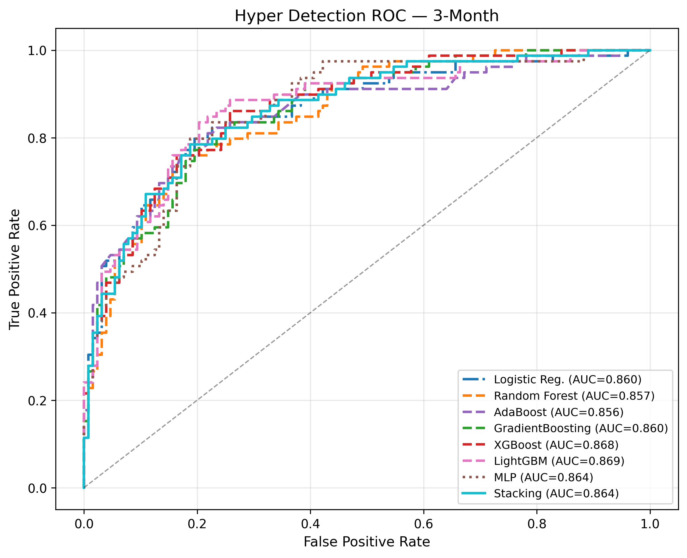
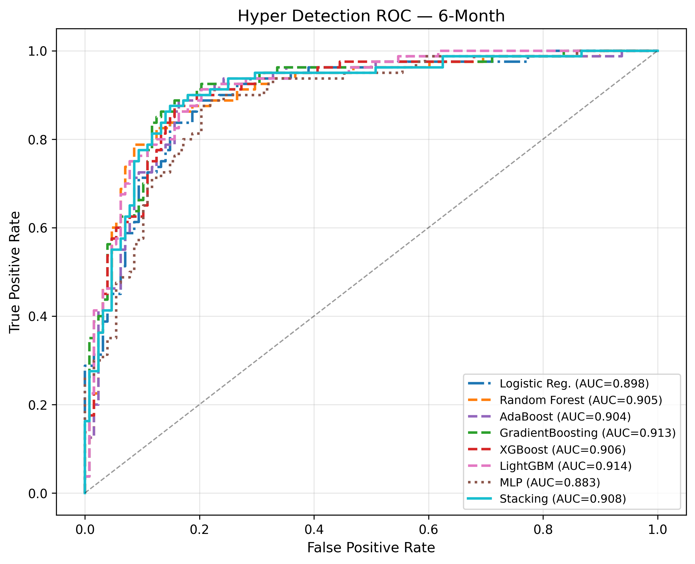
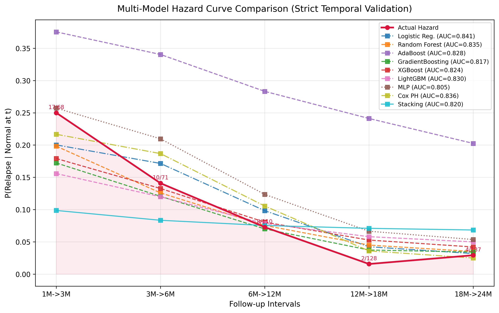
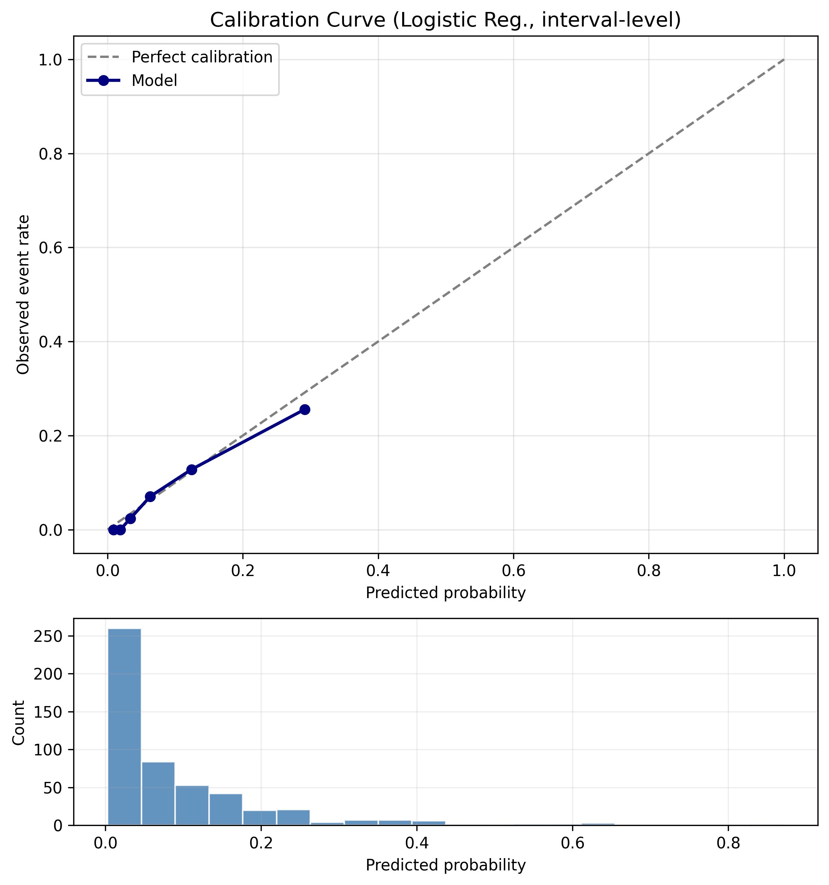
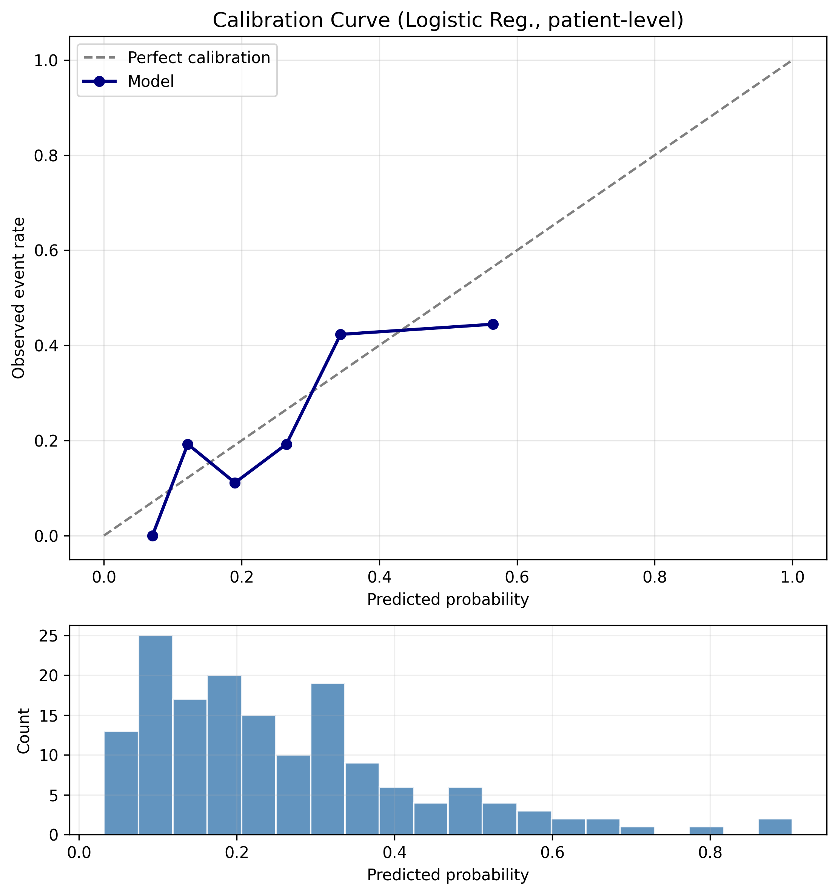
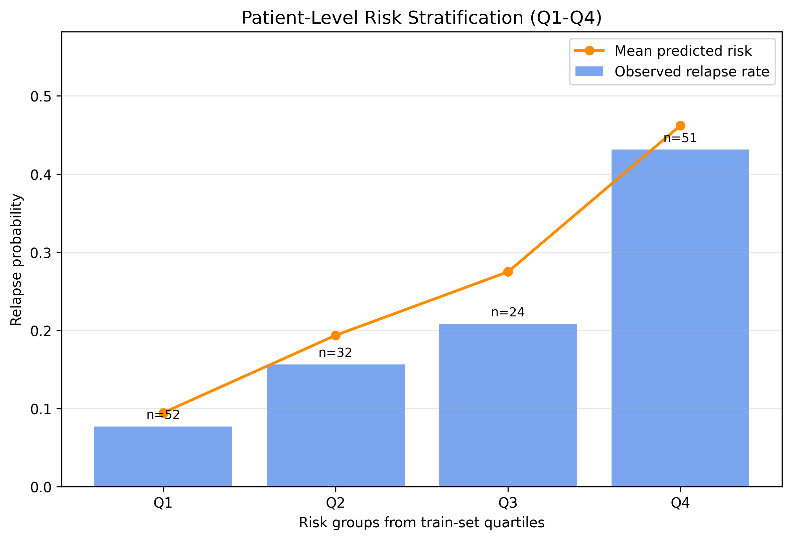
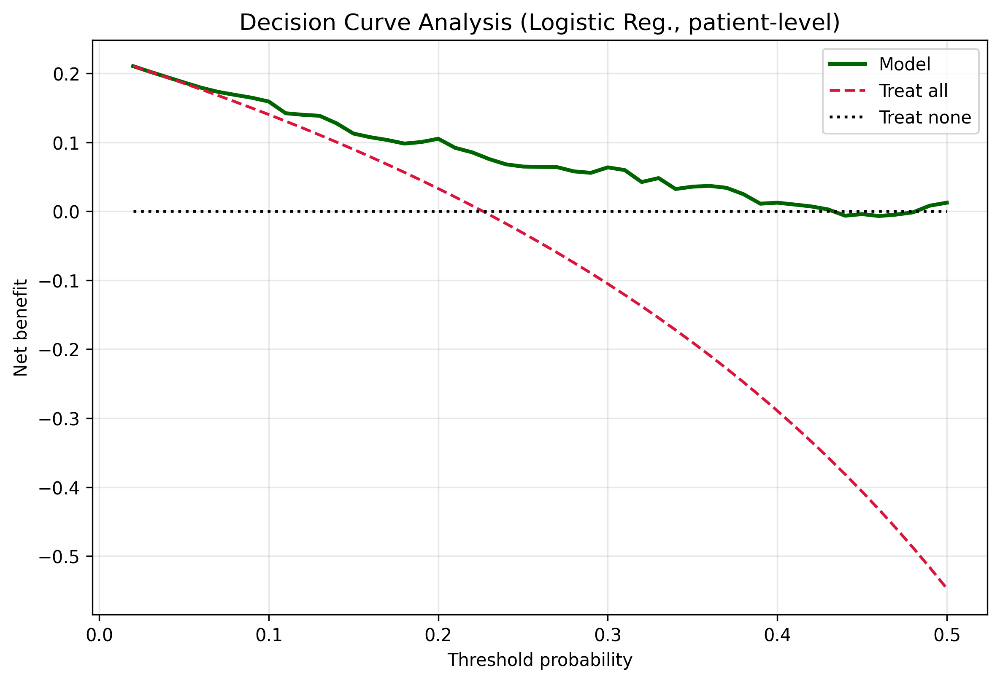
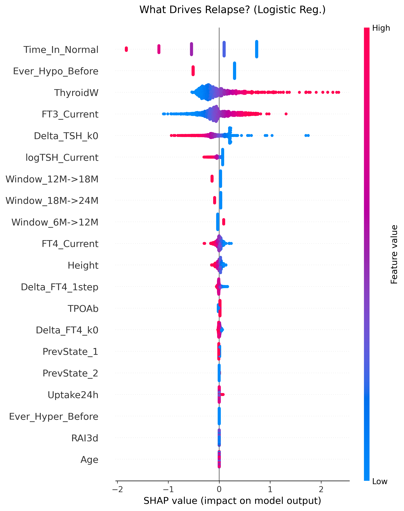

# 基于时序 Landmark 机器学习的 Graves 甲亢 RAI 治疗后早期状态识别与动态复发风险分层

## 摘要
### 背景
Graves 甲亢患者在接受放射性碘治疗后，常经历“甲亢-正常-甲减”之间的动态状态转移。传统固定终点模型通常只能回答某一单一结局，难以同时支持早期状态识别与后续复发监测。临床上更关键的决策问题包括：患者在 `3M` 或 `6M` 复诊时是否仍处于甲亢状态，以及对已经恢复正常的患者，下一次随访是否会再次复发。

### 目的
建立一个统一的时序 Landmark 机器学习框架，在同一真实世界纵向队列中，同时完成：

1. 固定 Landmark 的早期甲亢状态识别。
2. 滚动 Landmark 的动态复发风险预测与患者级风险分层。

### 数据与方法
研究基于 `1003` 条治疗记录、`889` 名患者的纵向随访数据，随访时间点为 `0M`、`1M`、`3M`、`6M`、`12M`、`18M`、`24M`。核心变量包括 `FT3`、`FT4`、`TSH`、医生诊断状态以及多项基线临床特征。模型开发采用时序安全 MissForest 填补、患者分组切分、`GroupKFold` 内部验证和 OOF 阈值选择。固定 Landmark 模块以 `3M` 和 `6M` 为预测时点；滚动 Landmark 模块使用 pooled long-format 数据预测 `Normal -> Hyper` 复发。

### 主要结果
在固定 Landmark 二分类任务中，`3M` 的最佳模型为 `LightGBM`，`AUC=0.869`、`PR-AUC=0.824`；`6M` 的最佳模型为 `GradientBoosting`，`AUC=0.928`、`PR-AUC=0.894`。在动态复发预测中，最佳 `interval-level` 模型为 `Logistic Regression`，`AUC=0.841`、`PR-AUC=0.334`、`Brier=0.064`；相应 `patient-level` 汇总结果为 `AUC=0.749`、`PR-AUC=0.453`、`Brier=0.154`。模型进一步显示出可接受的校准表现、正向的决策曲线净获益以及明确的患者级风险分层能力。

### 结论
该研究提示：基于纵向随访数据的统一 Landmark 框架，可同时支持 RAI 治疗后的早期状态识别与动态复发预警。固定 Landmark 结果更适合回答“当前控制状态如何”，滚动 Landmark 结果则更适合服务于“下一步随访强度如何安排”的临床管理决策。

---

## 研究背景
RAI 治疗后，患者的病程并非单向线性改善，而往往伴随多时间点、多状态的动态转移。若仅以一个固定结局建模，容易忽略中间状态及其临床意义。本研究试图从两个连续的临床问题出发建立一体化框架：

1. 在 `3M` 或 `6M` 复诊时，患者当前是否仍为甲亢？
2. 对已经恢复到正常状态的患者，下一次是否会复发，以及整个后续观察期内谁属于高风险人群？

因此，本项目并非单纯比较若干算法，而是围绕 RAI 后随访管理构建一条完整的时序风险分层路径。

---

## 研究设计与主线
本项目建议作为一篇统一论文组织，而不是拆成多个互不相干的小课题。三部分工作在同一临床路径中分别承担不同角色：

| 分析模块 | 脚本 | 回答的问题 | 论文角色 |
|---|---|---|---|
| 固定 Landmark 二分类 | `hyper_detect.py` | `3M/6M` 时点当前是否仍为甲亢 | 主分析 1 |
| 滚动 Landmark 复发预测 | `repluse.py` | 已恢复正常后下一次是否复发 | 主分析 2 |
| 固定 Landmark 三分类 | `all2.py` | `3M/6M` 时点处于甲亢、正常还是甲减 | 补充分析 |

建议的核心论文定位是：

> 在同一真实世界纵向队列中，建立一个统一的时序 Landmark 机器学习框架，同时完成 RAI 治疗后的早期状态识别与后续动态复发监测。

---

## 数据来源与变量
当前数据集包含 `1003` 条治疗记录和 `889` 名唯一患者。随访时间点包括 `0M`、`1M`、`3M`、`6M`、`12M`、`18M`、`24M`。其中：

- `0M` 为治疗前，所有患者默认处于 `Hyper`
- 核心实验室指标包括 `FT3`、`FT4`、`TSH`
- 临床状态标签由医生评价给出，分为 `Hyper`、`Normal`、`Hypo`
- 基线特征包括性别、年龄、身高、体重、BMI、突眼、甲状腺重量、RAI 摄取率、TRAb、TPOAb、TGAb、剂量等

状态映射如下：

- `Hyper`：甲亢
- `Normal`：正常
- `Hypo`：甲减

---

## 终点定义与术语解释
### 固定 Landmark
固定 Landmark 指在某一个固定随访时点，例如 `3M` 或 `6M`，仅使用截至该时点可获得的信息进行预测。它回答的是“现在控制得怎么样”。

### 滚动 Landmark
滚动 Landmark 指在每一个可用随访节点上建立预测，将每个相邻时间区间作为一个样本。它回答的是“下一步会不会出问题”。

### Interval-level
`interval-level` 是区间层面的复发预测。一个样本对应一位患者在某个相邻随访区间，如 `1M->3M` 或 `3M->6M`，且该患者在区间起点时处于 `Normal`。模型预测的是：

$$
P(\text{Relapse at } k+1 \mid S_k = \text{Normal}, X_{\le k})
$$

也就是：“患者本次复查已经正常，到下一次复查时是否会重新回到甲亢？”

### Patient-level
`patient-level` 是患者层面的风险汇总。它将同一患者在多个区间上的预测风险综合为“在整个后续观察期内是否至少复发一次”的总体风险。当前实现采用：

$$
P(\text{any relapse during follow-up}) = 1 - \prod_{j=1}^{k}(1-p_j)
$$

其临床意义是：“这个患者在后续整个观察期内，至少出现一次复发的总体概率有多大？”

### Q1-Q4 风险分层
`Q1~Q4` 不是终点，而是 patient-level 风险分层方式。模型先根据训练集患者预测概率的四分位数建立分层阈值，再将测试集患者划分到 `Q1~Q4`，用于展示模型是否能够识别低、中、高风险患者。

---

## 方法学框架
### 数据预处理与防泄漏设计
为尽量接近真实临床使用场景，本项目采用了严格的防泄漏策略：

- 训练/测试切分先于任何预处理步骤
- MissForest 仅在训练集上拟合
- Landmark 输入矩阵按时间截断，仅保留当前时点及之前的列
- `GroupKFold` 或患者分组切分，避免同一患者同时出现在训练和验证中
- 阈值由训练集 OOF 预测选择，测试集仅用于最终评估

### 缺失值处理
缺失值使用 MissForest 风格的迭代填补实现，即 `IterativeImputer + RandomForestRegressor`。固定 Landmark 模块按照 `seq_len` 截断输入，滚动 Landmark 模块按照 `depth` 截断输入，避免未来信息反向渗入当前时点。

### 特征构建
固定 Landmark 模块使用：

- 静态基线变量
- 截至当前 Landmark 的 `FT3 / FT4 / TSH` 序列
- 相对基线的变化量
- 在 `6M` 时加入 `6M-3M` 的短期变化量

滚动 Landmark 模块在此基础上进一步加入：

- 当前实验室值：`FT3_Current`、`FT4_Current`、`logTSH_Current`
- 历史状态记忆：`Ever_Hyper_Before`、`Ever_Hypo_Before`、`Time_In_Normal`
- 动量特征：`Delta_FT4_k0`、`Delta_TSH_k0`、`Delta_FT4_1step`、`Delta_TSH_1step`
- 时间窗口指示变量：`Window_*`
- 既往状态变量：`PrevState_*`

### 评估指标
本研究重点使用以下指标：

- 区分度：`ROC-AUC`、`PR-AUC`
- 分类性能：`Accuracy`、`Balanced Accuracy`、`Recall`、`Specificity`、`F1`
- 概率性能：`Brier score`
- 校准：calibration curve
- 临床净获益：decision curve analysis, `DCA`
- 可解释性：`SHAP`

---

## 结果一：固定 Landmark 的早期甲亢状态识别
### 3 个月时点
在 `3M` 的二分类任务中，多种模型均表现较强。最佳模型为 `LightGBM`：

- `AUC = 0.869`
- `PR-AUC = 0.824`

作为参考，`Logistic Reg.` 的表现为：

- `AUC = 0.860`
- `PR-AUC = 0.814`
- `Accuracy = 0.797`
- `F1 = 0.731`

这表明在 `3M` 时点，利用早期随访信息识别当前是否仍为甲亢已经具备较高可行性。



### 6 个月时点
在 `6M` 的二分类任务中，模型表现进一步提升。最佳模型为 `GradientBoosting`：

- `AUC = 0.928`
- `PR-AUC = 0.894`

其他模型也维持在很高水平：

- `Random Forest`: `AUC = 0.915`, `PR-AUC = 0.878`
- `AdaBoost`: `AUC = 0.916`, `PR-AUC = 0.889`
- `Stacking`: `AUC = 0.921`, `PR-AUC = 0.886`
- `Logistic Reg.`: `AUC = 0.907`, `PR-AUC = 0.874`

这一结果提示：到 `6M` 时点，随访数据已经能够非常稳定地识别当前甲亢状态，可作为临床上判断控制效果和随访策略的有力工具。



### 本部分的临床意义
固定 Landmark 二分类结果主要回答：

- 患者当前控制得如何
- 是否仍需强化治疗或加密复查

这部分是整篇论文的第一个主分析，代表“当前状态识别”能力。

---

## 结果二：滚动 Landmark 的动态复发预警
### 状态转移概览
状态转移热图显示，在全部相邻随访转移中：

- 总转移次数：`6018`
- 稳定转移：`4167`
- `Normal -> Hyper` 复发：`210`
- `Hypo -> Normal` 恢复：`358`

复发主要集中于：

- `1M->3M`
- `3M->6M`
- `6M->12M`

提示治疗后早期至中期是复发监测的关键窗口。

### Interval-level 结果
在 `interval-level` 测试集中：

- 测试区间数：`514`
- 复发事件数：`41`

最佳模型为 `Logistic Regression`：

| 指标 | 数值 |
|---|---|
| ROC-AUC | `0.841` |
| PR-AUC | `0.334` |
| Accuracy | `0.772` |
| Balanced Accuracy | `0.732` |
| Recall | `0.683` |
| Specificity | `0.780` |
| Brier score | `0.064` |
| 阈值 | `0.12` |

95% CI：

- `AUC`: `0.793–0.890`
- `PR-AUC`: `0.214–0.479`
- `Brier`: `0.046–0.081`
- `Recall`: `0.545–0.822`
- `Specificity`: `0.747–0.812`

校准统计量：

- `Calibration intercept = -0.053`，`95% CI -0.649–0.625`
- `Calibration slope = 1.061`，`95% CI 0.839–1.388`

这些结果提示，interval-level 模型不仅具有较好的区分能力，而且预测概率整体未见明显系统性高估或低估。`Calibration intercept` 接近 `0`、`Calibration slope` 接近 `1`，说明模型在内部验证中表现出较好的概率刻度稳定性。尽管 `ACC` 不属于这类低事件率任务最合适的主指标，但模型在区分度、召回率和概率性能上已具备较好的预警价值。





### Patient-level 结果
在 patient-level 汇总后：

- 训练患者数：`626`
- 测试患者数：`159`

终点定义为“观察期内是否至少复发一次”。最佳汇总结果为：

| 指标 | 数值 |
|---|---|
| ROC-AUC | `0.749` |
| PR-AUC | `0.453` |
| Recall | `0.750` |
| Specificity | `0.593` |
| Brier score | `0.154` |
| 阈值 | `0.23` |

95% CI：

- `AUC`: `0.657–0.835`
- `PR-AUC`: `0.324–0.625`
- `Brier`: `0.119–0.185`
- `Recall`: `0.600–0.889`
- `Specificity`: `0.512–0.686`

校准统计量：

- `Calibration intercept = -0.275`，`95% CI -0.817–0.376`
- `Calibration slope = 0.929`，`95% CI 0.529–1.551`

这一结果说明，即使将区间风险汇总到患者层面，模型仍可实现中等到良好的风险区分，并更接近临床“谁应该重点盯”的真实使用场景。相比 interval-level，patient-level 的校准区间更宽，提示患者级绝对风险估计仍存在一定不确定性，但总体上未观察到明显失真。





### 临床净获益
Decision curve analysis 显示：

- interval-level 模型在较低至中等阈值范围内具有净获益
- patient-level 模型在更宽阈值区间保持正净获益

因此，patient-level 结果比单纯区间分类更容易转化为随访强度调整与高风险患者筛查策略。



### 敏感性分析
为检验主要结论是否依赖某一特定处理选择，本研究进一步进行了患者级汇总方式与时间窗口两类敏感性分析。

#### 患者级汇总方式敏感性分析
patient-level 风险分别采用三种合理汇总方式进行对照：

- `Product_AnyRisk`: `AUC = 0.749`，`PR-AUC = 0.453`，`Brier = 0.154`
- `Max_Interval_Risk`: `AUC = 0.738`，`PR-AUC = 0.469`，`Brier = 0.155`
- `Mean_Interval_Risk`: `AUC = 0.801`，`PR-AUC = 0.595`，`Brier = 0.156`

三种方法均维持了可接受的 discrimination，提示 patient-level 的主要结论并不依赖单一聚合公式。其中，`Product_AnyRisk` 与“观察期内至少复发一次”的终点定义最一致，因此仍作为主分析；`Mean_Interval_Risk` 则在当前数据中显示出更高的患者级区分度，可作为补充敏感性证据；`Max_Interval_Risk` 对高风险患者更敏感，但代价是特异度下降。

#### 时间窗口敏感性分析
以最佳 interval-level 模型为基础，对不同时间窗口组合进行再评估：

- `All_Windows`: `AUC = 0.841`，`PR-AUC = 0.334`，`Brier = 0.064`
- `Exclude_1M_3M`: `AUC = 0.864`，`PR-AUC = 0.389`，`Brier = 0.042`
- `Exclude_12Mplus`: `AUC = 0.739`，`PR-AUC = 0.351`，`Brier = 0.111`
- `Only_3Mplus`: `AUC = 0.864`，`PR-AUC = 0.389`，`Brier = 0.042`

该结果提示，模型表现并非仅由最早的 `1M->3M` 窗口单独驱动；相反，在去除最早窗口后，模型仍维持甚至略有提升的 discrimination。另一方面，若仅保留较早的高事件率窗口并剔除晚期窗口，性能会明显变化，说明不同时间阶段的风险结构具有异质性，支持将时间窗口显式纳入模型而非忽略时序信息。

### 可解释性
在当前最佳复发模型 `Logistic Reg.` 上，SHAP 提示最重要的驱动因素包括：

- `Time_In_Normal`
- `Ever_Hypo_Before`
- `ThyroidW`
- `FT3_Current`
- `Delta_TSH_k0`
- `logTSH_Current`

临床解释上可概括为：

- 正常状态维持越久，复发风险越低
- 既往出现过甲减者，再次回到甲亢的风险可能更低
- 甲状腺重量较大、当前 FT3 偏高提示更高复发风险
- TSH 恢复不足相关特征提示更高复发倾向

需要强调的是，SHAP 反映的是特征重要性与方向，不等于因果推断。



---

## 扩展分析：固定 Landmark 三分类状态分流
`all2.py` 采用级联式三分类框架，在 `3M` 和 `6M` Landmark 上将患者分流为 `Hyper / Normal / Hypo`。该模块的意义在于证明同一时序框架不仅可以完成二分类状态识别，还能够扩展到更细粒度的状态管理任务。

为了保持主文聚焦，当前建议将三分类结果作为补充材料，而不与上述两个主分析并列。这样可以避免文章从“时序风险分层”主线偏移为多个并列模型实验。

---

## 讨论
### 主要发现
本研究最重要的发现不是某一个算法取得了最高 AUC，而是：

1. 同一时序 Landmark 框架能够同时覆盖“当前状态识别”与“未来复发监测”两个核心临床决策点。
2. 固定 Landmark 二分类模型在 `3M` 和 `6M` 均表现优秀，尤其 `6M` 时达到很强的区分度。
3. 滚动 Landmark 模型不仅在 interval-level 上具有较好的区分能力，而且在 patient-level 上实现了风险分层、校准评估和临床净获益展示。
4. 新增的 calibration intercept/slope 与敏感性分析进一步支持：模型输出的概率值整体可信，且主要发现并不依赖某一个单独的 patient-level 汇总规则。

### 与现有文献的关系
现有相关文献更多聚焦于固定时点、单一终点或基线预测远期疗效。相比之下，本研究的特点在于：

- 使用同一真实世界纵向队列
- 将固定 Landmark 与滚动 Landmark 纳入同一框架
- 除区分度外，还系统报告置信区间、校准统计量、DCA、patient-level 风险分层、敏感性分析与 SHAP

需要谨慎指出的是，不同研究之间的任务定义并不完全一致，因此不宜使用简单的 head-to-head superiority 叙述。更专业的表述应是：在当前 Landmark 设定与内部验证条件下，本研究显示出较强的区分度和较好的临床解释性。

### 临床意义
该框架的潜在临床用途可分为两个层面：

- `3M/6M` 固定 Landmark：用于评估当前疾病控制状态
- 恢复正常后的滚动 Landmark：用于安排后续随访强度和筛选高风险患者

因此，它更接近一个“随访管理工具”而不是单次门诊的确定性诊断工具。

进一步地，新增的校准与敏感性分析使这一临床解释更为稳健。对于 interval-level 模型，`calibration intercept` 接近 `0`、`calibration slope` 接近 `1`，提示预测概率可用于风险沟通；对于 patient-level 结果，不同聚合方式虽然在召回率与特异度之间表现出不同取舍，但总体 discrimination 维持稳定，说明患者级风险分层结论并非由某一个特定数学公式“制造”而来。

### 局限性
当前结果仍应被视为探索性内部验证结果，主要局限包括：

1. 单中心或单来源回顾性数据，外部验证缺失。
2. 动态复发测试集事件数有限，部分置信区间仍然较宽，尤其体现在 patient-level 的校准斜率区间上。
3. patient-level 高风险段的校准存在波动，提示患者级绝对风险估计仍需更大样本进一步验证。
4. 不同 patient-level 聚合方式会改变召回率与特异度的平衡，因此临床使用时仍需根据场景明确风险阈值和干预目标。
5. 复发预警模型更偏向高召回筛查，而非高特异度诊断。
6. 正式投稿仍需补充纳入排除标准、流程图和 EPV 论证。

---

## 论文写作建议
如果将本 README 继续发展为正式手稿，建议采用以下结构：

| 手稿部分 | 对应内容 |
|---|---|
| Introduction | RAI 后管理的两个临床痛点：当前状态识别与后续复发监测 |
| Methods | 数据来源、状态定义、固定与滚动 Landmark、反泄漏设计、评估指标 |
| Results | `3M/6M` 固定 Landmark 二分类结果、动态复发 interval-level 与 patient-level 结果 |
| Discussion | 临床意义、与文献关系、局限性和未来方向 |
| Supplement | `all2.py` 三分类扩展结果 |

当前最推荐的文章角色分配如下：

| 脚本 | 建议论文角色 |
|---|---|
| `hyper_detect.py` | 主分析 1 |
| `repluse.py` | 主分析 2 / 方法学亮点 |
| `all2.py` | 补充分析 |
| `causal.py` | 独立后续工作 |
| `cluster.py` | 机制探索或另一篇论文 |

---

## 运行说明
推荐环境：

```bash
conda activate med
```

常用运行命令：

```bash
python hyper_detect.py
python repluse.py
python all2.py
```

主要输出目录：

- `hyper_detect_result/`
- `multistate_result/`
- `all_result/`

---

## 关键词
Graves 甲亢，放射性碘治疗，Landmark analysis，机器学习，复发预测，risk stratification，decision curve analysis，SHAP，longitudinal follow-up
