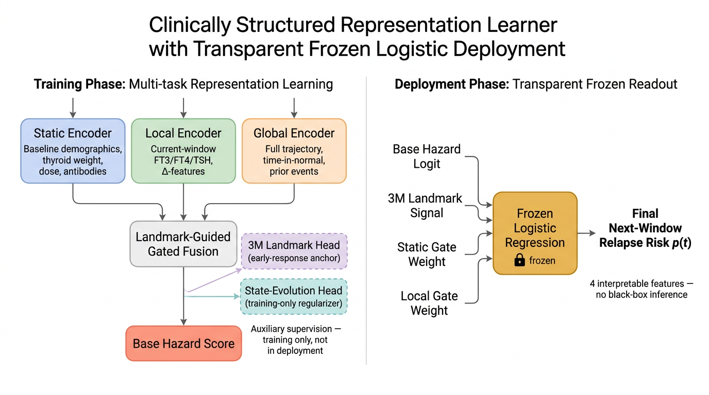
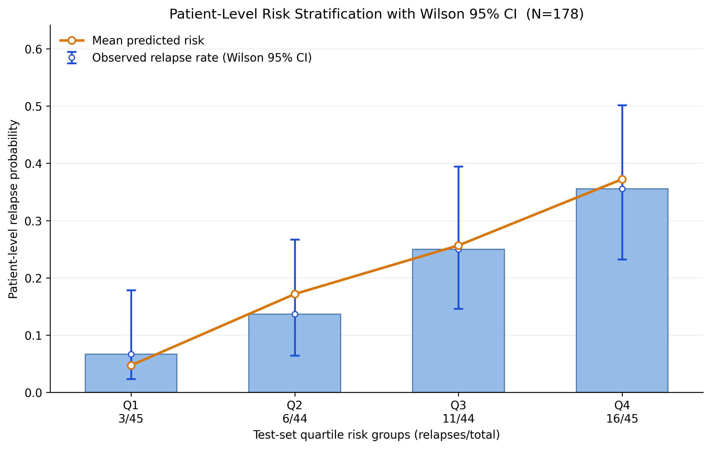
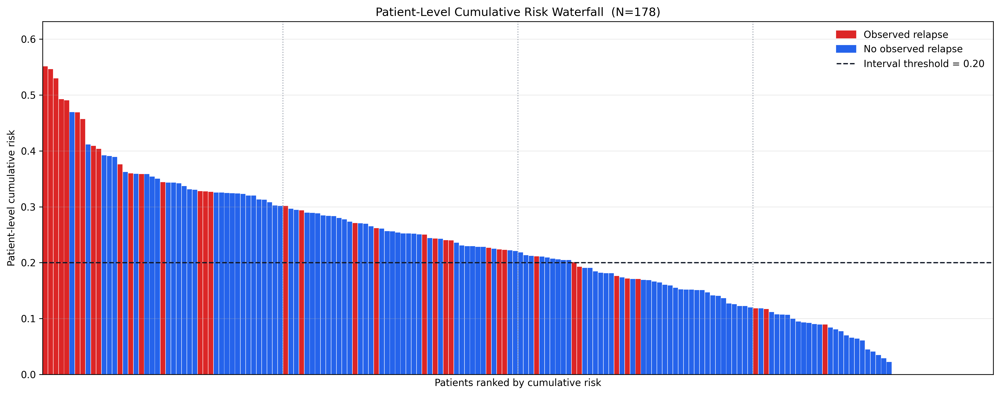
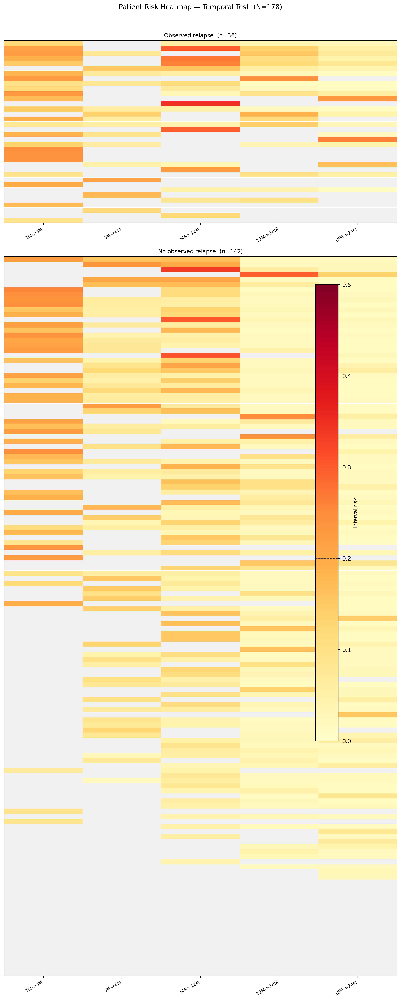
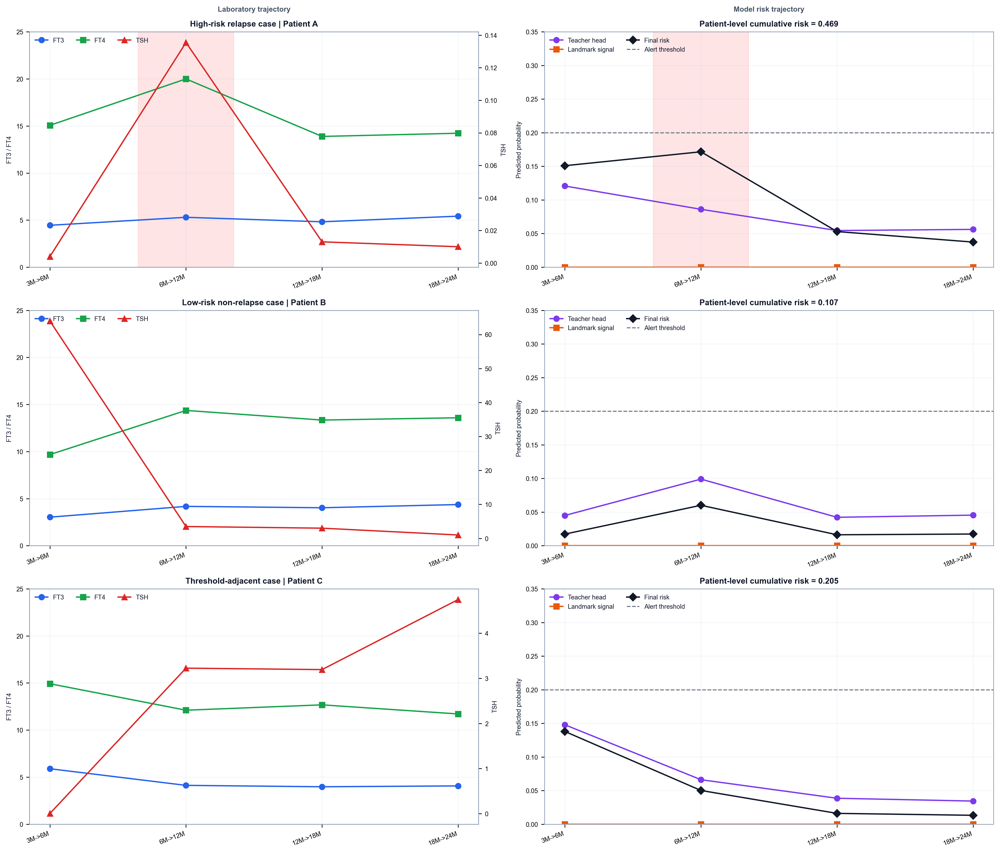
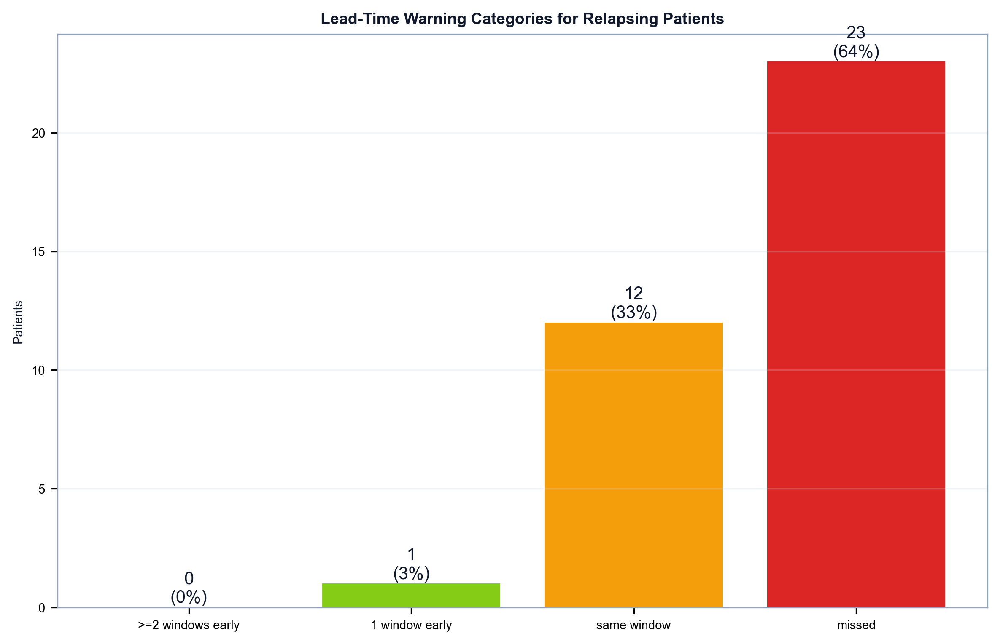
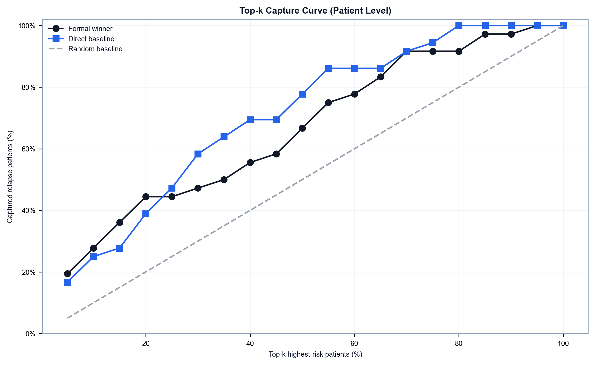
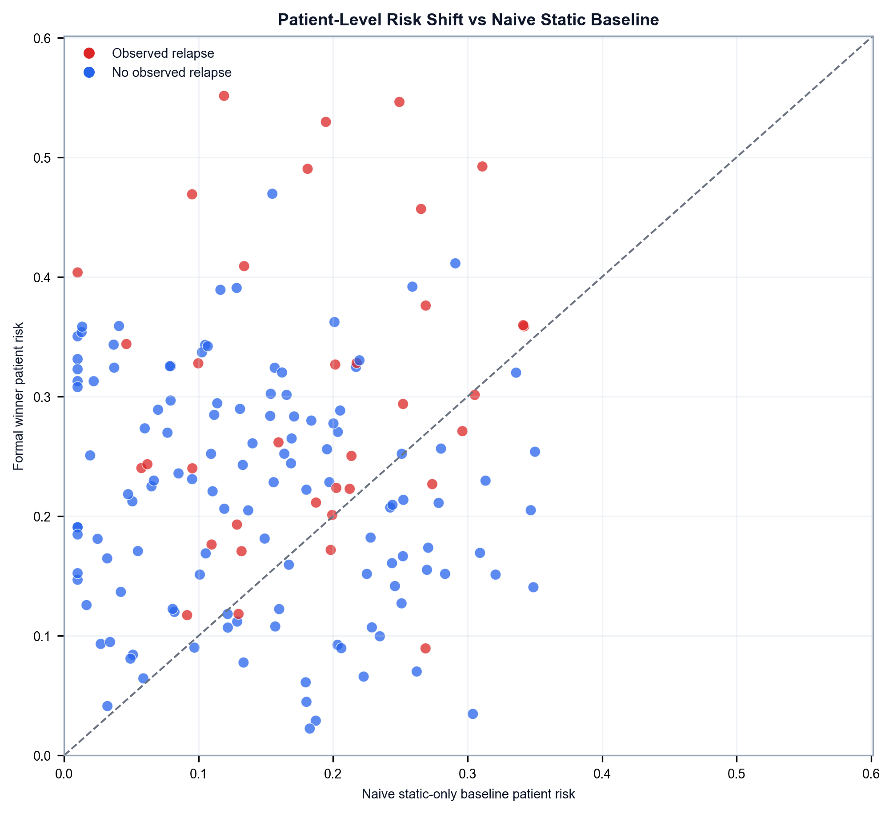

在线应用：https://rai-tmu.streamlit.app/

# 基于 Landmark 引导的局部-全局多头动态风险网络
## 放射性碘治疗后 Graves 病复发动态预警研究

## 摘要
本研究不再将随访预测理解为某个固定时间点的状态分类问题，也不再将其写成一个松散拼接的两阶段附属流程，而是将其形式化为一个**基于 landmark 的动态复发风险预测问题**。在每个随访时点 `t`，模型仅使用 `t` 时点及之前可获得的信息，更新患者在下一时间窗 `t -> t+1` 内发生复发的风险。

最终模型由三类信息共同驱动：静态临床背景、近期随访动态、全病程纵向轨迹；同时保留 `3M` 早期反应信号作为 **early-response landmark expert**，并引入下一状态预测头用于正则化时间表征。最终风险并非直接由一个不透明神经输出头给出，而是通过一个低维、冻结、可解释的逻辑回归融合层完成读出。

在当前评估框架下，最终模型达到：

- 内部验证集：`AUC = 0.863`，`PR-AUC = 0.358`
- 时间外推测试集：`AUC = 0.841`，`PR-AUC = 0.328`

作为直接对照，较早的 dynamic-only 滚动 landmark 基线在时间外推测试集上达到：

- `AUC = 0.762`，`PR-AUC = 0.283`

综上，landmark 引导、多头监督与透明融合读出共同构成了一个更完整的动态风险分层框架。与直接动态基线相比，该框架在稀有事件排序能力上更优，同时维持了可接受的时间外推泛化。

---

## 在线应用
当前结果已部署为一个精简的 Streamlit 随访工作台，仅保留两个直接面向临床使用场景的功能：

- `3M 早期反应评估`：输入基线信息与 `0M / 1M / 3M` 实验室指标，判断患者在 `3M` 时点是否仍处于较高早期反应风险。
- `动态复发预警`：输入当前 landmark 之前的静态信息、实验室轨迹与临床状态，在当前状态为 `Normal` 时更新下一时间窗内的复发风险。

在线应用不在浏览器端重新训练模型，而是直接调用已经固定的部署 bundle 完成推理。因此，它对应的是本文当前主结果的部署态实现，而不是一个独立于正文之外的演示原型。

---

## 1. 临床问题与方法定位
本研究所回答的，不是“患者当前属于哪一种甲状腺功能状态”，也不是“能否先预测未来实验室指标，再交给下游分类器”。更准确的临床问题是：

> 在每个随访 landmark `t`，仅使用 `t` 时点之前的可得信息，更新患者在下一个随访区间 `t -> t+1` 中发生复发的风险。

这种表述的意义在于，它更贴近真实临床随访。患者风险并不是一个固定不变的终身标签，而是随着治疗反应、甲状腺功能轨迹、既往波动历史和后续监测信息不断被修正的动态量。

在这一框架下，`3M` 分支不被解释为“通用患者编码器”，而被定义为**早期治疗反应的 landmark 专家分支**：

- 在 `3M` 之前，模型利用已有历史去预判患者将进入怎样的早期反应状态；
- 在 `3M` 及之后，模型利用已经观测到的 `3M` 信息，继续修正后续复发风险。

这也是当前方法与旧式“把一个固定时间点分类器硬塞进主模型”之间最关键的区别。这里保留 `3M`，不是因为它代表某种抽象 hidden truth，而是因为它在临床上对应的是**早期治疗反应状态**，在方法上对应的是**动态风险分层中的一个关键 landmark**。

---

## 2. 队列、验证方案与泄漏控制
### 2.1 队列概况

- 纳入队列：`889` 个患者
- 预设随访 landmark：`0M`、`1M`、`3M`、`6M`、`12M`、`18M`、`24M`
- 可用信息类型：
  - 人口学与基线负担
  - 连续随访 `FT3 / FT4 / TSH`
  - 抗体、剂量、摄取相关指标
  - 临床判定的 `Hyper / Normal / Hypo` 状态

### 2.2 时间顺序切分
本研究采用**按患者、按时间顺序**切分：

- 总队列：`889` 个患者
- 前 `80%` 患者：模型开发期，共 `711` 人
- 后 `20%` 患者：时间外推测试集，共 `178` 人
- 在开发期内部，再取最后 `15%` 患者作为内部验证集，共 `107` 人；其余 `604` 人用于拟合

README 下面涉及 cohort 规模的表述统一按**患者级**汇报，不再并列展示记录数或区间数；模型训练时虽然仍在 landmark 随访窗口上完成动态学习，但队列描述、分层和基线特征表均按患者口径解释。

### 2.2.1 筛选队列与分析队列

上述 `889` 人为**筛选队列**（具有完整结局记录的所有入组患者）。由于本研究的复发定义为 **Normal → Hyper 的状态回转**，只有在某一随访时点处于正常甲功状态（Normal）的患者才被视为"处于复发风险中"（at risk），其对应的随访区间才会进入模型的训练或评估。

在 `889` 人中，有 `229` 人在全部随访窗口内均未进入正常甲功状态——他们在治疗后始终处于甲亢或甲减状态，不满足 Normal → Hyper 复发的前提条件。这些患者并非被主观排除，而是在构建纵向 at-risk 区间时自然不产生任何预测行。因此：

- **筛选队列（基线特征表）**：`889` 人（含全部入组患者，§2.4 基线表描述此口径）
- **分析队列（实际参与模型）**：`660` 人（至少在一个随访窗口内曾处于 Normal 状态）
  - 开发期：`525` 人（贡献 `1555` 条 at-risk 区间）
  - 时间外推测试集：`135` 人（贡献 `440` 条 at-risk 区间）

时间顺序切分在**筛选队列层面**完成（即先按入组顺序将全部 `889` 人分为 `711 / 178`），之后再在纵向表构建阶段自然过滤为分析队列。这一顺序确保了分组边界不受 Normal 状态出现与否的影响，避免引入未来信息偏倚。

### 2.3 泄漏控制原则
整个分析遵循五条硬约束：

1. 先按患者切分，再做任何预处理。
2. 缺失值插补仅在开发期拟合。
3. 所有动态特征只保留当前 landmark 及之前的信息，不暴露未来。
4. 模型选择采用按患者分组的重采样。
5. 时间外推测试集不参与阈值搜索，也不参与模型选择。

### 2.4 基线特征表

下面这张表改为直接可复制的患者级三线表，口径为“每位患者保留一条治疗前基线记录”。因为这是 **pretreatment baseline**，此时全队列的临床起点均按 Graves 甲亢治疗前状态理解，所以这里不再展开 `Hyper / Normal / Hypo` 三列；三分类状态分析只放在后文补充结果中。

| Characteristic | Overall (n=889) | Training (n=604) | Validation (n=107) | Temporal validation (n=178) | P value |
|---|---:|---:|---:|---:|---:|
| Male, n (%) | 217 (24.4%) | 138 (22.8%) | 22 (20.6%) | 57 (32.0%) | 0.027 |
| Age, median (IQR) | 42.00 (32.00, 56.00) | 42.00 (32.00, 55.00) | 42.00 (32.50, 58.50) | 41.50 (31.00, 57.00) | 0.902 |
| Height, median (IQR) | 1.64 (1.60, 1.69) | 1.64 (1.60, 1.69) | 1.64 (1.60, 1.69) | 1.63 (1.58, 1.69) | 0.788 |
| Weight, median (IQR) | 60.00 (54.00, 67.00) | 60.00 (54.00, 67.00) | 60.00 (54.00, 65.00) | 57.00 (52.00, 70.00) | 0.715 |
| BMI, median (IQR) | 22.31 (20.40, 24.62) | 22.39 (20.45, 24.73) | 22.31 (20.34, 24.03) | 20.83 (18.73, 24.22) | 0.478 |
| Exophthalmos, n (%) | 889 (100.0%) | 604 (100.0%) | 107 (100.0%) | 178 (100.0%) | NA |
| Thyroid weight, median (IQR) | 27.30 (19.00, 43.10) | 26.70 (18.48, 40.85) | 25.80 (19.95, 41.15) | 31.25 (20.90, 50.30) | 0.016 |
| RAI 3d uptake, median (IQR) | 2.50 (1.70, 3.90) | 2.40 (1.70, 4.00) | 2.50 (1.55, 3.75) | 2.70 (1.70, 3.90) | 0.566 |
| Treatment count, median (IQR) | 1.00 (1.00, 1.00) | 1.00 (1.00, 1.00) | 1.00 (1.00, 1.00) | 1.00 (1.00, 1.00) | 0.136 |
| Dose, median (IQR) | 5.00 (4.00, 8.00) | 5.00 (3.00, 8.00) | 5.00 (4.00, 7.00) | 6.00 (4.00, 9.00) | 0.036 |
| 24h uptake, median (IQR) | 0.68 (0.61, 0.74) | 0.68 (0.60, 0.75) | 0.69 (0.62, 0.73) | 0.68 (0.62, 0.70) | 0.024 |
| Max uptake, median (IQR) | 0.76 (0.70, 0.82) | 0.77 (0.70, 0.83) | 0.76 (0.71, 0.81) | 0.77 (0.74, 0.79) | 0.789 |
| Half-life, median (IQR) | 5.40 (4.50, 6.30) | 5.45 (4.50, 6.40) | 5.30 (4.30, 5.70) | 5.10 (4.40, 5.83) | 0.081 |
| TGAb, median (IQR) | 29.45 (20.00, 191.00) | 28.10 (20.00, 237.00) | 41.70 (20.00, 217.00) | 28.30 (20.00, 116.25) | 0.362 |
| TPOAb, median (IQR) | 326.00 (49.75, 1000.00) | 325.00 (40.60, 1000.00) | 329.50 (73.22, 1000.00) | 331.00 (58.27, 1000.00) | 0.450 |
| TRAb, median (IQR) | 13.98 (6.21, 27.70) | 13.35 (5.97, 25.85) | 13.28 (6.39, 29.91) | 16.02 (6.33, 30.13) | 0.271 |
| FT3 0M, median (IQR) | 18.00 (9.60, 30.72) | 17.44 (9.42, 30.72) | 19.49 (11.38, 30.72) | 20.02 (9.67, 30.72) | 0.635 |
| FT4 0M, median (IQR) | 28.86 (19.81, 38.58) | 27.77 (19.44, 37.67) | 31.27 (21.26, 41.91) | 30.31 (20.19, 41.12) | 0.108 |
| TSH 0M, median (IQR) | 0.00 (0.00, 0.00) | 0.00 (0.00, 0.00) | 0.00 (0.00, 0.00) | 0.00 (0.00, 0.00) | 0.566 |

注：本表所有统计均按患者级汇报，`P value` 比较的是 `Training / Validation / Temporal validation` 三个 cohort；`Exophthalmos` 在全队列中无变异，因此不报告组间检验值。

这张表的重要性在于三点：

- 队列本身具有明显的临床异质性；
- 时间外推测试集不是一个简单的随机留出样本；
- 因而所有主结果都必须在“真实时间漂移”而不是 IID 假设下解读。

---

## 3. 方法学框架
最终部署模型并不是一个单次端到端输出风险的黑盒网络，而是一个**先学习动态病程表征、再进行透明风险读出**的两阶段框架。

第一阶段，模型在每个随访 landmark 上同时读取三类互补信息：相对稳定的基线临床背景、反映近期波动的局部随访信号，以及概括全病程恢复模式的纵向轨迹特征。三路信息在共享表征空间中汇合后，不直接被解释为“最终复发概率”，而是先接受两个临床上更具约束性的辅助任务校正：一是 `3M` 早期反应 landmark，二是下一阶段状态演化信息。这样做的目的，不是单纯增加任务数，而是让动态表征始终围绕“早期治疗反应”和“后续病程走向”这两个与复发密切相关的临床线索组织起来。

第二阶段，预训练完成后的主体表征被冻结，不再继续自由漂移；最终部署风险由一个低维、透明、可解释的逻辑回归读出层给出。对于当前 formal winner，这个最终读出只依赖四个信号：基础动态风险得分、`3M` landmark 信号，以及静态分支与局部分支的门控权重。换句话说，最终模型真正回答临床问题的方式，并不是让一个复杂神经网络直接“拍板”，而是在受约束的动态表征之上，用一个可追踪的线性层完成最终风险更新。

从方法定位上看，这条线最重要的不是“结构有多深”，而是它把三件事同时保留下来了：动态 landmark 语境、早期反应约束，以及部署时的透明读出。这也是它与单纯 rolling baseline 或松散两阶段流水线的根本区别。

因此，当前主线模型可以概括为：

- 明确区分 `static / local / global` 三类信息；
- 明确保留 `3M landmark` 监督；
- 明确保留 `next-state` 辅助监督；
- 最终部署层保持透明、低维、可解释。

### 3.1 三个输入分支
#### 1. 静态分支（Static branch）
- 编码相对稳定的背景信息，如性别、年龄、体格指标、抗体、摄取相关变量和剂量相关变量；
- 表征患者相对稳定的基础风险底盘。

#### 2. 局部分支（Local branch）
- 编码近期随访信息，包括当前 `FT3 / FT4 / TSH`、短期变化量、当前区间以及前一状态；
- 表征短期活动性和近期不稳定性。

#### 3. 全局分支（Global branch）
- 编码全病程工程化轨迹特征，如 `Time_In_Normal`、区间宽度、既往复发计数和高风险早期窗口交互项；
- 表征纵向恢复组织结构和较长时间尺度上的病程模式。

### 3.2 多头监督（Multi-head supervision）
#### 1. 基础动态风险流（Base hazard stream）
- 预训练阶段首先学习一个受强基线监督约束的动态风险表示——即利用已有的强基线模型 out-of-fold 预测概率作为 soft label，引导 backbone 的风险排序能力；
- 最终部署风险并不直接等同于这一路神经输出，而是在冻结主体表征后，再由低维逻辑回归融合层完成正式读出。

#### 2. `3M landmark` 头
- 将表征锚定在早期治疗反应状态上；
- 防止动态模型在训练中丢失临床上有意义的早期反应信息。

#### 3. 下一状态辅助头（Next-state auxiliary head）
- 保留对后续病程走向的辅助约束；
- 让共享时间表征不仅关注“会不会复发”，也保留“接下来向哪个状态演化”的动态信息。

### 3.3 主方法图

这张图是全文的主方法图。它将队列构建、时间安全开发流程、`static / global / local / landmark` 表征学习、多头监督、可解释输出以及最终 Web 应用入口纳入同一叙事框架，更符合本研究的真实方法学脉络。

### 3.3.1 模型架构：训练期与部署期

上图将模型拆分为**训练期**（左侧）和**部署期**（右侧）两个视角，对应"复杂训练、简单落地"的设计思路。

**训练期：多任务表征学习。** 三路编码器分别处理三类在临床上含义不同的信息来源：

- **Static Encoder** 读取治疗前就已确定的基线负担——甲状腺重量、放射性碘剂量、抗体水平等。这些变量在整个随访期间基本不变，代表的是患者的"出发点风险"。
- **Local Encoder** 读取最近一次随访窗口内的短期变化——当前 FT3 / FT4 / TSH 值、与上一窗口的变化量（Δ 特征）以及当前甲功状态。这些信息反映的是"最近一次就诊时医生在化验单上看到的东西"。
- **Global Encoder** 读取从治疗到当前时点的全病程纵向轨迹——累计处于正常甲功状态的窗口数（Time\_In\_Normal）、是否曾出现过甲减或甲亢波动、既往复发次数，以及早期关键窗口（1M→3M / 3M→6M / 6M→12M）内生化指标与窗口的交互特征。这些信息概括的是"整条恢复曲线的组织结构"。

三路表征在共享空间中汇合后，经过 **Landmark-Guided Gated Fusion**：门控网络根据三路信息和 3M 早期反应信号的强弱，动态调整静态 / 局部 / 全局三路的贡献权重——直觉上，如果一位患者已有充分的早期反应证据，模型会更信赖全局轨迹特征；反之，如果早期信号尚不明朗，则更依赖近期窗口的短期波动。

在训练期，融合表征同时接受三个监督信号（即"多任务学习"）：

1. **Base Hazard Head**（基础动态风险头）：学习预测下一窗口复发风险，是主任务。
2. **3M Landmark Head**（早期反应锚点）：约束共享表征保留 3M 早期治疗反应信息——这不是一个独立的分类器，而是训练期的"锚定信号"，确保 backbone 不会遗忘临床上最具预后价值的早期反应窗口。
3. **State-Evolution Head**（状态演化正则化器，仅训练期）：预测下一窗口甲功状态走向，作为辅助正则化任务。它的作用不是给出第二个临床预测，而是让共享表征在学习"会不会复发"的同时，也保留"接下来病程往哪个方向演化"的动态信息。

**部署期：4 个可解释特征 → 冻结逻辑回归。** 训练完成后，上述整个 backbone 被冻结（参数不再更新）。最终面向临床的风险输出，由一个仅有 4 个输入的逻辑回归完成：

| 输入特征 | 临床含义 |
|---|---|
| Base Hazard Logit | backbone 输出的基础动态风险得分 |
| 3M Landmark Signal | 3M 早期反应信号（已观测时用真值，未观测时用预测值） |
| Static Gate Weight | 门控网络分配给基线信息的权重 |
| Local Gate Weight | 门控网络分配给近期窗口信息的权重 |

这意味着最终部署的"模型"本质上是一个**低维、透明、可审计的线性层**——医生不需要理解 backbone 内部的神经网络如何运作，只需要知道"最终风险由哪四个维度的信号综合决定"。这也是本模型与端到端黑箱深度网络的核心区别：**训练阶段的复杂结构服务于学习更稳定的疾病过程表征，部署阶段的简单结构服务于临床可解释性和可追溯性。**

### 3.4 为什么 `3M landmark` 头是合理的
保留专门的 `3M landmark` 头，并不是为了让故事更好听，而是因为前期 fixed-landmark binary 分析已经证明：`3M` 时点本身就携带强、可学习、可复现的信号。

在 `3M` 时点，fixed-landmark binary 结果达到：

- 最佳时间外推测试 `Accuracy = 0.813`，对应 `Elastic+LGBM Blend Routed`
- 最佳时间外推测试 `AUC = 0.857`，对应 `Elastic+LGBM Blend`
- 最佳时间外推测试 `F1 = 0.752`，对应 `Elastic+LGBM Blend Routed`

因此，保留 `3M` 分支的逻辑并不是“将一个二分类器神化为通用真相”，而是承认：早期治疗反应本身已经足够强，可以作为临床上有意义的方法学锚点，用来约束后续动态风险更新。

`3M` ROC 曲线进一步说明，这一信号不是偶然存在的弱 side signal，而是当前多头动态风险框架能够成立的重要前提之一。

### 3.5 面向稀有事件的温和数据增强（）

本研究面对的是典型的"小样本 + 少数类 + 纵向"场景：训练集中实际触发"下一窗复发"的阳性区间仅约 `169 / 2096`（事件率 `~8%`），因此**与其大幅增加合成病人，不如在合法临床语义范围内增强"模型看病程的视角"与"少数类边界"**。我们借鉴近两年针对电子健康记录的三条路线，做了精简实现。

首先是 **landmark-constrained hidden-space mixup**：我们不在原始 `FT3 / FT4 / TSH / 剂量` 层面做线性插值，而是在融合层前的隐藏表征上做有约束的 mixup——仅在**同一 landmark 阶段、同一当前状态 (`Hyper / Normal / Hypo`) 、相近基线风险十分位**的样本之间混合，混合系数 `λ ~ Beta(8, 2)`（偏向保留原样本），增强比例为 `15%`。这样做的动机与 ICLR 2024 *SelMix* 以及 KDD 2024 *ExcelFormer* 的 Hid-Mix / Feat-Mix 一致：**表格—纵向数据不适合照搬图像式增强，应在更合适的表征层做局部平滑**；同时 landmark 与 state 约束避免产生医学上自相矛盾的样本。我们也刻意**不把 mixup 施加到 `3M` landmark 头与下一状态头**，以保留这两路辅助监督的语义锚点作用。

其次是 **早期反应 soft-target augmentation**：`3M` landmark 头不再使用硬二元标签，而是以 fixed-landmark binary 强模型的 out-of-fold probability 作为 soft target 并以 Huber 损失回归，避免早期反应信号在共享表征里被过度离散化；同时在 `t ≥ 3M` 的训练样本上以一定概率将 observed landmark 表征与 predicted landmark 表征做 `λ ~ U(0.4, 0.8)` 的混合，使模型在推理阶段面对带噪 early-response signal 时不过度依赖"完美 3M 真值通道"。

最后是 **delta residual bootstrap**：对阳性或 baseline 风险高、但当前模型漏判的 hard-border 样本，在训练集中按"同状态、同 landmark、同 risk band"找 KNN 邻居，抽取其短期 delta residual（如 `ΔFT4 / ΔTSH / ΔFT3`）叠加到原样本上，并用训练集 `1%–99%` 分位数做 clamp 以及状态—化验一致性规则过滤。我们**不采用原始特征空间 SMOTE 与完整 GAN / diffusion 生成**：前者会在多模态表格中产生医学不自然的样本，后者在当前样本量下难以稳定收敛，相关问题在 IJCAI 2024 *Multi-TA* 与 KDD 2024 *EHRPD* 的对比分析中已经明确。

增强仅在训练阶段施加；内部验证与时间外推测试集严格保留原始样本分布。

---

## 4. 主要结果
### 4.1 直接动态基线
较早的 dynamic-only 滚动 landmark 基线仍然重要，因为它证明了：即使不引入 landmark-guided 多头结构，仅凭动态轨迹本身，这个“下一时间窗复发预警”任务也是可学习的。

在时间外推测试集上，该基线达到：

- `AUC = 0.782`
- `PR-AUC = 0.291`
- `F1 = 0.316`

这说明本文并不是在解决一个不同的问题，而是在同一个任务定义下，进一步引入早期 landmark 约束、辅助监督和透明融合读出。

### 4.2 最终模型的判别能力

最终模型表现为：

- 训练拟合集：`AUC = 0.878`，`PR-AUC = 0.385`
- 内部验证集：`AUC = 0.863`，`PR-AUC = 0.358`
- 时间外推测试集：`AUC = 0.841`，`PR-AUC = 0.328`

最重要的读法不是单看某一个点值，而是看到：`Train > Val > Test` 三个 `PR-AUC` 形成了清晰的单调下降，而非"验证集远高于测试集"的虚高曲线；这意味着模型在时间漂移下的泛化衰减是连续、可解释的，并未出现过拟合崩塌。

### 4.3 校准情况

预测概率主要分布在临床上预期的低风险区间。在时间外推测试集实际覆盖到的概率范围内，校准总体可接受，未见明显的大尺度失真。

### 4.4 决策曲线分析

在较低阈值概率范围内，模型相对 treat-all 与 treat-none 策略均表现出正向 net benefit。这更支持它被理解为**早期随访分诊工具**，而不是一个用于高阈值确认诊断的分类器。

### 4.5 阈值敏感性

最终采用的操作阈值为 `0.20`。在这个阈值下，模型相对更偏向高特异度而不是高召回，更符合低患病率事件下的保守预警策略。

### 4.6 混淆矩阵

在该阈值下：

- `Specificity = 0.928`
- `Recall = 0.341`
- `F1 = 0.315`

因此，这不是一个激进的阳性判定配置，更准确地说，它对应的是一个**高特异度的随访预警场景**。

### 4.7 患者级风险分层与置信区间

在患者级分析中，我们不再直接把某一个 interval 的风险当作病人结局，而是将同一病人的多窗口风险按 `1 - ∏(1 - p_t)` 聚合为**累计患者级风险**，再用于病人级评估和分层。

将时间外推测试集按训练集患者级风险四分位分层后，`Q4` 的观察到复发率最高，且均值预测风险也最高。图中蓝柱表示各组真实复发率，橙线表示各组平均预测风险；柱顶标注采用 `复发人数/组内总人数`，误差条为 Wilson `95%` 置信区间，因此这张图比单纯的均值柱状图更不容易被误读。

需要谨慎的是：这里的 `95% CI` 反映的是各组观察到复发率本身的不确定性，而不是组间差异的正式显著性检验。当前图上 `Q4` 的风险负担最高这一点是清楚的，但中间风险层之间仍存在区间重叠，因此它更适合被理解为**描述性风险分层图**，而不是“所有分层都已经严格拉开”的证据。

### 4.8 患者级累计风险瀑布图

瀑布图将所有患者按累计风险从高到低排序。红色为最终观察到复发的患者，蓝色为未复发患者。可以看到，高风险尾部富集了更多真实复发个体；同时，图中也保留了 `Q1-Q4` 分界与操作阈值，便于将“风险分层”和“二值预警”放在同一个坐标系里理解。

### 4.9 患者级风险热图

这张图现在改成了更紧凑的**双面板结构**，不再把全部患者硬挤在一张过长的单矩阵里。上半部分是 `Observed relapse` 患者，下半部分是 `No observed relapse` 患者；每个面板内部都按患者级累计风险从高到低排序，因此读图时可以先看“同一结局内部谁更高风险”，再看“不同结局之间的整体分布差异”。

主热图中的每一列对应一个随访窗口，颜色表示该窗口的复发风险，浅灰表示该窗口没有观测记录。左侧窄条不是另一张热图，而是患者所属的累计风险四分位分层（`Q1-Q4`）；横向白线则把不同风险层之间的边界切开。右侧颜色条上的虚线标记 `0.20`，用于提示正式预警阈值在单窗风险尺度上的大致位置。

和旧版相比，这个版本更容易看出两件事：一是复发患者主要集中在高累计风险区，且常在前几个窗口就出现持续偏高的风险带；二是未复发患者虽然也会有零星高值，但整体更偏向低风险底色，而且后期窗口普遍更淡。这使它更像“随访风险地图”，而不只是一个又长又灰的原始矩阵。

### 4.10 典型病例的纵向风险更新
<!---->

这张图现在固定展示三个**窗口完全一致**的示例患者，三人都覆盖同一套四个随访窗口：`3M->6M`、`6M->12M`、`12M->18M`、`18M->24M`。这样横向比较时，不会再混入“有人只有一个点、有人有四条线”的阅读噪声。

三个病例分别是：

- `High-risk relapse case`：同一窗口结构下，患者级累计风险最高且最终复发
- `Low-risk non-relapse case`：同一窗口结构下，患者级累计风险最低且最终未复发
- `Threshold-adjacent case`：同一窗口结构下，患者级累计风险最接近正式阈值 `0.20`

读图方式可以分成两步：

- 左侧面板：`FT3 / FT4 / TSH` 的纵向实验室轨迹。红色半透明背景表示该窗口内观察到了复发事件；如果没有红色背景，表示该病例在展示窗口内未观察到复发。
- 右侧面板：同一四个窗口上的三条模型相关曲线。紫线是 `Base hazard`（基础动态风险得分），橙线是 `Landmark signal`（3M 早期反应信号），黑线是最终 `Final risk`（冻结 LR 输出的部署风险），灰色虚线是正式预警阈值 `0.20`。

标题中的 `Patient-level cumulative risk` 不是某一个单独窗口的点值，而是把这四个窗口的最终风险按 `1 - ∏(1 - p_t)` 聚合后的患者级累计风险。因此，标题里的累计风险可以明显高于图中任意一个单窗风险点，这不是画错了，而是**区间风险聚合**的结果。

这张图的意义不在于挑三条“好看”的曲线，而在于把同一随访结构下的三种临床读法摆在一起：

- 高风险复发病例：最终风险在前两个窗口维持较高水平，并在复发窗口前后没有被压到低位
- 低风险未复发病例：最终风险始终贴近低位，四窗累计后仍保持较低患者级风险
- 阈值邻近病例：单窗风险都不算特别高，但四窗累计后会把患者级风险推到阈值附近，说明这条模型更像连续随访预警器，而不是只看单次最高点的硬分类器

### 4.11 提前预警能力（效果较差）

对于最终复发的患者，我们进一步统计模型第一次越过 `0.20` 阈值时，距离真实复发还有多少个窗口。结果显示，这一正式模型更像是一个**高特异度、有限提前量**的预警器：部分病例可以提前一个窗口发出信号，但仍有相当一部分病例会落在“同窗提示”或“未提前捕获”。

---

## 5. 模型解释
### 5.1 最终融合层系数

最终冻结逻辑回归融合层使用四个输入：

- `Base_Hazard_Logit`（基础动态风险得分）
- `Landmark_Signal`（3M 早期反应信号）
- `Gate_Static`（基线分支门控权重）
- `Gate_Local`（近期窗口分支门控权重）

其系数结构为：

- `Base_Hazard_Logit = +0.551`
- `Gate_Static = +0.268`
- `Gate_Local = -0.268`
- `Landmark_Signal = +0.160`

这说明最终分数主要由 backbone 输出的基础动态风险得分驱动（系数最大），再由分支门控模式进行方向性修正——静态分支权重越高风险越高（正系数），而近期窗口权重越高风险越低（负系数，提示近期指标稳定时 Local 通道被激活），辅以 3M 早期反应信号支持。换句话说，最终模型并不是随意拼接，而是在一个低维透明层中，用临床上可追溯的四个维度完成最后的风险整合。

### 5.2 端到端特征层 SHAP

本文的主解释层采用的是**端到端 SHAP**，而不是仅解释最终融合层四个输入的读出层 SHAP。也就是说，这一层解释已经回到了工程化特征粒度。

排名靠前的特征包括：

- `Global::Time_In_Normal`
- `Global::FT3_Current_x_CoreWindow_1M->3M`
- `Global::FT4_Current`
- `Global::Interval_Width`
- `Global::FT3_Current`
- `Global::CoreWindow_1M->3M`
- `Global::Ever_Hypo_Before`
- `Local::Window_1M->3M`

它们共同提示：当前模型主要读取的是**全病程恢复组织结构**和**早期窗口内的动态不稳定性**，而不是单纯依赖静态背景负担。

### 5.3 个体级局部解释

高风险示例的主要抬升因素包括：处于正常状态的时间较短、landmark 信号偏高，以及甲状腺相关动态特征活跃。

低风险示例则呈现出相反模式：正常状态维持更久、随访时点更靠后、纵向生化信号更稳定。

---

## 6. 方法开发补充图
下列图并非临床主解释图层，但它们记录了模型开发阶段的行为，因此作为补充结果予以保留。

### 6.1 Backbone 比较

这张图主要反映不同门控与主体结构变体在验证集上的筛选信号，属于方法开发轨迹，而不是最终临床结论。

### 6.2 Gate 比较

这张图展示了主要候选模型在 `static / local / global` 三路上的权重分配。最终入选方案更接近“以 local 为主、global 设下限”的模式，而不是完全由 global 主导。

### 6.3 顶部实验比较

这张图比较了按验证集和时间外推测试 `PR-AUC` 排名前列的融合实验。它对于理解模型选择过程有价值，但不应被误读为最终解释层。

---

## 7. 融合层 SHAP 补充结果
融合层 SHAP 作为补充结果保留，但它本质上解释的是**最终读出层**，而不是特征工程层。

### 7.1 Fuse-space SHAP 总图

### 7.2 Fuse-space SHAP 重要性

从重要性排序看，最终低维读出主要由 `Base_Hazard_Logit` 驱动，其后是 `Landmark_Signal`、`Gate_Static` 和 `Gate_Local`。这与冻结逻辑回归层的系数结构一致。

### 7.3 Fuse-space 局部解释

这些局部解释更适合作为一致性检查，用来确认最终融合层是否按预期工作，而不是作为主要的临床特征归因结果。

---

## 8. 历史脉络与补充分析
本文仍保留若干较早的分析线作为方法演化的背景。在定型当前 landmark 引导的三头动态风险框架之前，我们先后尝试过三条方向不同的替代路线：一是**直接把下一随访时点是否处于甲亢状态**做成固定时间点二分类器，本质上把“下一时间窗是否复发”这个纵向问题压缩成单头分类任务，时间外推测试 `PR-AUC` 约为 `0.287`；二是更正式的**两阶段预测流程**，先学习生理过渡状态、再把过渡表征交给下游复发分类器，形式上更工程化但监督信号在两段之间被切断，时间外推 `PR-AUC` 约为 `0.243`；三是**先用回归头预测未来的 `FT3 / FT4 / TSH` 数值、再把预测数值喂给下游复发分类器**的串联流水线，因为误差会沿上下游累积，时间外推 `PR-AUC` 仅约 `0.196`。三者均明显低于当前三头模型在同一测试集上的 `0.328`，原因在于它们要么只回答了一个静态的局部问题、要么把监督切成了难以端到端优化的两段，因而无法同时利用早期反应 landmark、动态轨迹与下一状态演化信号。相比之下，fixed-landmark 分析与 recurrent-survival 路线更适合理解为方法学对照：前者（`3M` 路由融合 `Accuracy > 0.81`，`6M AUC > 0.91`）支撑了保留 `3M` 作为 landmark 专家分支的合理性，后者虽然回答的是相邻但不完全相同的问题，仍为当前动态风险表述提供了重要的方法学参照。

---

## 9. 补充材料

### 9.1 患者级 Top-k 捕获曲线

这张图回答的是一个更贴近分诊场景的问题：如果只优先盯住最高风险的前 `k%` 患者，能够提前覆盖多少真实复发个体。与治疗前静态基线相比，当前正式模型在**低 `k` 区间（`k ≤ 25%`）**内累积捕获明显更快——在 `k = 5%` 时即已覆盖约 `19%` 的复发病例，而静态基线仅约 `6%`；在 `k = 20%` 时正式模型累积覆盖约 `44%`，静态基线约 `31%`。这与临床现实高度吻合：分诊窗口越窄，对排序质量越敏感，多头 landmark 模型的相对优势也越显著。

### 9.2 患者级风险迁移散点图

这张图回答的问题和 9.1 不一样。Top-k 告诉你"整体排序变好了"，而它要回答的是：**当前模型到底把哪些病人重新搬了位置，又搬到了哪里，搬得是否合理。**

读图方法可以拆成三步：

1. **横纵轴含义**。横轴是治疗前静态基线给出的**患者级累计风险**——即把一位病人在所有随访窗口上按 `1 - ∏(1 - p_t)` 聚合得到的单一标量；纵轴是当前正式模型给出的同口径患者级累计风险。一个点就是一位病人。
2. **`y = x` 参考线**。虚线表示"两个模型给该病人的评估完全一致"。
   - 位于参考线**上方**的点：正式模型把这位病人评估为**更高风险**（被"往上抬"）。
   - 位于参考线**下方**的点：正式模型把这位病人评估为**更低风险**（被"往下压"）。
   - 贴近参考线：两个模型意见一致，这部分病人不是正式模型重新定义的对象。
3. **颜色**。红色为最终观察到复发的病人，蓝色为最终未复发的病人。因此可以直接按"颜色 × 相对位置"去读：
   - 红点集中在参考线**上方**——正式模型把真正会复发的病人更准确地**抬进了高风险层**；
   - 蓝点集中在参考线**下方**——正式模型合理地**释放了被基线虚高预警**的未复发病人；
   - 红点落在参考线下方或蓝点落在参考线上方，则属于"方向错了"的重排，可以直接在图上数出来。

这张图的叙事作用与 9.1 是配套而非重复：

- 9.1 证明**整体排序在 Top-k 区间确实更优**；
- 9.2 证明这种 PR-AUC / Top-k 的提升不是来自随机抖动，而是**病人维度上有方向性、可解读的重分层**——真复发被合理挪高，未复发被合理压低。

换句话说，这是一张**"风险迁移审计图"**：它不是在比平均性能，而是在逐个病人地交代"新模型到底改动了谁、改动得是否临床合理"，从而把 §4 的聚合指标落回到个体病人的风险决策层面。

### 9.3 文件位置
相关结果与图表集中存放于：

- `results/relapse_teacher_frozen_fuse/`

主要包括：

- 最终模型包与元数据
- 判别、校准、DCA、阈值与混淆矩阵图
- 端到端 SHAP 结果
- 开发阶段比较图

如果按照技术报告的阅读顺序，最值得优先阅读的是：

1. 主方法图
2. 判别结果
3. 校准图
4. 决策曲线分析
5. 患者级风险分层
6. 端到端 SHAP

这六层合在一起，构成了当前主模型在临床意义、统计性能和解释层面的完整闭环。

---

## 附录 A. 特征英文名称与中文含义对照表

模型共使用 54 个工程化特征，按来源分为四个分支（Static / Local / Global / Meta）。下表列出每个特征的英文标识与临床含义。

### 静态基线特征 (Static)

| 英文特征名 | 中文含义 |
|---|---|
| Static::Age | 患者年龄 |
| Static::Sex | 患者性别 |
| Static::Height | 身高 |
| Static::Weight | 体重 |
| Static::BMI | 体质指数 |
| Static::ThyroidW | 甲状腺重量（超声估算，克） |
| Static::Dose | 放射性碘治疗剂量 |
| Static::RAI3d | 治疗后第 3 天残余辐射量 |
| Static::Uptake24h | 24 小时碘摄取率 |
| Static::MaxUptake | 最大碘摄取率 |
| Static::HalfLife | 放射性碘有效半衰期（天） |
| Static::Exophthalmos | 是否合并突眼症 |
| Static::TGAb | 治疗前甲状腺球蛋白抗体（TGAb） |
| Static::TPOAb | 治疗前甲状腺过氧化物酶抗体（TPOAb） |
| Static::TRAb | 治疗前促甲状腺激素受体抗体（TRAb） |
| Static::TreatCount | 既往放射性碘治疗次数 |

### 局部近期窗口特征 (Local)

| 英文特征名 | 中文含义 |
|---|---|
| Local::FT3_Current | 当前窗口 FT3 值 |
| Local::FT4_Current | 当前窗口 FT4 值 |
| Local::logTSH_Current | 当前窗口 log(TSH+1) |
| Local::Delta_FT4_1step | FT4 单步变化量（与上一窗口之差） |
| Local::Delta_TSH_1step | TSH 单步变化量（与上一窗口之差） |
| Local::PrevState_0 | 上一窗口状态编码：甲亢 |
| Local::PrevState_1 | 上一窗口状态编码：正常 |
| Local::PrevState_2 | 上一窗口状态编码：甲减 |
| Local::Window_1M->3M | 当前窗口为 1M→3M（独热） |
| Local::Window_3M->6M | 当前窗口为 3M→6M（独热） |
| Local::Window_6M->12M | 当前窗口为 6M→12M（独热） |
| Local::Window_12M->18M | 当前窗口为 12M→18M（独热） |
| Local::Window_18M->24M | 当前窗口为 18M→24M（独热） |

### 全病程纵向特征 (Global)

| 英文特征名 | 中文含义 |
|---|---|
| Global::FT3_Current | 截至当前的 FT3 值（全局视角） |
| Global::FT4_Current | 截至当前的 FT4 值（全局视角） |
| Global::logTSH_Current | 截至当前的 log(TSH+1)（全局视角） |
| Global::Start_Time | 当前窗口起始月份 |
| Global::Interval_Width | 当前窗口宽度（月） |
| Global::Time_In_Normal | 截至当前处于正常甲功状态的累计窗口数 |
| Global::Ever_Hypo_Before | 截至当前是否曾出现过甲减 |
| Global::Ever_Hyper_Before | 截至当前是否曾出现过甲亢（复发前兆） |
| Global::Prior_Relapse_Count | 截至当前的既往复发次数 |
| Global::Delta_TSH_k0 | TSH 相对于基线的变化量 |
| Global::CoreWindow_1M->3M | 核心窗口 1M→3M 标记 |
| Global::CoreWindow_3M->6M | 核心窗口 3M→6M 标记 |
| Global::CoreWindow_6M->12M | 核心窗口 6M→12M 标记 |
| Global::FT3_Current_x_CoreWindow_1M->3M | FT3 × 核心窗口 1M→3M 交互项 |
| Global::FT3_Current_x_CoreWindow_3M->6M | FT3 × 核心窗口 3M→6M 交互项 |
| Global::FT3_Current_x_CoreWindow_6M->12M | FT3 × 核心窗口 6M→12M 交互项 |
| Global::Time_In_Normal_x_CoreWindow_1M->3M | 正常状态累计 × 核心窗口 1M→3M 交互项 |
| Global::Time_In_Normal_x_CoreWindow_3M->6M | 正常状态累计 × 核心窗口 3M→6M 交互项 |
| Global::Time_In_Normal_x_CoreWindow_6M->12M | 正常状态累计 × 核心窗口 6M→12M 交互项 |
| Global::Delta_TSH_k0_x_CoreWindow_1M->3M | TSH 基线变化 × 核心窗口 1M→3M 交互项 |
| Global::Delta_TSH_k0_x_CoreWindow_3M->6M | TSH 基线变化 × 核心窗口 3M→6M 交互项 |
| Global::Delta_TSH_k0_x_CoreWindow_6M->12M | TSH 基线变化 × 核心窗口 6M→12M 交互项 |

### 地标元信息 (Meta)

| 英文特征名 | 中文含义 |
|---|---|
| Meta::LandmarkObsMask | 3 个月地标结局是否已观测（0/1 掩码） |
| Meta::LandmarkObsValue | 3 个月地标结局观测值（甲亢复发概率） |
