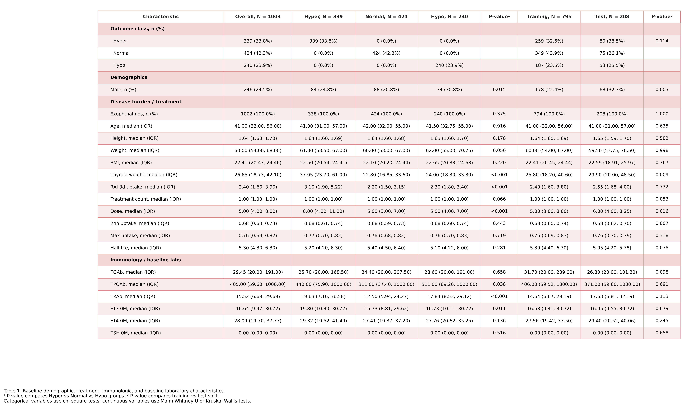
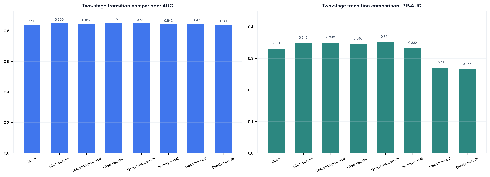
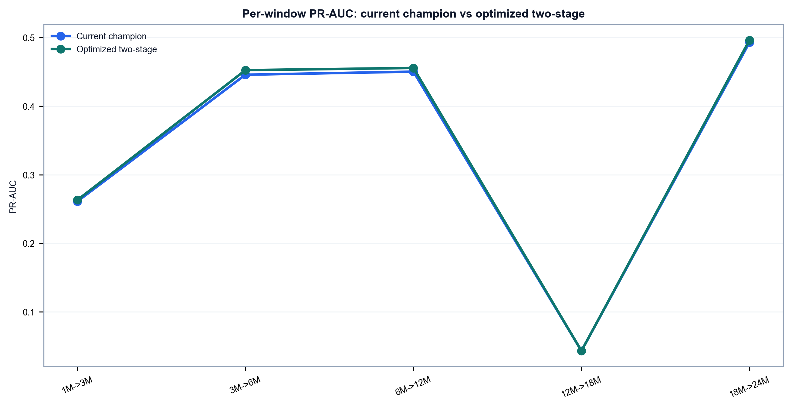
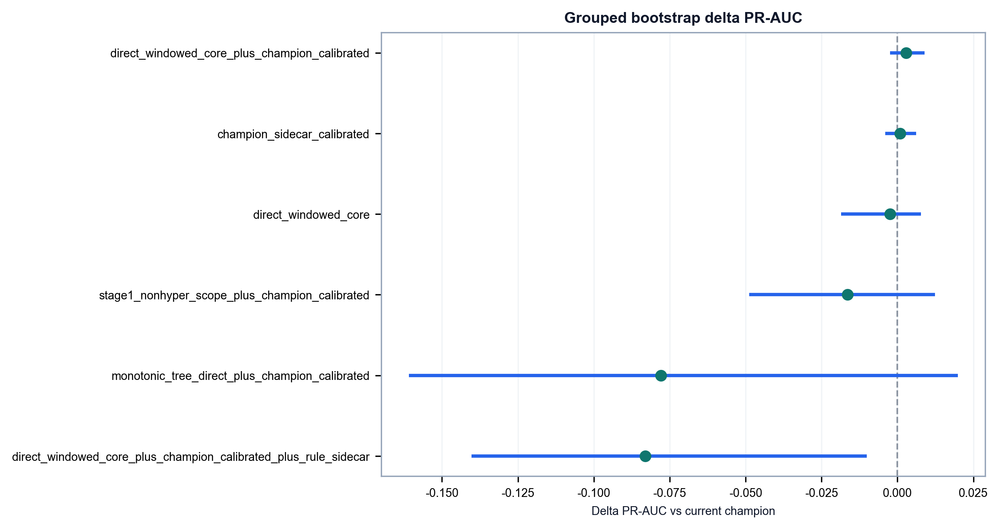
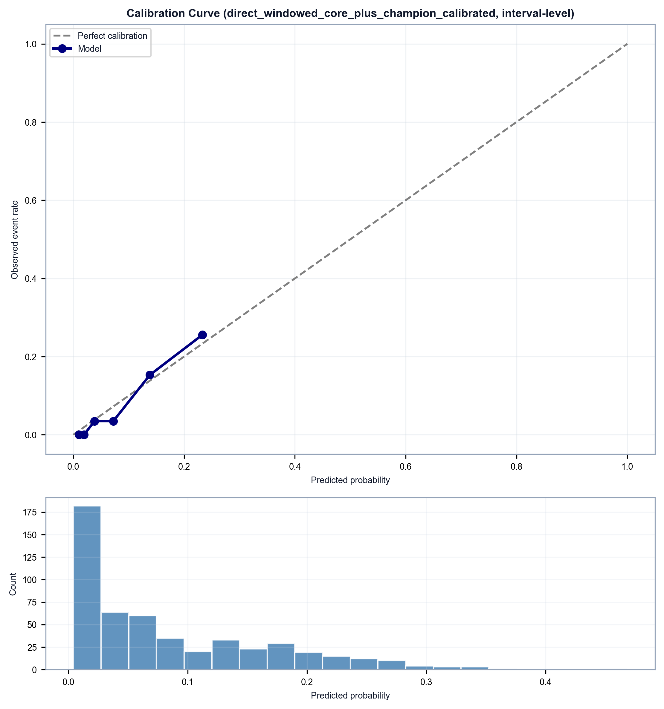
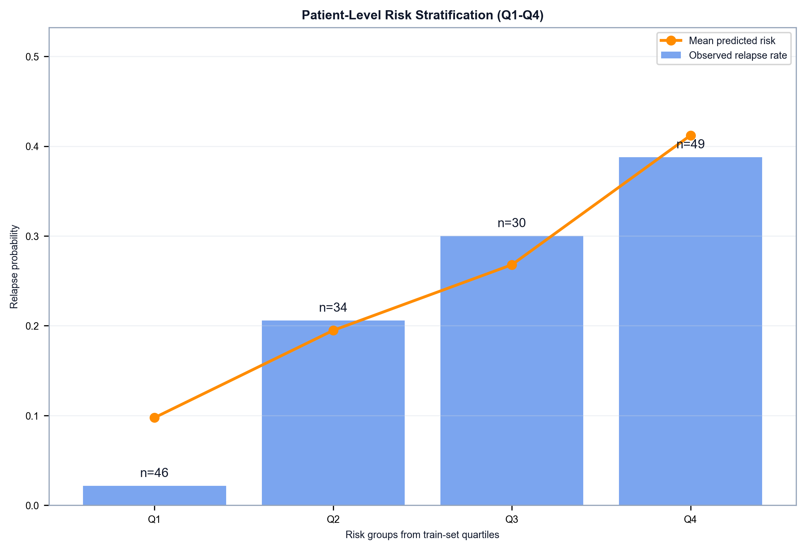
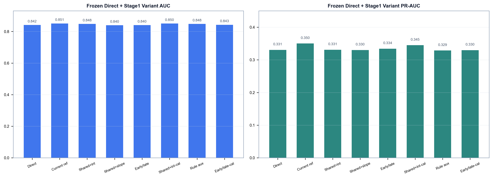

# RAI 后 Graves 病程的固定 landmark 与 rolling landmark 建模
## 以 two-stage 下一窗口复发预警为当前主线的真实世界纵向研究

## 一句话结论
在当前队列中，最值得作为主结果的不是单次时点的状态识别，也不是更早期的“先预测未来化验值再接下游分类”的探索版，而是现在这条 **two-stage 下一窗口复发预警主线**：

> 先提取“下一次复诊会不会重新回到甲亢端”的转归信号，再和当前直接复发风险做透明融合。

对应主脚本：
[`scripts/relapse_two_stage_transition.py`](./scripts/relapse_two_stage_transition.py)

主结果目录：
`results/relapse_two_stage_transition/`

当前测试集上的主结果为：

- `PR-AUC = 0.351`
- `AUC = 0.849`
- `Brier = 0.063`

作为对照，之前的 rolling landmark 直接模型：
[`scripts/relapse.py`](./scripts/relapse.py)

在同一测试框架下为：

- `PR-AUC = 0.334`
- `AUC = 0.841`
- `Brier = 0.064`

也就是说，当前 two-stage 主线是在已经可用的 direct baseline 基础上，再把少数复发事件的识别能力往前推了一小步。

---

## 研究框架总览
这套工作不是几个脚本平铺摆放，而是围绕同一个临床问题逐层展开：

- 前导问题：在固定时点，患者当前是否仍处于甲亢端
- baseline 问题：当前已经恢复 `Normal` 的患者，下一窗口会不会重新回到 `Hyper`
- 当前主线：在 direct baseline 之上，再补上一条下一窗口转归信号


当前 README 主文只保留三条主线：

| 脚本 | 角色 | 主要输出目录 |
| --- | --- | --- |
| [`scripts/fixed_landmark_binary.py`](./scripts/fixed_landmark_binary.py) | 前导分析：固定 `3M / 6M` 二分类 | `results/fixed_landmark_binary/` |
| [`scripts/relapse.py`](./scripts/relapse.py) | baseline：rolling landmark 直接复发预警 | `results/relapse/` |
| [`scripts/relapse_two_stage_transition.py`](./scripts/relapse_two_stage_transition.py) | 当前主线：two-stage 下一窗口复发预警 | `results/relapse_two_stage_transition/` |

其余结果统一放到本文末尾附录：

- [`scripts/relapse_recurrent_survival.py`](./scripts/relapse_recurrent_survival.py)
- [`scripts/relapse_two_stage_physio.py`](./scripts/relapse_two_stage_physio.py)
- [`scripts/fixed_landmark_multiclass.py`](./scripts/fixed_landmark_multiclass.py)

---

## 数据与验证框架
### 队列概况

- 总记录数：`1003`
- 唯一患者数：`889`
- 随访节点：`0M`、`1M`、`3M`、`6M`、`12M`、`18M`、`24M`
- 输入信息包括：
  - 人口学和基础疾病负荷
  - `FT3 / FT4 / TSH` 随访轨迹
  - 医生评估的 `Hyper / Normal / Hypo` 状态

### 外层切分

所有主脚本共用同一外层验证逻辑：

- 按患者首次出现顺序做 `80/20` 患者级顺序切分
- 训练集：`711` 名患者 / `795` 条原始记录
- 测试集：`178` 名患者 / `208` 条原始记录

这意味着 README 里的主结果都来自 **时间顺序切分 + 患者级隔离**，而不是随机切分。

### 防泄漏原则

1. 先切分，再做任何预处理。
2. 缺失值填补只在训练集拟合。
3. 所有 fixed landmark 与 rolling landmark 输入都按当前时间深度截断。
4. 内层模型选择统一使用患者级 `GroupKFold`。
5. 分类阈值来自训练阶段的 OOF 预测，不在测试集上回调。

### 基线特征表


配套文件：
`results/cohort_summary/Baseline_Characteristics_Table.csv`

这张表先交代了三件事：

- 队列本身存在真实世界临床异质性
- 训练集与测试集并不是完全随机同分布
- 后面的 fixed、rolling 和 two-stage 结果都建立在同一个共同起点之上

---

## 特征选择与重跑说明
README 里的主结果不是“原始全特征直接建模”的分数，而是 **先在外层训练集内做特征选择，再把整条训练和测试流程重跑** 后得到的结果。

主线二分类任务统一使用：

- `StandardScaler`
- `L1 Logistic Regression`
- `GroupKFold`
- `PR-AUC` 作为内层选择指标

这个设计的目的不是单纯把变量变少，而是为了保证：

- 变量筛选不偷看测试集
- 不同模型共享同一份 train-only 特征子集
- 解释图和最终测试分数对应的是同一版模型

从几条主线反复保留下来的变量家族看，真正稳定的信号主要集中在：

- 当前激素水平，尤其是 `FT3 / FT4`
- `TSH` 恢复方向和恢复幅度
- 已经维持正常多久
- 之前是否经历过异常状态
- 当前所处的随访窗口

换句话说，本项目最稳定的预测信息并不是“背景信息堆得越多越好”，而是 **现在恢复得怎么样、恢复了多久、之前走过什么轨迹**。

---

## 主结果
### 1. Fixed landmark 二分类：先证明“当前状态”是可学的
对应脚本：
[`scripts/fixed_landmark_binary.py`](./scripts/fixed_landmark_binary.py)

这一层先回答一个更基础的问题：

> 在 `3M` 或 `6M` 这些固定时点，患者当前是不是仍处于甲亢端？

这一步不是最终临床问题，但它很重要，因为如果“当前状态”本身都难以识别，后面的 rolling landmark 和 two-stage 就没有基础。


从整体表现看：

- `3M` 时点已经可以得到稳定判别
- `6M` 时点表现更强，说明到这一阶段“当前恢复得怎么样”已经有较高可学性

以测试集为例：

- `3M`：`Logistic Reg.` 的 `AUC = 0.838`，`Random Forest = 0.849`
- `6M`：`Logistic Reg.` 的 `AUC = 0.898`，`Random Forest = 0.904`


这一段最重要的结论不是“固定时点谁分数最高”，而是：

> 当前状态识别本身是可学的，因此后面把问题推进到“下一窗口是否复发”是有地基的。

---

### 2. Rolling landmark direct baseline：`Normal -> Hyper` 下一窗口复发预警
对应脚本：
[`scripts/relapse.py`](./scripts/relapse.py)

这是整个项目第一次把问题改写成真正贴近门诊管理的问题：

> 当前已经恢复 `Normal` 的患者，下一次复诊时会不会重新回到 `Hyper`？

这条线之所以重要，是因为它既是之前的主线，也是当前 two-stage 的直接 baseline。

#### 为什么这个问题值得单独建模


这张图可以直接读出几个临床上很关键的事实：

- `0M -> 1M` 仍以 `Hyper` 为主，符合治疗早期演化
- 从 `3M -> 6M` 开始，`Normal -> Normal` 明显增加，说明出现了一批“看起来已经稳定”的患者
- 但 `Normal -> Hyper` 并没有消失，尤其在 `3M -> 6M` 和 `6M -> 12M` 仍持续出现

这也是为什么后面的主线问题不是“状态分类”，而是“恢复正常后下一步会不会反弹”。

#### direct baseline 的主结果


在 `scripts/relapse.py` 的候选模型中，`Logistic Regression` 仍然是当前最均衡的 baseline：

- `PR-AUC = 0.334`
- `AUC = 0.841`
- `Brier = 0.064`

它不是最复杂的模型，但在稀少复发事件场景里，少数事件识别与可解释性之间的平衡最好，因此继续作为后续 two-stage 的对照。


这条 baseline 的意义可以用一句话概括：

> 即使不引入第二阶段，只用当前状态和病程轨迹，也已经能得到一个清楚、可解释、可部署的复发预警工具。

---

### 3. 当前主线：two-stage relapse warning
对应脚本：
[`scripts/relapse_two_stage_transition.py`](./scripts/relapse_two_stage_transition.py)

这里所谓 **two-stage**，用白话说，就是：

> 先提取下一窗口转归信号，再和当前直接风险做透明融合。

它不是先去“完整模拟未来每个化验值”，再把模拟结果一股脑塞进下游模型；它更像是在 direct baseline 上补一条更贴近临床问题的下一步转归信息。

#### Stage 1 在做什么
Stage 1 的重点不是把未来化验值预测到非常精确，而是给出一个回答下列问题的分数：

> 这个患者在下一次复诊时，会不会重新掉回甲亢端？

当前这一步的结果可以简要理解为：

- 未来生理值预测平均测试 `R² = 0.072`
- `next-hyper` 二分类头测试 `AUC = 0.826`
- `next-hyper` 二分类头测试 `PR-AUC = 0.323`

这说明 Stage 1 不是“高精度未来化验模拟器”，但已经足以产生一条有用的下一窗口转归信号。

#### Stage 2 在做什么
Stage 2 没有回到宽表拼接，也没有回到黑盒 stacking。

当前最优路线做得很克制：

- 保留了 `relapse.py` 那条 direct baseline 的主干
- 只给少数关键变量增加了早期窗口交互
- 再把经过早期/晚期轻度校正的下一窗口转归信号与之透明融合

所以，这条主线的重点不是“做得更复杂”，而是 **在不牺牲可解释性的前提下，把真正有用的第二层信息补进来**。

#### 两条最值得比较的线

| 路线 | PR-AUC | AUC | Brier |
| --- | ---: | ---: | ---: |
| rolling landmark direct baseline | `0.334` | `0.841` | `0.064` |
| 当前 two-stage 主线 | `0.351` | `0.849` | `0.063` |

配套结果文件：

- `results/relapse_two_stage_transition/TwoStageTransition_Best_Group_Summary.csv`
- `results/relapse_two_stage_transition/TwoStageTransition_DeltaBootstrap.csv`
- `results/relapse_two_stage_transition/TwoStageTransition_PerWindow_Metrics.csv`



这张图最重要的信息不是“差了很多”，而是：

- direct baseline 已经不弱
- two-stage 不是换题，而是在同一个临床问题上继续精修
- 最终提升主要体现在稀少复发事件识别，也就是 `PR-AUC`

#### 提升主要发生在哪些窗口


当前主线的增益主要集中在：

- `3M -> 6M`
- `6M -> 12M`
- `18M -> 24M`

其中最有临床意义的仍然是早中期窗口，因为这正是门诊随访频率和复发管理最敏感的阶段。

#### bootstrap 视角下，提升有多稳


相对 direct baseline：

- `ΔPR-AUC = +0.021`
- `95% CI = +0.005 到 +0.040`

这意味着：

> 相对 direct 主干，这条 two-stage 主线带来的提升是明确的。

#### 校准与临床可用性




从 interval-level 校准和 patient-level 风险分层来看，这条模型的意义并不只是把分数再抬高一点，而是：

- 风险输出仍然能用于随访沟通
- 患者级高低风险层之间仍有可分离性
- 改进集中在“当前看似正常、但下一步可能反弹”的那批患者

所以这条主线最适合的理解方式是：

> 它不是要替代临床判断，而是帮助把“看起来稳定但下一步可能反弹”的患者更早挑出来。

---

## 附录
### 附录 A：两阶段探索过程简述
在当前主线定稿前，项目中还尝试过多条 two-stage 路线，包括：

- 扩大 Stage 1 家族，比较不同的下一窗口二分类头
- 直接增强 direct 分支，再看是否能稳定抬高总分
- 将训练范围扩展到非甲亢状态样本
- 尝试加入第二条更窄的规则型转归分数

中途曾得到一版较强的两阶段内部参照，但最终仍由当前 two-stage 主线略微超过。




这一段探索的核心结论并不是“模型越多越好”，而是：

- 未来生理信息确实有价值
- 但大规模扩展 Stage 1 家族、宽表拼接或加入过多额外分数，并不能稳定带来收益
- 最终留下来的，是更克制、更透明的 two-stage 主线

---

### 附录 B：recurrent survival 尝试
对应脚本：
[`scripts/relapse_recurrent_survival.py`](./scripts/relapse_recurrent_survival.py)

这条线的价值主要是方法学对照：如果把问题写成 recurrent-event 语言，结论会不会变？


这条线提示我们：

- recurrent-event 视角并没有失效
- 在方法学层面，它仍然能给出有竞争力的结果
- 但对于“这次复诊后下一次复诊是否会反弹”的门诊问题，离散 visit-to-visit 预警仍然更直观，也更容易解释和部署

因此，recurrent survival 在仓库里保留为重要对照，但不作为当前 README 的主部署路线。

---

### 附录 C：fixed landmark 三分类
对应脚本：
[`scripts/fixed_landmark_multiclass.py`](./scripts/fixed_landmark_multiclass.py)

三分类分析更适合作为“当前状态分流”的补充，而不是当前主线。


这部分的意义主要在于：

- 补充说明 `Hyper / Normal / Hypo` 三状态之间并非完全不可分
- 证明固定时点状态分流是可学的
- 但它回答的仍然是“现在是什么状态”，不是“下一步会不会复发”

---

## 复现说明
### 主文三条主线

```bash
python scripts/fixed_landmark_binary.py
python scripts/relapse.py
python scripts/relapse_two_stage_transition.py --clear-cache
```

### 附录脚本

```bash
python scripts/relapse_recurrent_survival.py
python scripts/relapse_two_stage_physio.py --clear-cache
python scripts/fixed_landmark_multiclass.py
```

### 轻量检查

```bash
python -m py_compile scripts/relapse_two_stage_transition.py
python -m unittest tests/test_relapse_two_stage_transition.py
```

如果只想先看最关键的结果，建议按这个顺序打开：

1. `results/relapse/Model_Comparison_Bar.png`
2. `results/relapse_two_stage_transition/TwoStageTransition_Group_Comparison.png`
3. `results/relapse_two_stage_transition/TwoStageTransition_PerWindow_PR_AUC_Comparison.png`
4. `results/relapse_two_stage_transition/TwoStageTransition_PR_AUC_Delta_Forest.png`

这样可以最快看清楚：

- 固定 landmark 说明当前状态可学
- `relapse.py` 给出直接 baseline
- 当前 two-stage 主线在同一个临床问题上进一步提升了下一窗口复发识别
