# 基于 Landmark 引导的局部-全局多头动态风险网络
## 放射性碘治疗后 Graves 病复发动态预警研究

## 摘要
本研究不再将随访预测理解为某个固定时间点的状态分类问题，也不再将其写成一个松散拼接的两阶段附属流程，而是将其形式化为一个**基于 landmark 的动态复发风险预测问题**。在每个随访时点 `t`，模型仅使用 `t` 时点及之前可获得的信息，更新患者在下一时间窗 `t -> t+1` 内发生复发的风险。

最终模型由三类信息共同驱动：静态临床背景、近期随访动态、全病程纵向轨迹；同时保留 `3M` 早期反应信号作为 **early-response landmark expert**，并引入下一状态预测头用于正则化时间表征。最终风险并非直接由一个不透明神经输出头给出，而是通过一个低维、冻结、可解释的逻辑回归融合层完成读出。

在当前评估框架下，最终模型达到：

- 内部验证集：`AUC = 0.869`，`PR-AUC = 0.372`
- 时间外推测试集：`AUC = 0.794`，`PR-AUC = 0.349`

作为直接对照，较早的 dynamic-only 滚动 landmark 基线在时间外推测试集上达到：

- `AUC = 0.762`，`PR-AUC = 0.283`

综上，landmark 引导、多头监督与透明融合读出共同构成了一个更完整的动态风险分层框架。与直接动态基线相比，该框架在稀有事件排序能力上更优，同时维持了可接受的时间外推泛化。

---

## 1. 临床问题与方法定位
本研究所回答的，不是“患者当前属于哪一种甲状腺功能状态”，也不是“能否先预测未来实验室指标，再交给下游分类器”。更准确的临床问题是：

> 在每个随访 landmark `t`，仅使用 `t` 时点之前的可得信息，更新患者在下一个随访区间 `t -> t+1` 中发生复发的风险。

这种表述的意义在于，它更贴近真实临床随访。患者风险并不是一个固定不变的终身标签，而是随着治疗反应、甲状腺功能轨迹、既往波动历史和后续监测信息不断被修正的动态量。

在这一框架下，`3M` 分支不被解释为“通用患者编码器”，而被定义为**早期治疗反应的 landmark 专家分支**：

- 在 `3M` 之前，模型利用已有历史去预判患者将进入怎样的早期反应状态；
- 在 `3M` 及之后，模型利用已经观测到的 `3M` 信息，继续修正后续复发风险。

这也是当前方法与旧式“把一个固定时间点分类器硬塞进主模型”之间最关键的区别。这里保留 `3M`，不是因为它代表某种抽象 hidden truth，而是因为它在临床上对应的是**早期治疗反应状态**，在方法上对应的是**动态风险分层中的一个关键 landmark**。

---

## 2. 队列、验证方案与泄漏控制
### 2.1 队列概况

- 原始记录数：`1003`
- 独立患者数：`889`
- 预设随访 landmark：`0M`、`1M`、`3M`、`6M`、`12M`、`18M`、`24M`
- 可用信息类型：
  - 人口学与基线负担
  - 连续随访 `FT3 / FT4 / TSH`
  - 抗体、剂量、摄取相关指标
  - 临床判定的 `Hyper / Normal / Hypo` 状态

### 2.2 时间顺序切分
本研究采用**按患者、按时间顺序**切分：

- 前 `80%` 患者：模型开发期
- 后 `20%` 患者：时间外推测试集
- 在开发期内部，再取最后 `15%` 患者作为内部验证集

在最终 interval-level 数据集中，对应为：

- 训练拟合集：`1796` 个区间，`146` 个阳性，`529` 名患者
- 内部验证集：`300` 个区间，`23` 个阳性，`97` 名患者
- 时间外推测试集：`514` 个区间，`41` 个阳性，`159` 名患者

### 2.3 泄漏控制原则
整个分析遵循五条硬约束：

1. 先按患者切分，再做任何预处理。
2. 缺失值插补仅在开发期拟合。
3. 所有动态特征只保留当前 landmark 及之前的信息，不暴露未来。
4. 模型选择采用按患者分组的重采样。
5. 时间外推测试集不参与阈值搜索，也不参与模型选择。

### 2.4 基线特征表

这张图的重要性在于三点：

- 队列本身具有明显的临床异质性；
- 时间外推测试集不是一个简单的随机留出样本；
- 因而所有主结果都必须在“真实时间漂移”而不是 IID 假设下解读。

---

## 3. 方法学框架
当前模型并未直接采用最复杂的 GRU-D 或 MMoE 结构，但保留了原始构想中最关键的方法学要点：

- 明确区分 `static / local / global` 三类信息；
- 明确保留 `3M landmark` 监督；
- 明确保留 `next-state` 辅助监督；
- 最终部署层保持透明、低维、可解释。

### 3.1 三个输入分支
#### 1. 静态分支（Static branch）
- 编码相对稳定的背景信息，如性别、年龄、体格指标、抗体、摄取相关变量和剂量相关变量；
- 表征患者相对稳定的基础风险底盘。

#### 2. 局部分支（Local branch）
- 编码近期随访信息，包括当前 `FT3 / FT4 / TSH`、短期变化量、当前区间以及前一状态；
- 表征短期活动性和近期不稳定性。

#### 3. 全局分支（Global branch）
- 编码全病程工程化轨迹特征，如 `Time_In_Normal`、区间宽度、既往复发计数和高风险早期窗口交互项；
- 表征纵向恢复组织结构和较长时间尺度上的病程模式。

### 3.2 多头监督（Multi-head supervision）
#### 1. 主风险读出流（Main deployed hazard stream）
- 最终风险并非直接由黑盒神经网络输出；
- 主体表征先生成受教师信号约束的风险表示，再通过冻结的低维逻辑回归层完成最终读出。

#### 2. `3M landmark` 头
- 将表征锚定在早期治疗反应状态上；
- 防止动态模型在训练中丢失临床上有意义的早期反应信息。

#### 3. `next-state` 头
- 预测下一次随访状态；
- 让共享时间表征保留病程演化信息，而不是仅围绕最终复发标签过拟合。

### 3.3 主方法图
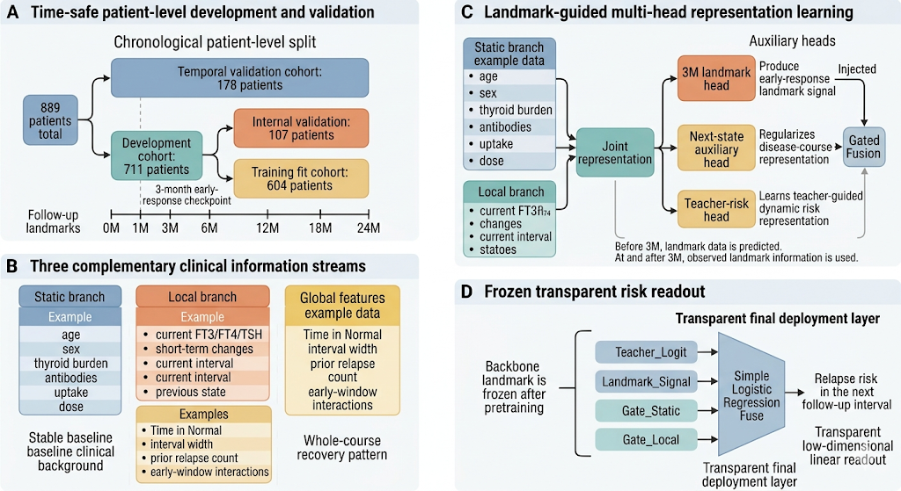

这张图是全文的主方法图。它将队列构建、时间安全开发流程、`static / global / local / landmark` 表征学习、多头监督、可解释输出以及最终 Web 应用入口纳入同一叙事框架，更符合本研究的真实方法学脉络。

### 3.4 为什么 `3M landmark` 头是合理的
保留专门的 `3M landmark` 头，并不是为了让故事更好听，而是因为前期 fixed-landmark binary 分析已经证明：`3M` 时点本身就携带强、可学习、可复现的信号。

在 `3M` 时点，fixed-landmark binary 结果达到：

- 最佳时间外推测试 `Accuracy = 0.813`，对应 `Elastic+LGBM Blend Routed`
- 最佳时间外推测试 `AUC = 0.857`，对应 `Elastic+LGBM Blend`
- 最佳时间外推测试 `F1 = 0.752`，对应 `Elastic+LGBM Blend Routed`

因此，保留 `3M` 分支的逻辑并不是“将一个二分类器神化为通用真相”，而是承认：早期治疗反应本身已经足够强，可以作为临床上有意义的方法学锚点，用来约束后续动态风险更新。

`3M` ROC 曲线进一步说明，这一信号不是偶然存在的弱 side signal，而是当前多头动态风险框架能够成立的重要前提之一。

---

## 4. 主要结果
### 4.1 直接动态基线
较早的 dynamic-only 滚动 landmark 基线仍然重要，因为它证明了：即使不引入 landmark-guided 多头结构，仅凭动态轨迹本身，这个“下一时间窗复发预警”任务也是可学习的。

在时间外推测试集上，该基线达到：

- `AUC = 0.762`
- `PR-AUC = 0.283`
- `F1 = 0.294`

这说明本文并不是在解决一个不同的问题，而是在同一个任务定义下，进一步引入早期 landmark 约束、辅助监督和透明融合读出。

### 4.2 最终模型的判别能力
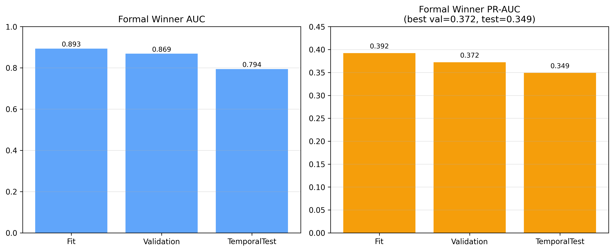

最终模型表现为：

- 训练拟合集：`AUC = 0.893`，`PR-AUC = 0.392`
- 内部验证集：`AUC = 0.869`，`PR-AUC = 0.372`
- 时间外推测试集：`AUC = 0.794`，`PR-AUC = 0.349`

最重要的读法不是单看某一个点值，而是看到：时间外推测试集的 `PR-AUC` 仍然接近内部验证集水平，说明模型在稀有事件排序上的能力在时间漂移下没有完全崩掉。

### 4.3 校准情况
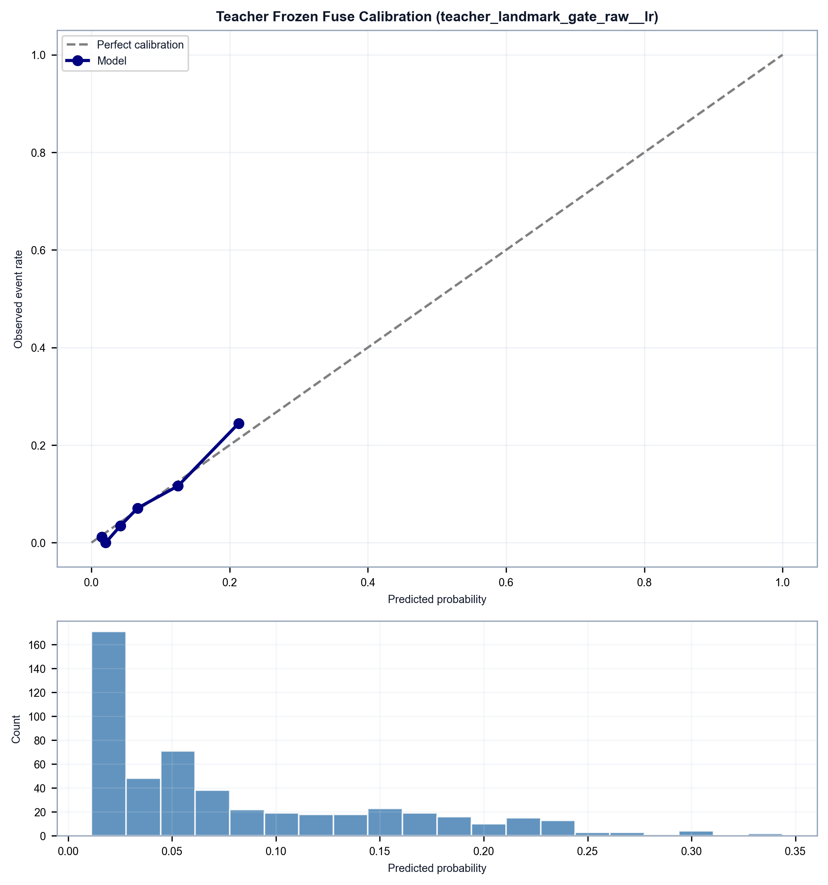

预测概率主要分布在临床上预期的低风险区间。在时间外推测试集实际覆盖到的概率范围内，校准总体可接受，未见明显的大尺度失真。

### 4.4 决策曲线分析
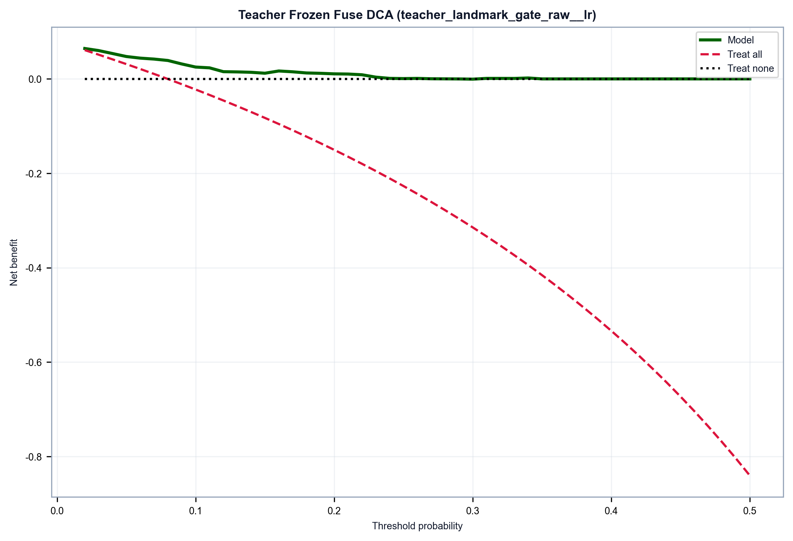

在较低阈值概率范围内，模型相对 treat-all 与 treat-none 策略均表现出正向 net benefit。这更支持它被理解为**早期随访分诊工具**，而不是一个用于高阈值确认诊断的分类器。

### 4.5 阈值敏感性
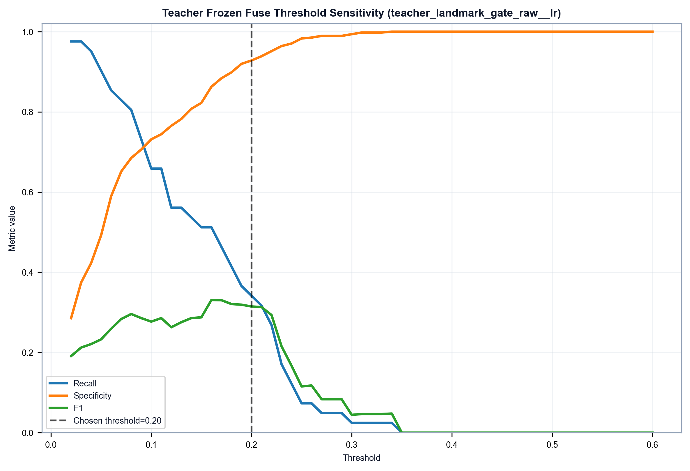

最终采用的操作阈值为 `0.20`。在这个阈值下，模型相对更偏向高特异度而不是高召回，更符合低患病率事件下的保守预警策略。

### 4.6 混淆矩阵
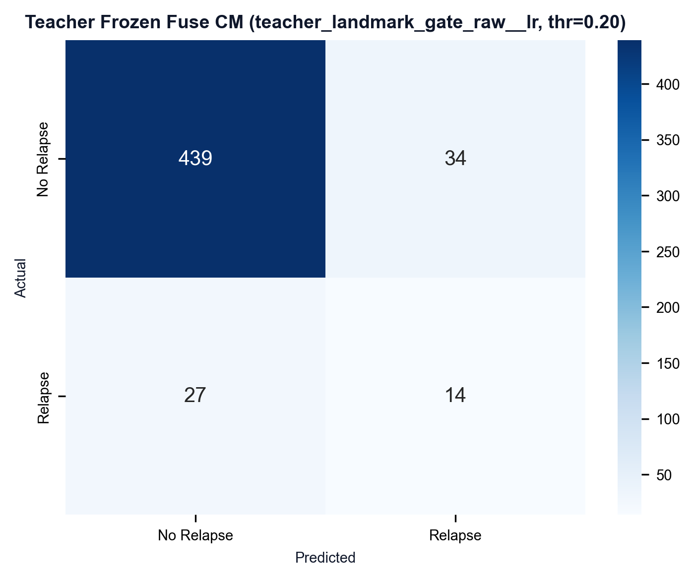

在该阈值下：

- `Specificity = 0.928`
- `Recall = 0.341`
- `F1 = 0.315`

因此，这不是一个激进的阳性判定配置，更准确地说，它对应的是一个**高特异度的随访预警场景**。

### 4.7 患者级风险分层
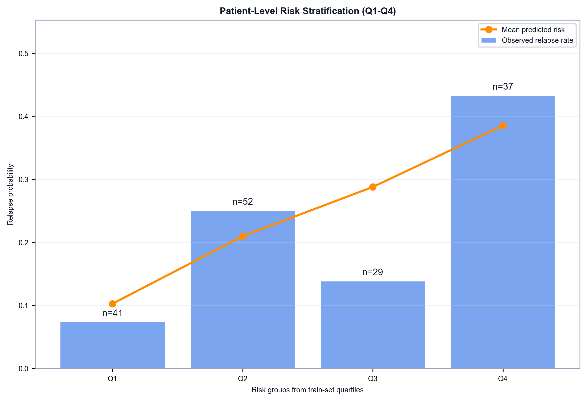

按患者级四分位进行分层后，可以看到从 `Q1` 到 `Q4` 预测风险总体上升，最高四分位对应最高的观察到复发负担。中间两层并非完全单调，提示中等风险区间仍有一定排序不稳定性，但高风险尾部已经形成有意义的分离。

---

## 5. 模型解释
### 5.1 最终融合层系数
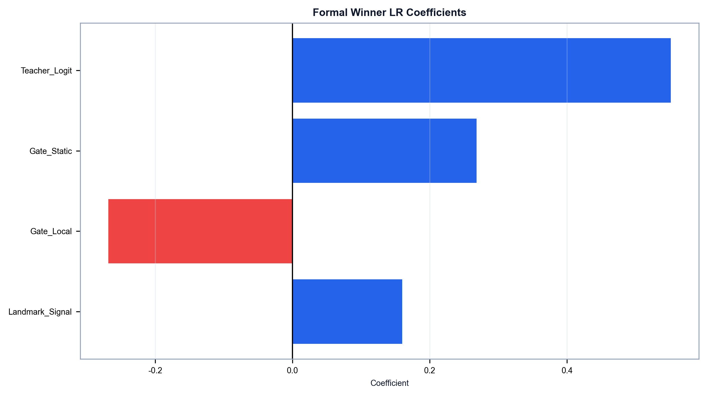

最终冻结逻辑回归融合层使用四个输入：

- `Teacher_Logit`
- `Landmark_Signal`
- `Gate_Static`
- `Gate_Local`

其系数结构为：

- `Teacher_Logit = +0.551`
- `Gate_Static = +0.268`
- `Gate_Local = -0.268`
- `Landmark_Signal = +0.160`

这说明最终分数主要由教师信号派生的风险流驱动，再由分支门控模式进行方向性修正，并辅以 landmark 信号支持。换句话说，最终模型并不是随意拼接，而是在一个低维透明层中完成最后的风险整合。

### 5.2 端到端特征层 SHAP
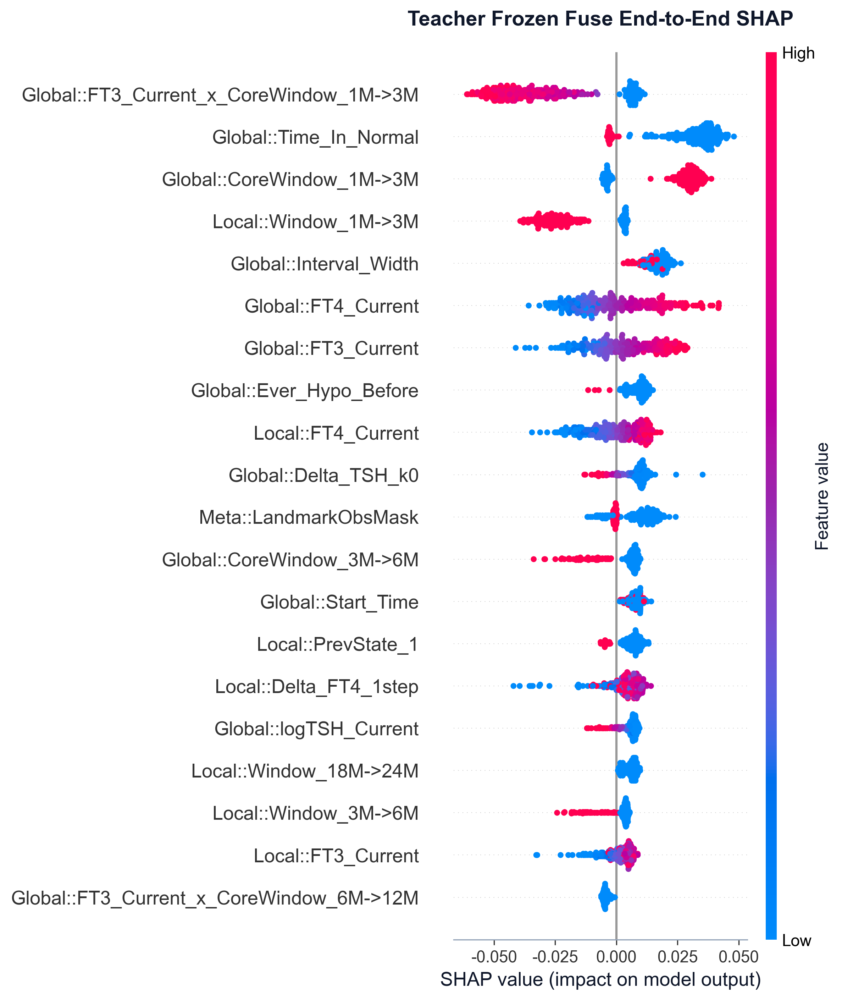

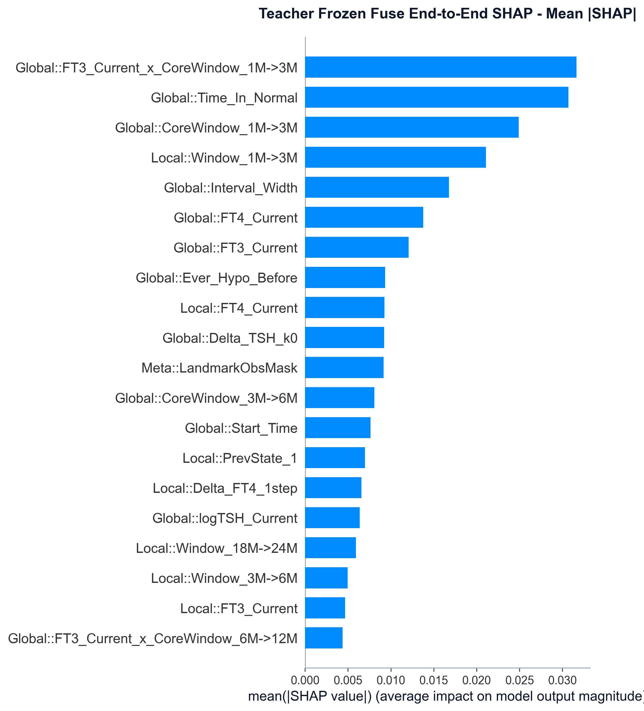

本文的主解释层采用的是**端到端 SHAP**，而不是仅解释最终融合层四个输入的读出层 SHAP。也就是说，这一层解释已经回到了工程化特征粒度。

排名靠前的特征包括：

- `Global::Time_In_Normal`
- `Global::FT3_Current_x_CoreWindow_1M->3M`
- `Global::FT4_Current`
- `Global::Interval_Width`
- `Global::FT3_Current`
- `Global::CoreWindow_1M->3M`
- `Global::Ever_Hypo_Before`
- `Local::Window_1M->3M`

它们共同提示：当前模型主要读取的是**全病程恢复组织结构**和**早期窗口内的动态不稳定性**，而不是单纯依赖静态背景负担。

### 5.3 个体级局部解释
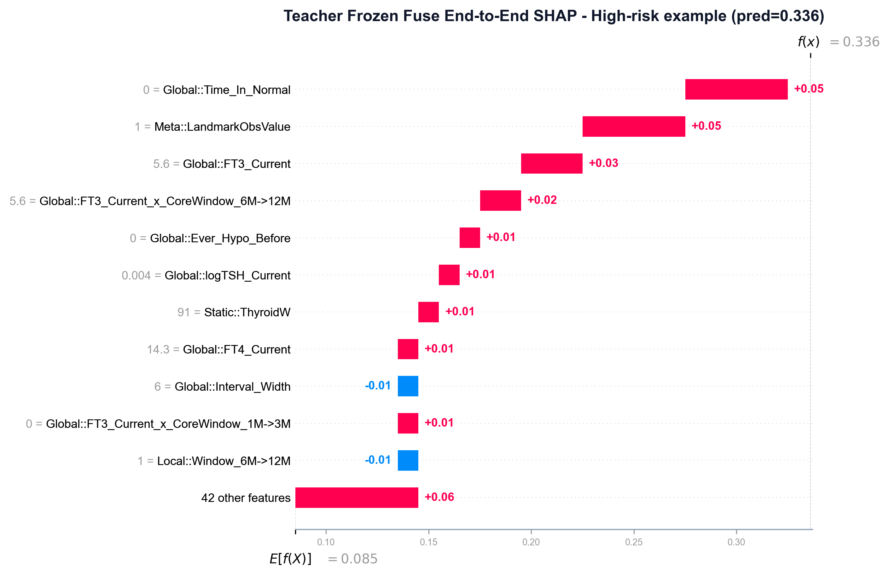

高风险示例的主要抬升因素包括：处于正常状态的时间较短、landmark 信号偏高，以及甲状腺相关动态特征活跃。

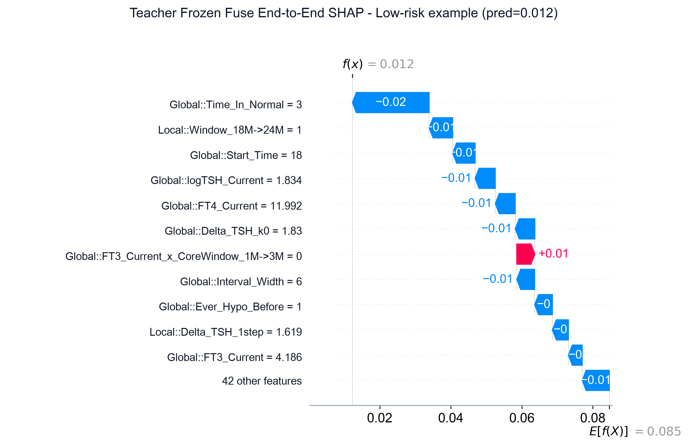

低风险示例则呈现出相反模式：正常状态维持更久、随访时点更靠后、纵向生化信号更稳定。

---

## 6. 方法开发补充图
下列图并非临床主解释图层，但它们记录了模型开发阶段的行为，因此作为补充结果予以保留。

### 6.1 Backbone 比较
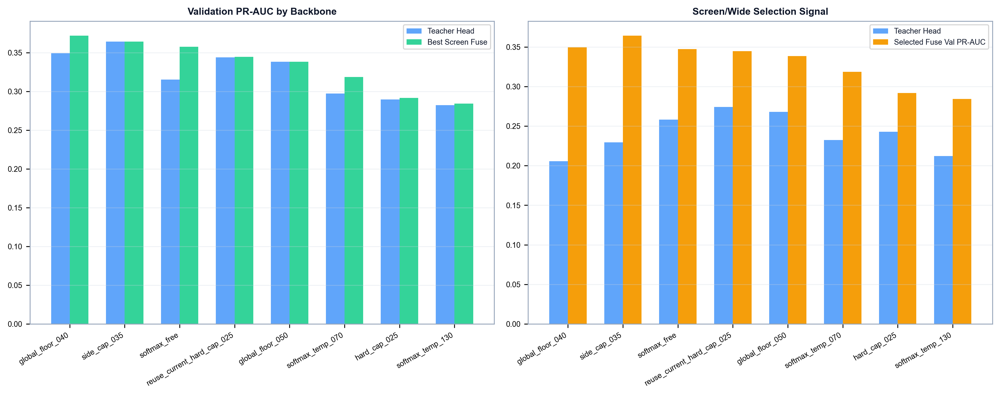

这张图主要反映不同门控与主体结构变体在验证集上的筛选信号，属于方法开发轨迹，而不是最终临床结论。

### 6.2 Gate 比较
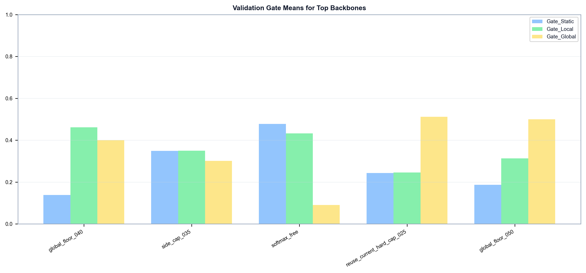

这张图展示了主要候选模型在 `static / local / global` 三路上的权重分配。最终入选方案更接近“以 local 为主、global 设下限”的模式，而不是完全由 global 主导。

### 6.3 顶部实验比较
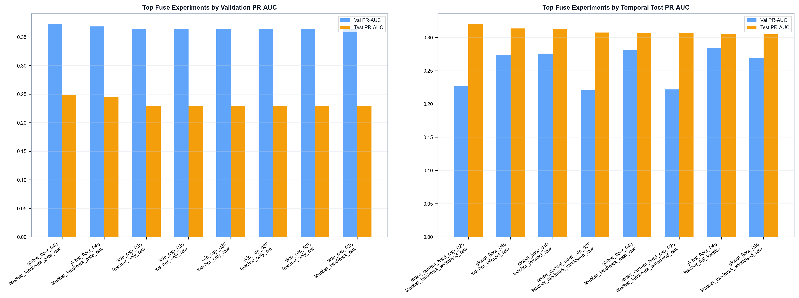

这张图比较了按验证集和时间外推测试 `PR-AUC` 排名前列的融合实验。它对于理解模型选择过程有价值，但不应被误读为最终解释层。

---

## 7. 融合层 SHAP 补充结果
融合层 SHAP 作为补充结果保留，但它本质上解释的是**最终读出层**，而不是特征工程层。

### 7.1 Fuse-space SHAP 总图
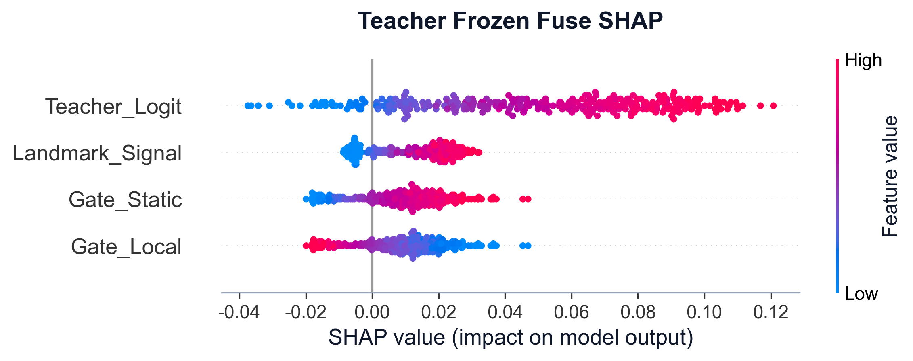

### 7.2 Fuse-space SHAP 重要性
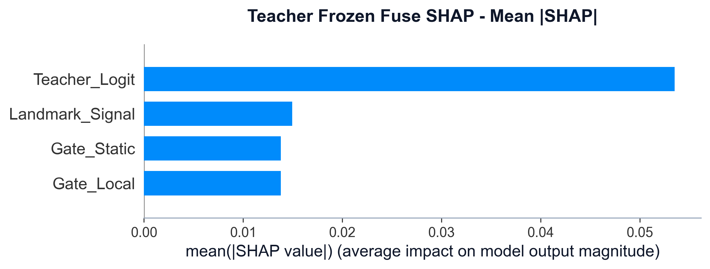

从重要性排序看，最终低维读出主要由 `Teacher_Logit` 驱动，其后是 `Landmark_Signal`、`Gate_Static` 和 `Gate_Local`。这与冻结逻辑回归层的系数结构一致。

### 7.3 Fuse-space 局部解释
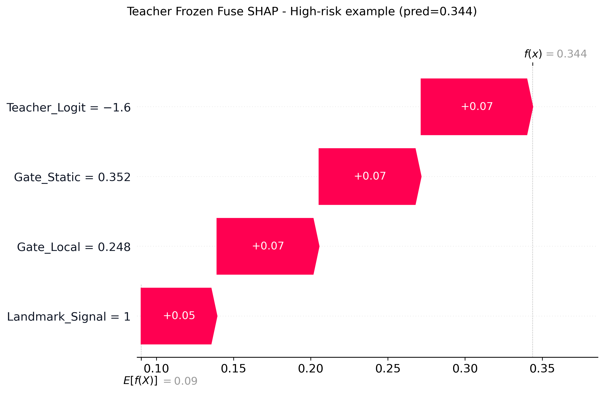

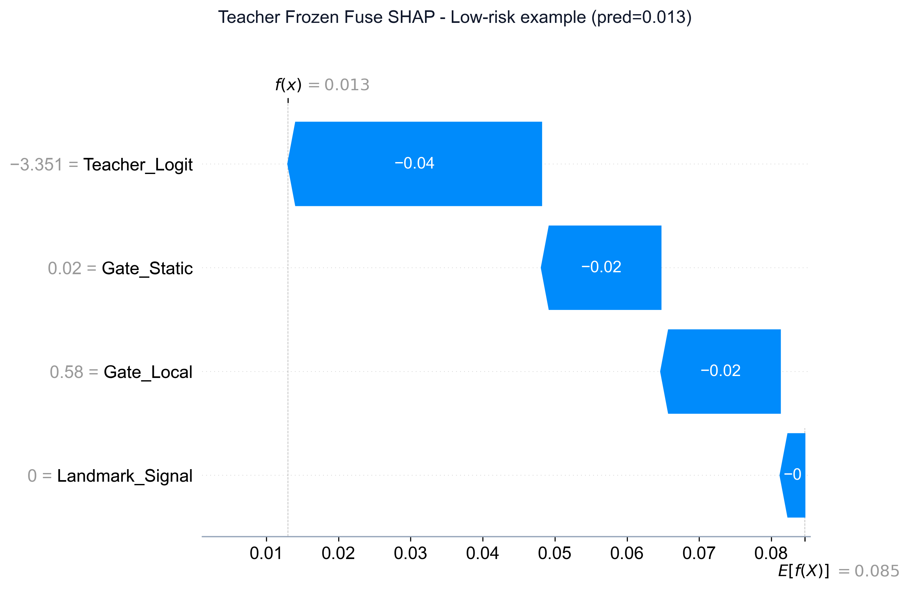

这些局部解释更适合作为一致性检查，用来确认最终融合层是否按预期工作，而不是作为主要的临床特征归因结果。

---

## 8. 历史脉络与补充分析
本文仍保留若干较早的分析线。它们不再定义当前的主叙事，但对理解方法演化过程仍有价值。

### 8.1 早期方法学路线图

这张较早的总览图记录了一个并行探索时期：fixed landmark、rolling landmark、recurrent-event 和 two-stage physiology 等多条路线曾同时推进。它不再代表最终方法摘要，但仍保留了当前方法所继承的几个关键骨架：时间安全预处理、以 landmark 为核心的临床 framing、患者级风险分层，以及最终 Web 应用落地。

### 8.2 Fixed-landmark 证据
fixed-landmark 分析目前主要作为前导证据存在：

- `3M` 路由融合模型的时间外推测试 `Accuracy` 已超过 `0.81`
- `6M` 最佳时间外推测试 `AUC` 已超过 `0.91`

因此，它现在更像是支撑当前多头框架的一组证据，而不是研究的中心结果线。

### 8.3 较早的转移 sidecar 路线
较早的转移 sidecar 路线在历史上曾达到约 `0.298` 的时间外推测试 `PR-AUC`。它在方法学上仍有参考价值，但从监督结构、解释闭环和部署一致性来看，已不如当前多头框架自洽。

### 8.4 Recurrent-survival 路线
recurrent-survival 分析仍然是有价值的方法学对照，但它回答的是一个相关而不完全相同的问题，因此更适合作为相邻证据，而不是当前主部署 formulation。

---

## 9. 补充材料
相关结果与图表集中存放于：

- `results/relapse_teacher_frozen_fuse/`

主要包括：

- 最终模型包与元数据
- 判别、校准、DCA、阈值与混淆矩阵图
- 端到端 SHAP 结果
- 开发阶段比较图

如果按照技术报告的阅读顺序，最值得优先阅读的是：

1. 主方法图
2. 判别结果
3. 校准图
4. 决策曲线分析
5. 患者级风险分层
6. 端到端 SHAP

这六层合在一起，构成了当前主模型在临床意义、统计性能和解释层面的完整闭环。
