# RAI 后 Graves 病程的固定 landmark 与 rolling landmark 建模
## 以 `Normal -> Hyper` 下一窗口复发预警为主线的真实世界纵向研究

## 一句话结论
在当前队列中，最值得作为主结论的不是“某个模型的最高分”，而是：**把问题定义为“RAI 后已经恢复 `Normal` 的患者，下一窗口是否会重新回到 `Hyper`”后，`scripts/relapse.py` 给出了最清晰、最贴近临床随访管理的结果。**
[APP](https://rai-tmu.streamlit.app/) https://rai-tmu.streamlit.app/

## 研究框架总览
本仓库已经不再是几个脚本并列摆放，而是一个围绕主线问题逐层展开的分析体系：

- 前导问题：`3M / 6M` 时点当前是否仍为甲亢
- 主线问题：当前已经 `Normal` 的患者，下一窗口是否会 `Normal -> Hyper`
- 扩展问题：如果换成 recurrent-event 语言，或者先预测未来生理值再判断复发，结论是否改变

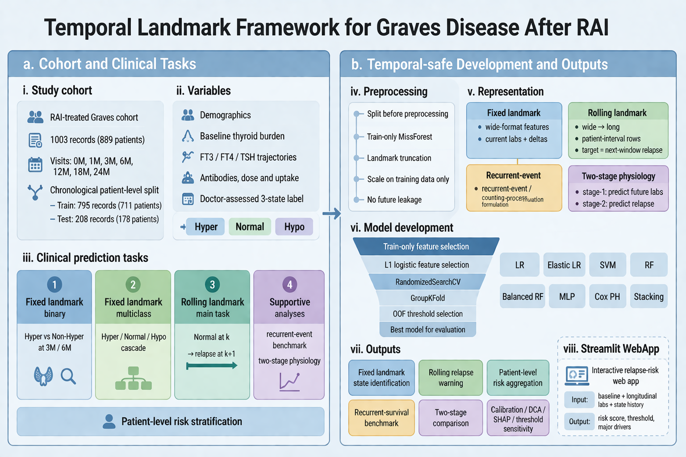
文件名：`methodology.png`

当前代码结构下，各脚本与结果目录的关系如下：

| 脚本 | 角色 | 主要输出目录 |
| --- | --- | --- |
| [`scripts/fixed_landmark_binary.py`](./scripts/fixed_landmark_binary.py) | 前导/基线分析：固定 `3M/6M` 二分类 | `results/fixed_landmark_binary/` |
| [`scripts/relapse.py`](./scripts/relapse.py) | 主线：rolling landmark 直接复发预警 | `results/relapse/` |
| [`scripts/relapse_recurrent_survival.py`](./scripts/relapse_recurrent_survival.py) | 扩展 1：recurrent-survival benchmark | `results/recurrent_survival/` |
| [`scripts/relapse_two_stage_physio.py`](./scripts/relapse_two_stage_physio.py) | 扩展 2：两阶段生理预测 | `results/relapse_two_stage_physio/` |
| [`scripts/fixed_landmark_multiclass.py`](./scripts/fixed_landmark_multiclass.py) | 补充分析：固定 landmark 三分类 | `results/fixed_landmark_multiclass/` |

---

## 数据与验证框架
### 队列概况

- 总记录数：`1003`
- 唯一患者数：`889`
- 随访节点：`0M`、`1M`、`3M`、`6M`、`12M`、`18M`、`24M`
- 静态特征：性别、年龄、身高、体重、BMI、突眼、甲状腺重量、RAI 摄取率、TRAb、TPOAb、TGAb、剂量等 `16` 项
- 动态特征：`FT3 / FT4 / TSH` 序列，以及医生评估状态

### 外层切分

所有主脚本共用同一外层验证逻辑：

- 按患者首次出现顺序做 `80/20` 患者级顺序切分
- 训练集：`711` 名患者 / `795` 条记录
- 测试集：`178` 名患者 / `208` 条记录

这意味着当前 README 所有主结果都来自**顺序切分 + 患者级隔离**，而不是随机切分。

### 防泄漏原则

1. 先切分，再做任何预处理。
2. MissForest 只在训练集拟合，再应用到训练/测试。
3. 所有 rolling / fixed landmark 输入都按深度截断，避免未来值进入当前样本。
4. 内层模型选择统一使用 `GroupKFold`。
5. 分类阈值来自 OOF 预测，而不是在测试集上回调。

---

## 主结果：rolling landmark 直接复发预警（`scripts/relapse.py`）
### 问题定义

主线任务不是“预测所有状态变化”，而是只在 **当前已经恢复 `Normal`** 的 at-risk interval 上问：

```text
当前为 Normal 的患者，在下一次复诊时是否会重新回到 Hyper？
```

测试集上，这个主问题对应：

- `514` 个 interval-level 样本
- `41` 个 `Normal -> Hyper` 复发事件
- `159` 名可进入 patient-level 聚合的测试患者

### 为什么这个问题值得单独建模

先看全部状态转移：

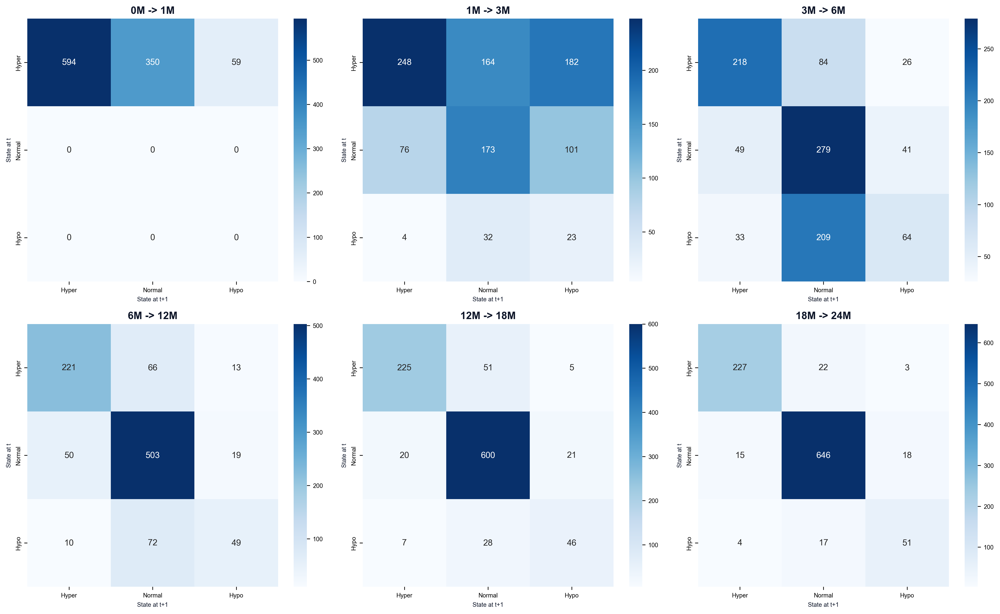
文件名：`results/relapse/Transition_Heatmaps.png`

从图上可以直接读到几个事实：

- `0M -> 1M` 基本仍以 `Hyper` 为主，这是治疗前后早期演化的自然结果。
- 从 `3M -> 6M` 开始，`Normal -> Normal` 明显增多，说明这时已经出现一批“看起来恢复稳定”的患者。
- 但 `Normal -> Hyper` 并没有消失，尤其在 `3M -> 6M` 和 `6M -> 12M` 仍能看到持续复发，因此“恢复正常后下一步会不会复发”是一个独立且临床上有意义的问题。
- 随访后期 `12M -> 18M`、`18M -> 24M` 的稳定转移更多，提示早中期窗口可能是更关键的风险识别阶段。

### interval-level 主模型表现

在 `scripts/relapse.py` 的候选模型中，`Logistic Regression` 仍然是当前主线最均衡的模型：

| 指标 | 数值 |
| --- | --- |
| AUC | `0.841` |
| PR-AUC | `0.334` |
| Brier | `0.064` |
| C-index | `0.727` |
| Recall | `0.585` |
| Specificity | `0.839` |
| Threshold | `0.15` |

对应 `95% CI`：

- `AUC: [0.793, 0.890]`
- `PR-AUC: [0.214, 0.479]`
- `Brier: [0.046, 0.081]`
- `Recall: [0.437, 0.750]`
- `Specificity: [0.809, 0.872]`

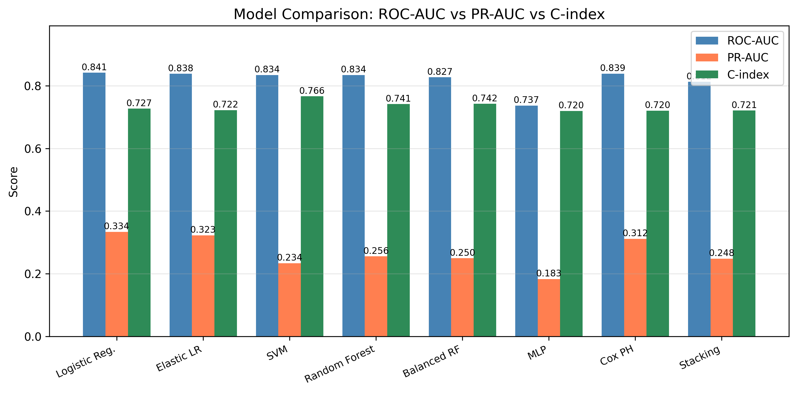
文件名：`results/relapse/Model_Comparison_Bar.png`

这个比较图最值得注意的不是“谁的 AUC 最高”，而是：

- `Logistic Reg.` 的 `PR-AUC` 最高，为 `0.334`，因此在稀少事件场景下更适合作为主模型。
- `Cox PH` 的 `PR-AUC` 接近 `0.327`，说明经典时间到事件语言并没有完全失效，但并未在当前 direct interval 任务中反超 LR。
- `SVM / RF / Balanced RF` 的 `C-index` 不低，但 `PR-AUC` 落后，说明它们更像“排序不错，但对少数事件抓取不如 LR 稳定”。

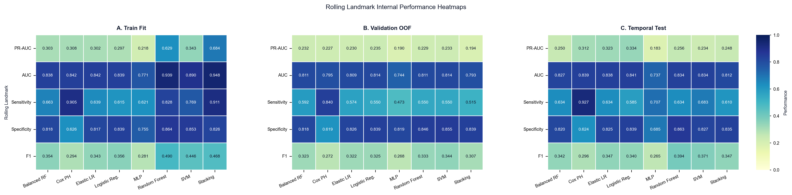
文件名：`results/relapse/Performance_Heatmaps.png`

这张内部性能热图把结果拆成 `Train Fit / Validation OOF / Temporal Test` 三个数据域，并且保留了最适合主线任务的指标组合：`PR-AUC`、`AUC`、`Sensitivity`、`Specificity`、`F1`。它的意义在于：

- `Train Fit` 只用来观察模型容量和过拟合倾向；
- `Validation OOF` 才是真正的内部开发集表现；
- `Temporal Test` 则回答时间外推后还能不能站得住。

从这张图能更直观看到：`Logistic Reg.` 在 `Validation OOF` 和 `Temporal Test` 上的 `PR-AUC` 仍然最稳，因此主线依旧应以 LR 为主，而不是只按训练拟合强度挑模型。

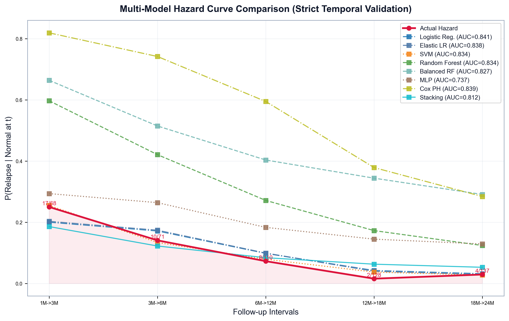
文件名：`results/relapse/Hazard_Curve_Strict.png`

这张 hazard curve 图说明：

- 实际复发 hazard 从 `1M->3M` 到 `12M->18M` 快速下降，之后略有回升。
- `Logistic Reg.` 和 `Elastic LR` 在早期窗口更贴近真实 hazard 曲线，而不少树模型整体偏高估。
- 这也是为什么主文里不应该只盯住单个 AUC，而要同时看概率刻度与时间结构是否合理。

### 校准与临床可用性

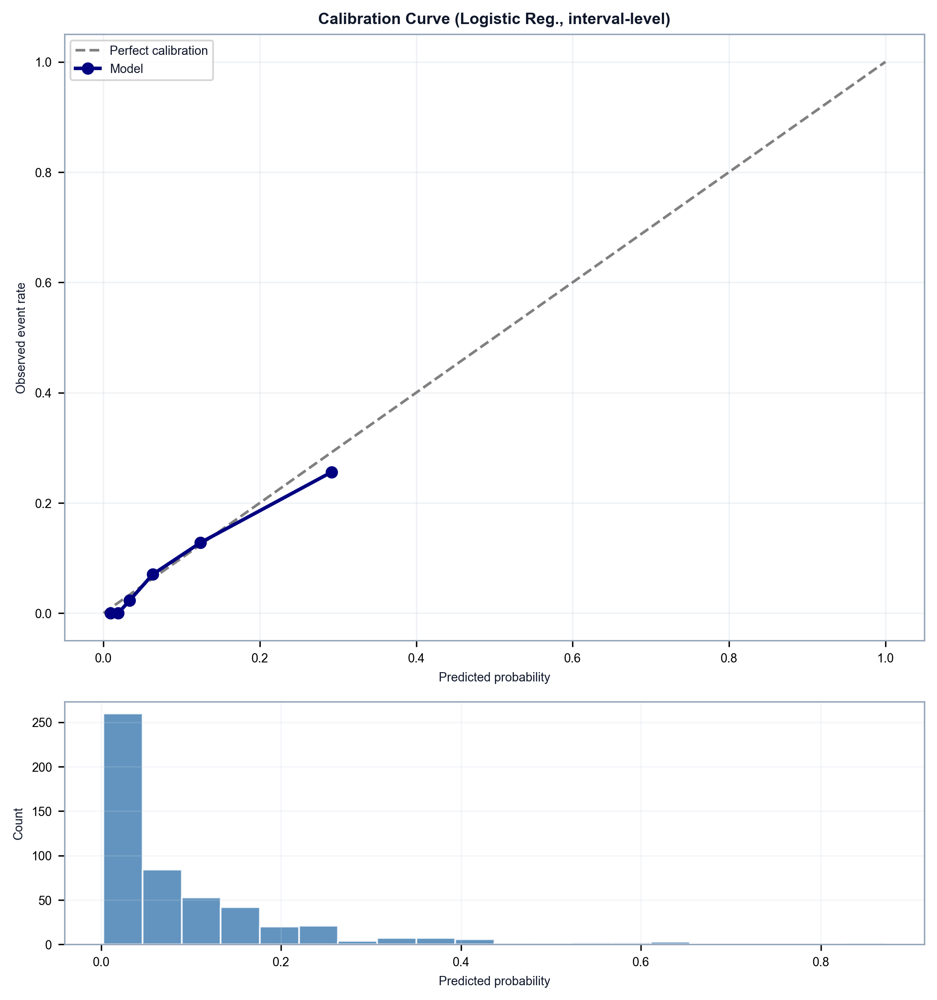
文件名：`results/relapse/Calibration_Interval.png`

interval-level 校准统计量为：

- `Calibration intercept = -0.053`
- `Calibration slope = 1.061`

这说明主线模型虽然预测概率整体偏低概率区间居多，但刻度并没有明显崩坏，仍然具备进一步用于风险沟通的基础。

### 可解释性：什么驱动复发？

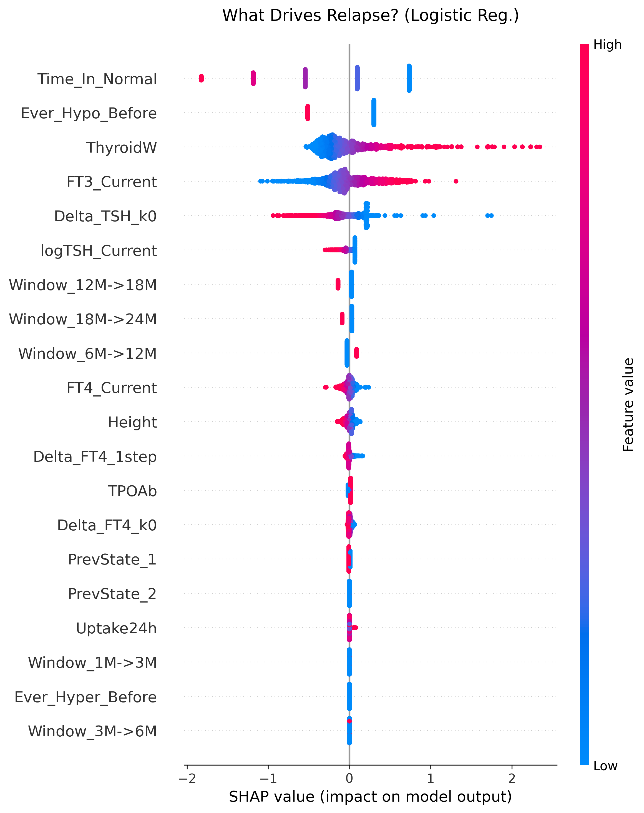
文件名：`results/relapse/Hazard_SHAP_Relapse.png`

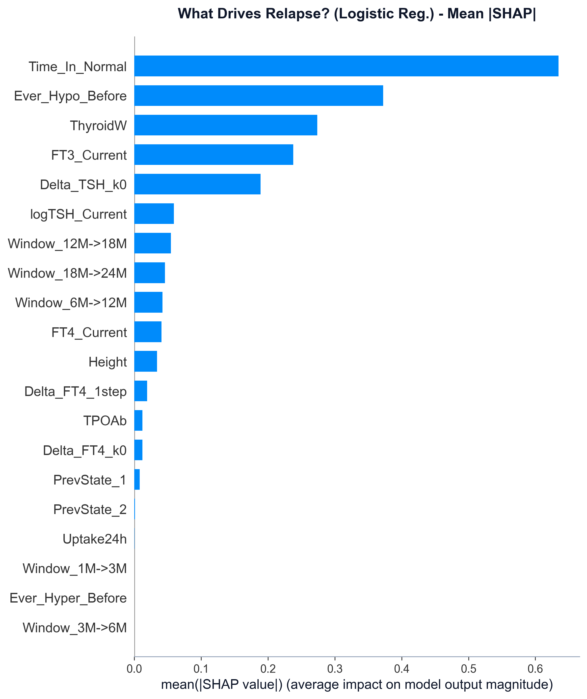
文件名：`results/relapse/Hazard_SHAP_Relapse_Bar.png`

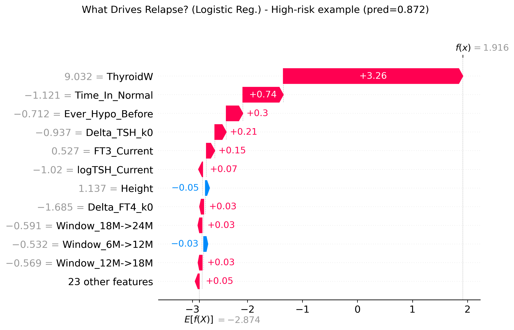
文件名：`results/relapse/Hazard_SHAP_Relapse_Local_HighRisk.png`

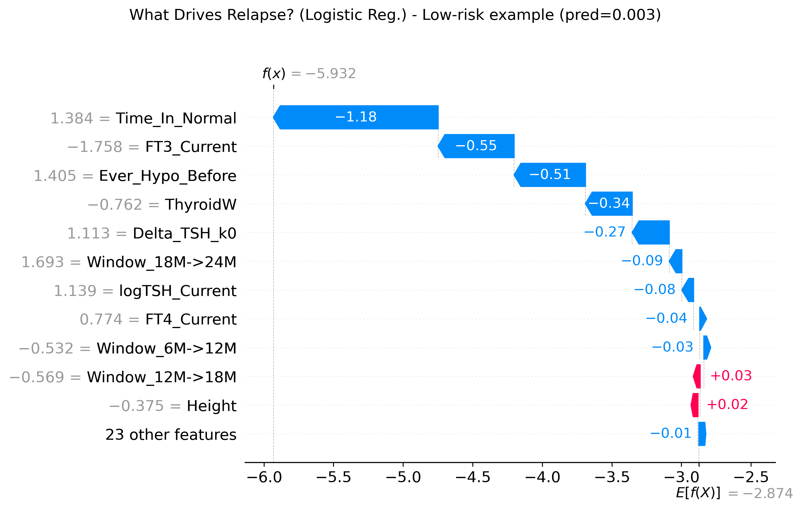
文件名：`results/relapse/Hazard_SHAP_Relapse_Local_LowRisk.png`

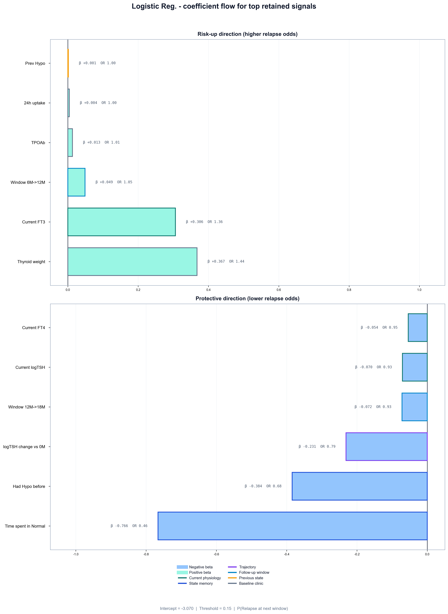
文件名：`results/relapse/Logistic_Reg_Coefficient_Flow.png`

主线 SHAP 现在分成四类视角：

- `Summary`：看总体方向和分布，确认高值/低值如何推动风险上升或下降。
- `Mean |SHAP|`：看平均贡献强度排序，确认哪些变量最稳定地主导模型输出。
- `High-risk example`：看一个高预测风险个体是如何被逐项推高到高风险区间。
- `Low-risk example`：看一个低预测风险个体是如何被保护性信号拉回低风险区间。

结合这套 SHAP 图与系数流图，当前主线最稳定的信号包括：

- `Time_In_Normal`：系数 `-0.766`，是最强保护因素之一。正常状态维持越久，下一窗口复发概率越低。
- `Ever_Hypo_Before`：系数 `-0.384`，提示既往进入甲减状态的患者，后续再复发为甲亢的倾向反而较低。
- `ThyroidW`：系数 `+0.367`，较大的甲状腺体积与复发风险增加相关。
- `FT3_Current`：系数 `+0.306`，当前 FT3 越高，越像“尚未真正稳定”。
- `Delta_TSH_k0`：系数 `-0.231`，TSH 相对基线恢复越明显，风险越低。

这部分结果非常重要，因为它告诉我们：**主线模型并不是在“瞎猜复发”，而是在利用当前激素水平、病程记忆和恢复轨迹做判断。**

### patient-level：从单窗口风险到随访管理

主线 patient-level 终点定义为：

```text
整个后续观察期内是否至少复发一次
```

默认聚合为：

```text
P(any relapse) = 1 - Π(1 - p_j)
```

默认聚合 `Product_AnyRisk` 下，测试集表现为：

| 指标 | 数值 |
| --- | --- |
| AUC | `0.749` |
| PR-AUC | `0.453` |
| Brier | `0.154` |
| Recall | `0.778` |
| Specificity | `0.585` |
| Threshold | `0.22` |

聚合敏感性分析：

| 聚合方式 | AUC | PR-AUC | Brier |
| --- | --- | --- | --- |
| `Product_AnyRisk` | `0.749` | `0.453` | `0.154` |
| `Max_Interval_Risk` | `0.738` | `0.469` | `0.155` |
| `Mean_Interval_Risk` | `0.801` | `0.595` | `0.156` |

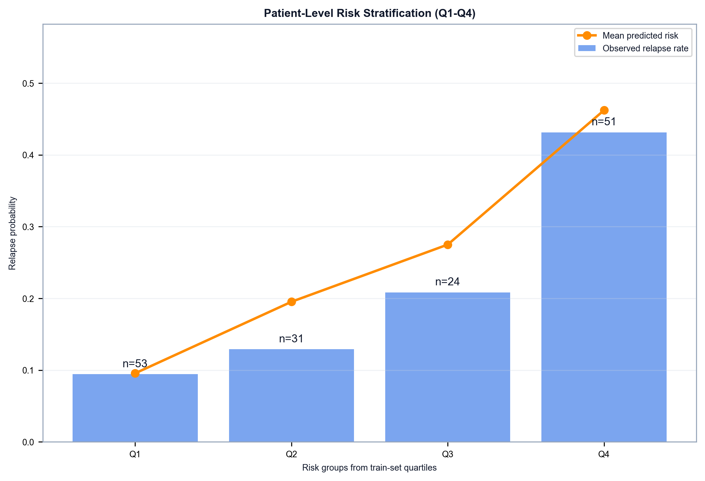
文件名：`results/relapse/Patient_Risk_Q1Q4.png`

Q1 到 Q4 的复发率呈明显梯度上升，说明 interval-level 风险可以被成功压缩成患者级分层工具。尤其是 Q4 组的观察复发率明显高于 Q1-Q3，这比单纯报告一个 patient-level AUC 更接近真实门诊管理场景。

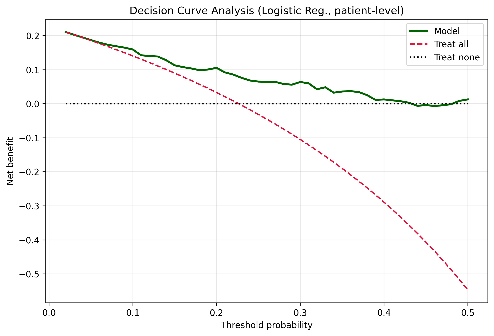
文件名：`results/relapse/DCA_Patient.png`

patient-level DCA 进一步说明，在一段较宽的阈值区间内，模型净获益高于 `treat all` 和 `treat none`，因此这个结果不只是统计意义上的“可分离”，也具有一定的决策支持价值。

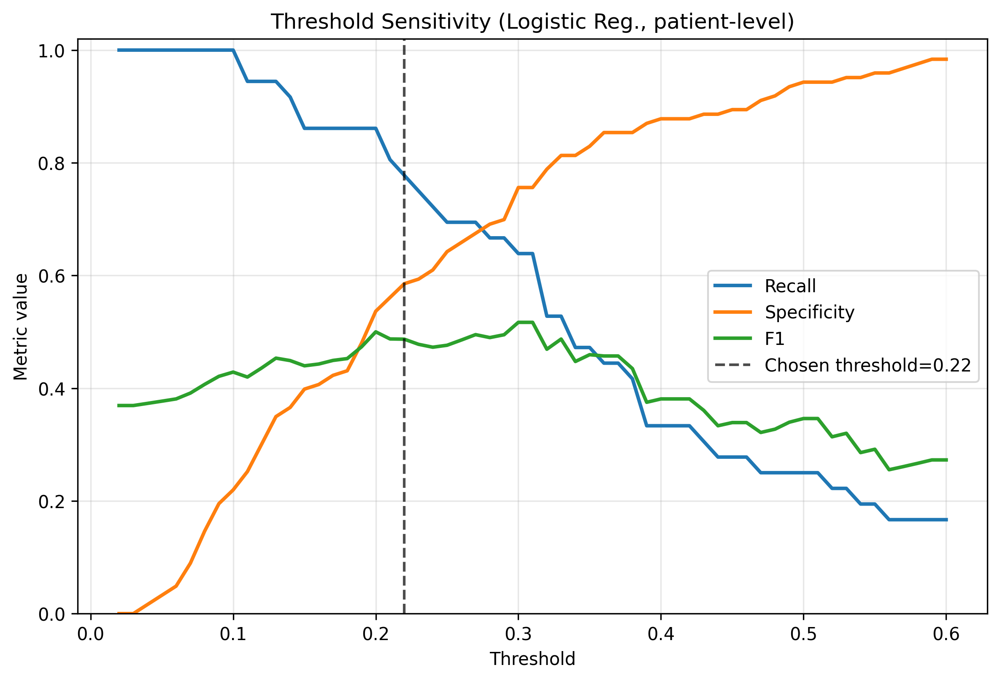
文件名：`results/relapse/Threshold_Sensitivity_Patient.png`

阈值敏感性图显示，当前选用的 `0.22` 本质上是在召回与特异度之间做折中：

- 如果继续降低阈值，可以进一步提高召回，但假阳性会更高。
- 如果显著提高阈值，特异度会上升，但会漏掉更多真正会复发的患者。

这类图对未来 WebApp 部署尤其重要，因为不同临床场景可能需要不同阈值策略。

### 窗口敏感性

| 场景 | Intervals | Events | AUC | PR-AUC | Brier |
| --- | --- | --- | --- | --- | --- |
| `All_Windows` | `514` | `41` | `0.841` | `0.334` | `0.064` |
| `Exclude_1M_3M` | `446` | `24` | `0.864` | `0.389` | `0.042` |
| `Exclude_12Mplus` | `249` | `35` | `0.739` | `0.351` | `0.111` |
| `Only_3Mplus` | `446` | `24` | `0.864` | `0.389` | `0.042` |

这说明：

- 模型不是纯粹被最早窗口“带飞”。
- 早中期窗口对判别更友好，而只保留更晚或更密集事件子集时，难度明显上升。
- 因此，显式纳入 `Window_*` 特征是合理的，而不是简单把所有时间点混成一个静态表。

---

## 前导结果：固定 landmark 二分类（`scripts/fixed_landmark_binary.py`）
### 这个分支回答什么问题

它不预测未来复发，而是回答更前导、更门诊化的问题：

```text
在 3M / 6M 复诊时，患者当前是否仍为 Hyper？
```

### 3M 结果

根据当前脚本运行结果：

- 最佳 `AUC`：`Random Forest = 0.849`
- 最佳 `PR-AUC`：`Balanced RF = 0.772`
- 按 `PR-AUC` 选择主报告模型时，`Balanced RF` 的测试集表现为：
  `AUC = 0.845`、`PR-AUC = 0.772`、`Brier = 0.164`、`Recall = 0.688`、`Specificity = 0.852`
  `Calibration intercept = -0.534`、`Calibration slope = 1.334`、`Threshold = 0.59`

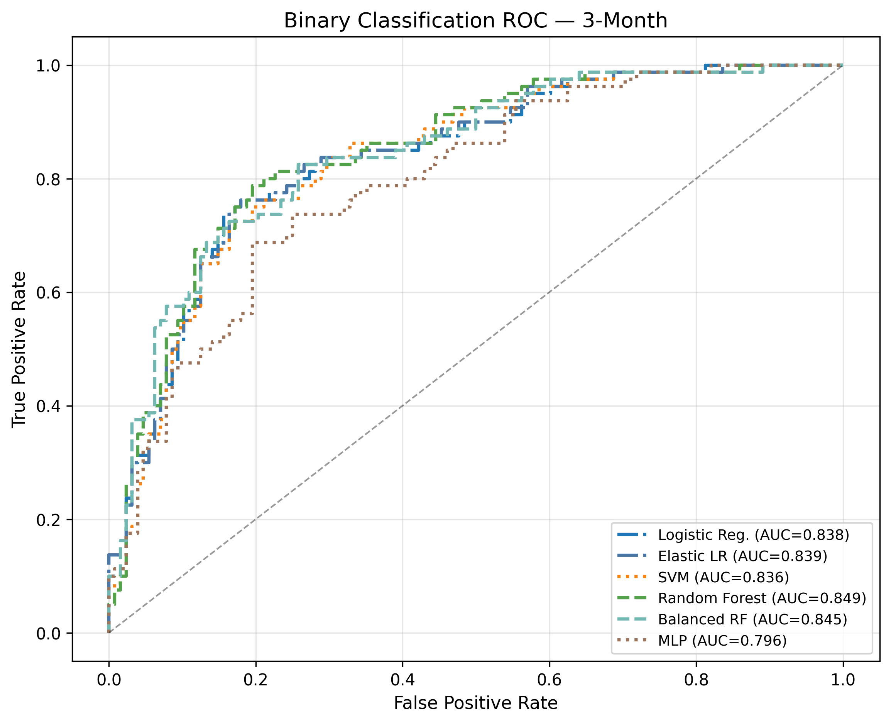
文件名：`results/fixed_landmark_binary/ROC_3-Mo.png`

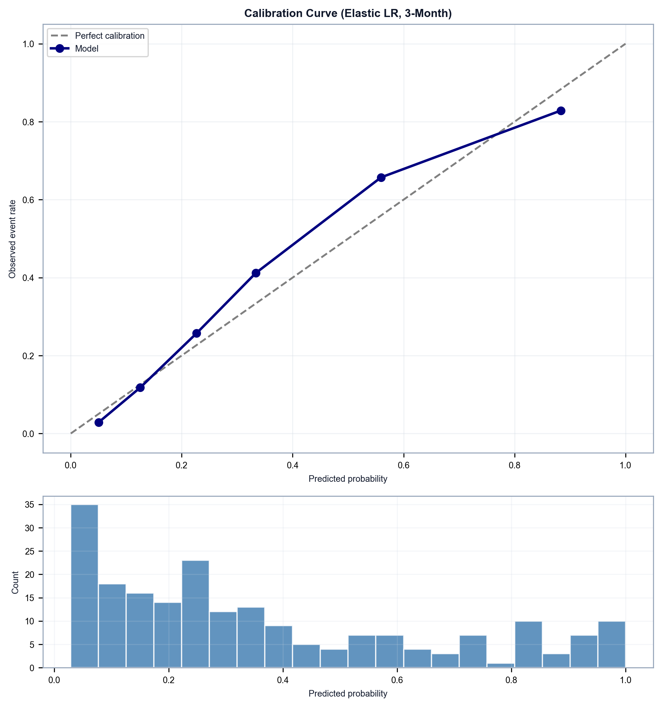
文件名：`results/fixed_landmark_binary/Calibration_3-Mo.png`

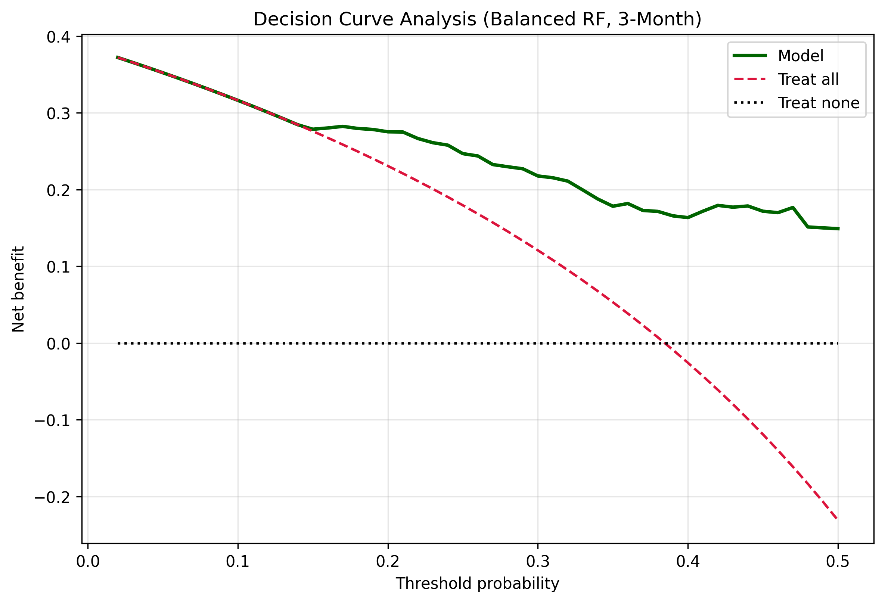
文件名：`results/fixed_landmark_binary/DCA_3-Mo.png`

3M 时点已经可以做到较稳定的“当前状态识别”，但模型之间差异仍较明显，说明在治疗后早期，信息是有的，但还没有到完全稳定的阶段。

### 6M 结果

6M 时点表现进一步提升：

- 最佳 `AUC`：`Random Forest = 0.904`
- 最佳 `PR-AUC`：`Random Forest = 0.852`
- 主报告模型 `Random Forest` 的测试集表现为：
  `AUC = 0.904`、`PR-AUC = 0.852`、`Brier = 0.114`、`Recall = 0.887`、`Specificity = 0.789`
  `Calibration intercept = -0.191`、`Calibration slope = 0.913`、`Threshold = 0.42`

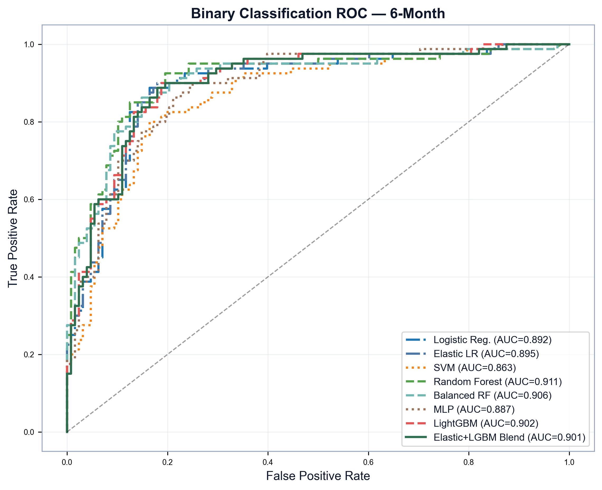
文件名：`results/fixed_landmark_binary/ROC_6-Mo.png`

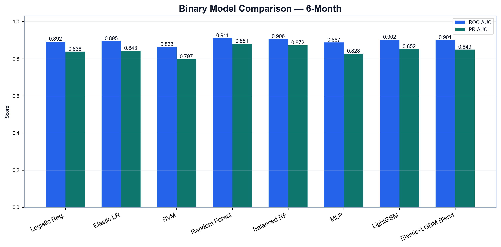
文件名：`results/fixed_landmark_binary/Bar_6-Mo.png`

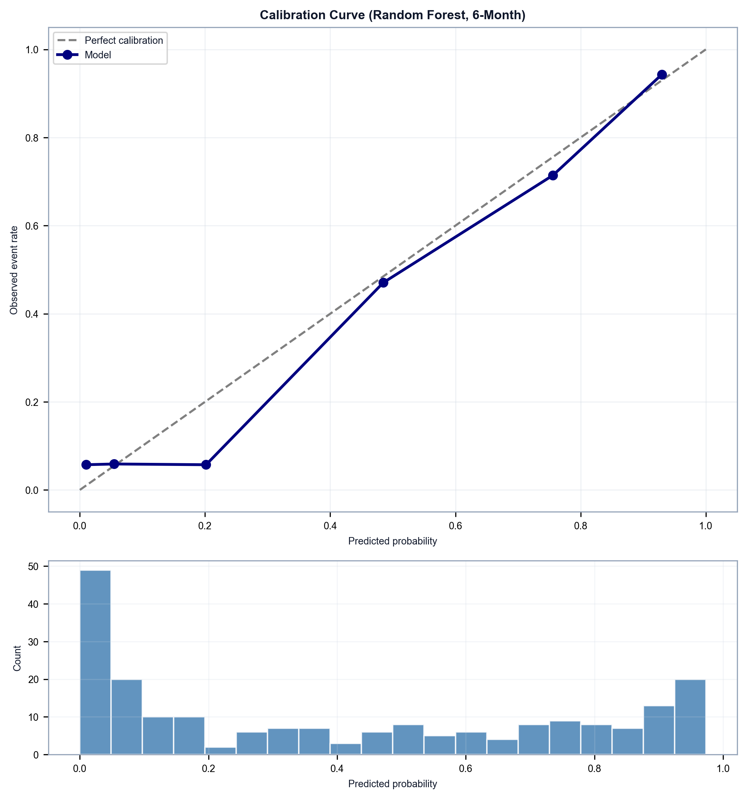
文件名：`results/fixed_landmark_binary/Calibration_6-Mo.png`

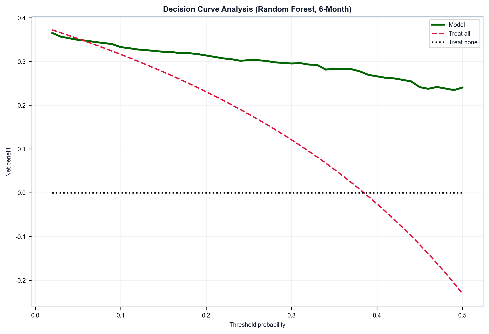
文件名：`results/fixed_landmark_binary/DCA_6-Mo.png`

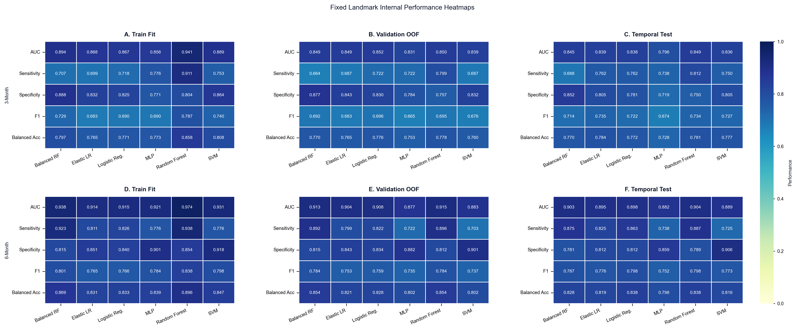
文件名：`results/fixed_landmark_binary/Performance_Heatmaps.png`

这张图把 `3M` 与 `6M` 分别拆成 `Train Fit / Validation OOF / Temporal Test` 三个数据域，并且不再把 `PR-AUC` 放在主面板中，而是改看更适合状态识别任务的 `AUC`、`Sensitivity`、`Specificity`、`F1`、`Balanced Acc`。这样做有两个好处：

- `fixed landmark` 的阳性比例没有主线 relapse 那么稀少，`PR-AUC` 可以退到补充表；
- `3M -> 6M` 的整体抬升会更直观，能够直接看到随着信息暴露增加，状态识别变得更稳定。

到 6M 时，几乎所有模型曲线都明显上移，说明随着更多治疗后信息暴露，“当前是否仍为甲亢”这个问题变得更容易。这里非常关键的一点是：**固定 landmark 的任务更像状态识别，而不是复发预警。** 它是主线 rolling landmark 的上游基线，不应替代主线。

### 固定 landmark 的解释图

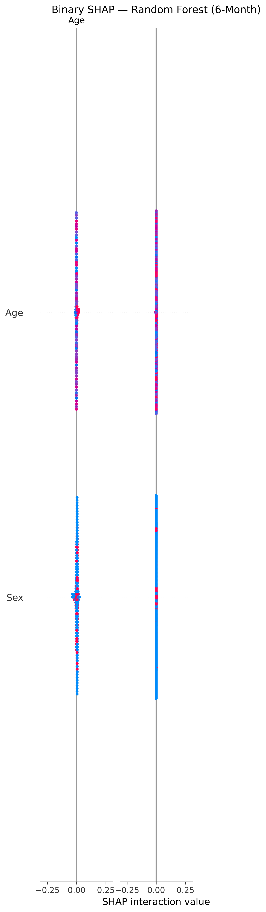
文件名：`results/fixed_landmark_binary/SHAP_6-Mo.png`

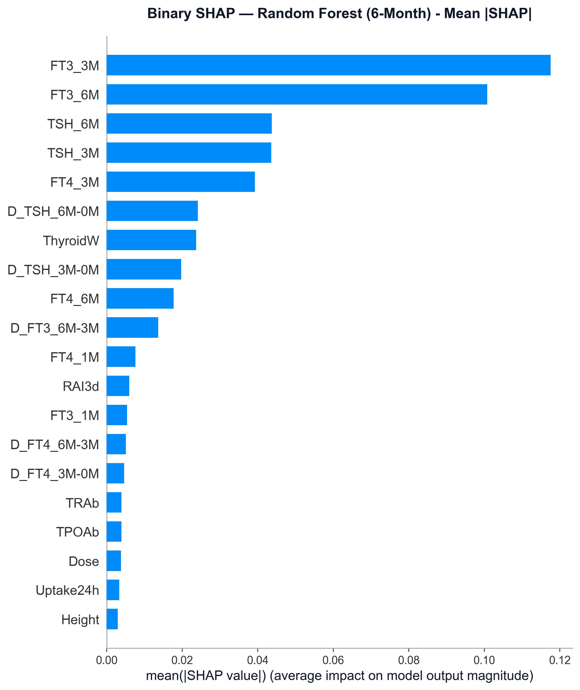
文件名：`results/fixed_landmark_binary/SHAP_6-Mo_Bar.png`

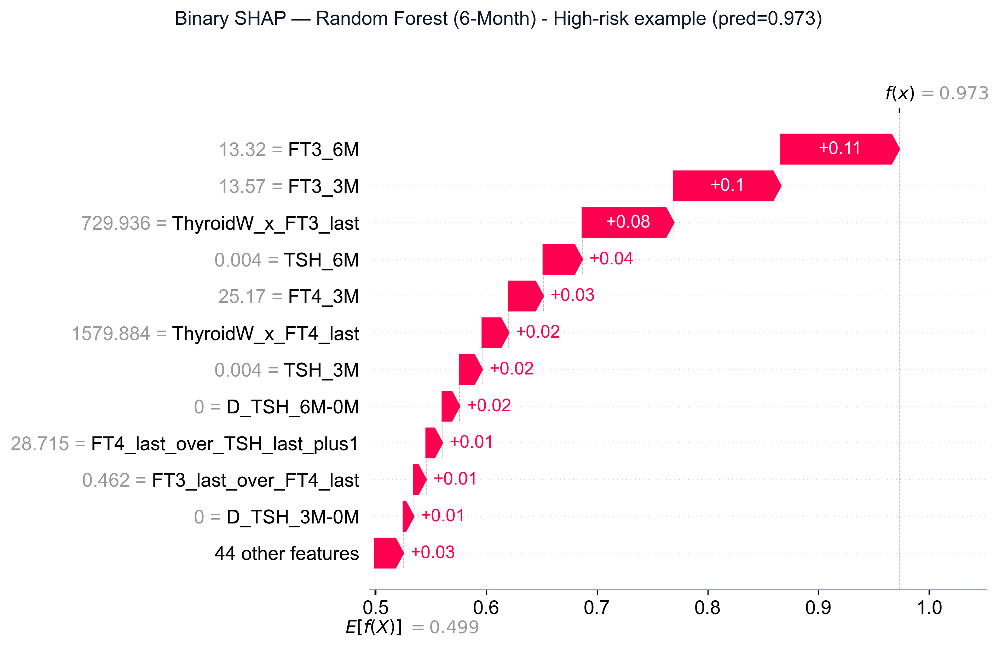
文件名：`results/fixed_landmark_binary/SHAP_6-Mo_Local_HighRisk.png`

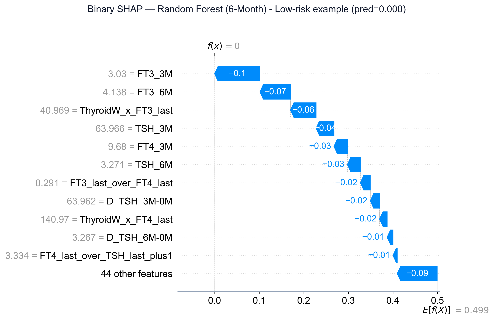
文件名：`results/fixed_landmark_binary/SHAP_6-Mo_Local_LowRisk.png`

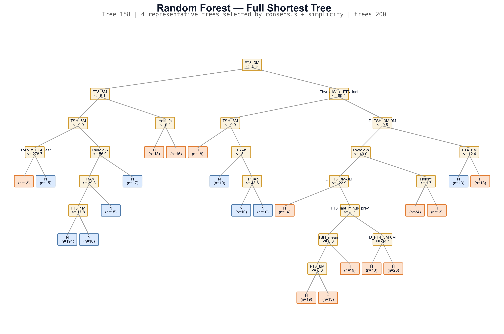
文件名：`results/fixed_landmark_binary/Random_Forest_6-Mo_Forest_Anatomy.png`

这里也不再只放一张 SHAP summary，而是同时给出全局排序和局部个体解释。综合这些图看，`FT3_3M`、`FT3_6M`、`TSH_3M`、`TSH_6M` 和 `ThyroidW` 是最核心的分裂或贡献特征。这与临床直觉一致：固定时点的“当前是否仍甲亢”，本质上还是围绕当前激素状态和甲状腺负荷展开。

这些图的意义主要在于说明：

- 固定 landmark 不是黑盒地“猜状态”；
- 它主要依赖的正是临床最熟悉的生理指标；
- 6M 时点之所以比 3M 更稳定，正是因为这些指标在 6M 更具分辨度。

---

## 扩展分析 1：recurrent-survival benchmark（`scripts/relapse_recurrent_survival.py`）
### 这个分支的定位

这一分支不是为了推翻主线，而是回答：如果换成原生 recurrent-event 视角，结论是否仍大体成立？

候选模型包括：

- `AG Cox`
- `PWP Gap Cox`
- `Event-Specific RSF`

当前汇总结果：

| 视角 | 最佳模型 | 结果 |
| --- | --- | --- |
| 最佳 C-index | `Event-Specific RSF [markov_lite]` | `0.791` |
| 最佳 next-window AUC | `Event-Specific RSF [history_augmented]` | `0.799` |
| 最佳 next-window PR-AUC | `AG Cox [history_augmented]` | `0.359` |

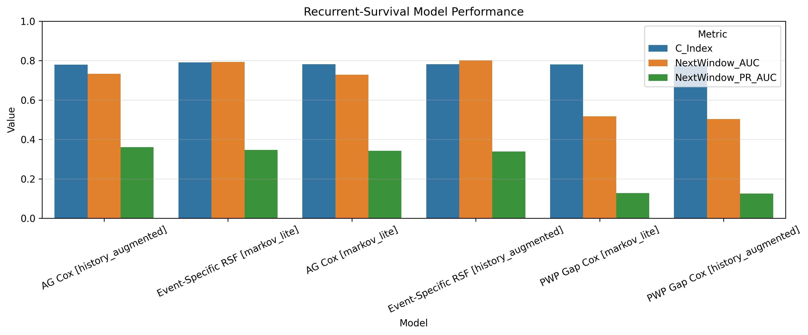
文件名：`results/recurrent_survival/Model_Comparison_Bar.png`

这个图传达的信息很清楚：

- `Event-Specific RSF` 更擅长排序和整体区分，AUC / C-index 较强。
- `AG Cox [history_augmented]` 的 next-window `PR-AUC` 最高，说明在稀少事件的识别上，经典 Cox 仍然有竞争力。
- `PWP Gap Cox` 在当前数据上明显偏弱，更像敏感性对照而非最终候选。

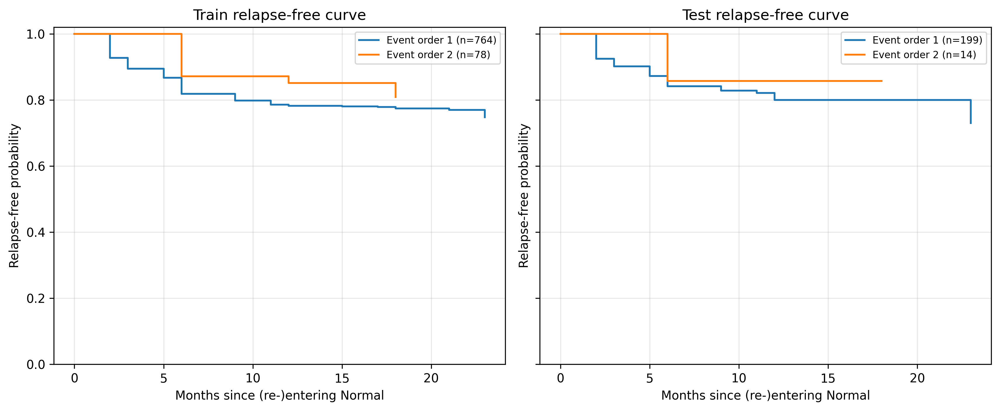
文件名：`results/recurrent_survival/EventOrder_KM.png`

这个 KM 图提示：再次进入 `Normal` 后，早期几个月仍是风险集最活跃的时段。也就是说，recurrent-event 视角并没有否定主线结论，反而支持“早中期需要更密切预警”的观点。

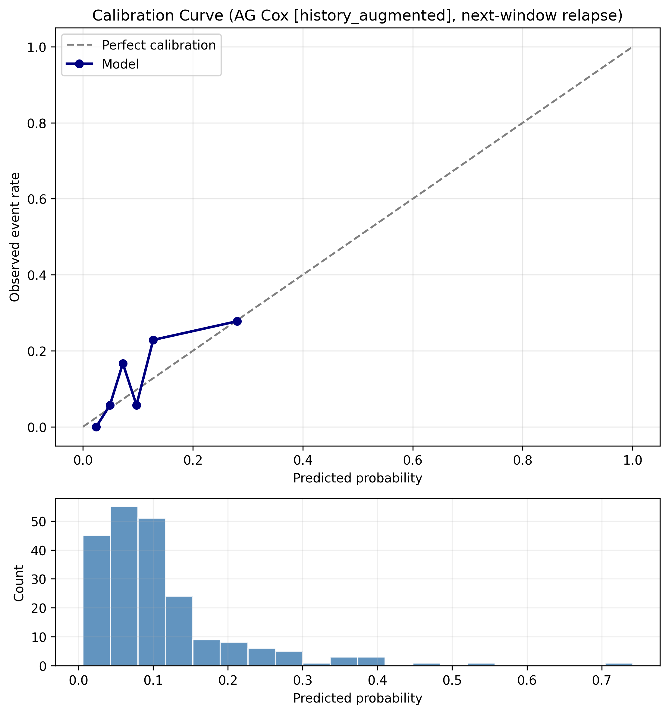
文件名：`results/recurrent_survival/Calibration_NextWindow.png`

从校准图看，`AG Cox [history_augmented]` 的 next-window 概率刻度总体可接受，但它的任务定义已经和主线 direct interval classification 不完全相同。因此，这条支线更适合写成**方法学对照与补充证据**，而不是主文主轴。

### Horizon 结果

按 horizon 看，`Event-Specific RSF [markov_lite]` 在短 horizon 上尤其强：

- `2M AUC = 0.913`
- `3M AUC = 0.875`
- `12M PR-AUC = 0.500`

这说明 survival benchmark 对事件排序确实敏感，但主文依然应以“当前为 `Normal`，下一窗口是否复发”的直接问题定义为主，因为它更容易部署，也更容易向临床解释。

---

## 扩展分析 2：两阶段生理预测复发（`scripts/relapse_two_stage_physio.py`）
### 两阶段框架想解决什么

这一分支先做：

```text
当前信息 -> 预测未来 FT3 / FT4 / logTSH -> 再预测复发
```

它检验的是：未来生理值是否足以充当复发风险的中介表示。

### Stage 1：未来生理值预测

最佳 stage-1 模型为 `RandomForest`，测试集平均表现：

- `MAE = 1.397`
- `RMSE = 2.728`
- `R² = 0.068`

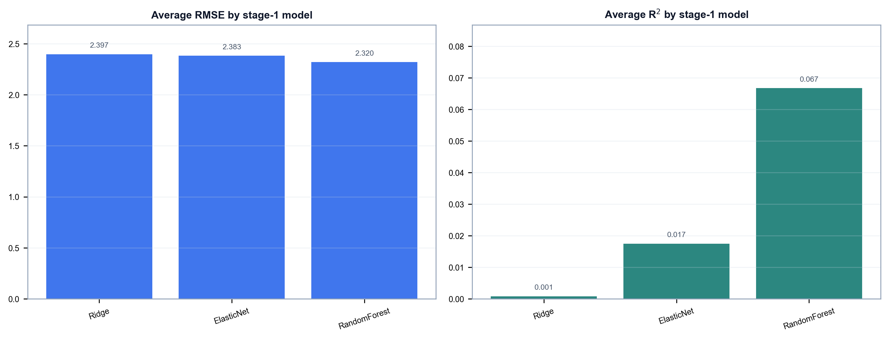
文件名：`results/relapse_two_stage_physio/Stage1_Forecast_Bar.png`

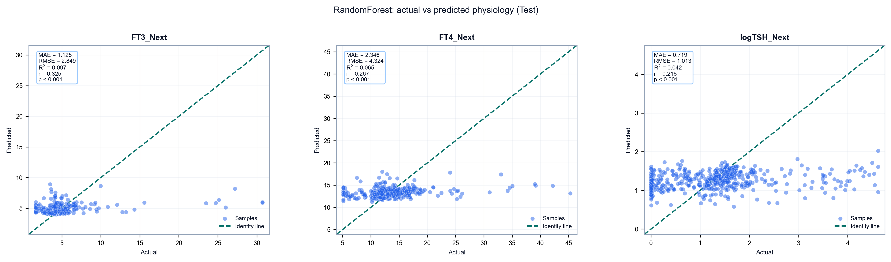
文件名：`results/relapse_two_stage_physio/RandomForest_Test_Scatter.png`

这说明未来生理值并非完全不可预测，但拟合强度有限，尤其不支持把 stage 1 当作一个高保真替代真实未来状态的模块。

### Stage 2：基于预测值做复发分类

| 组别 | 最佳模型 | AUC | PR-AUC | Brier |
| --- | --- | --- | --- | --- |
| `direct` | `Elastic LR` | `0.828` | `0.319` | `0.067` |
| `predicted_only` | `Logistic Reg.` | `0.840` | `0.265` | `0.067` |
| `predicted_plus_current` | `Logistic Reg.` | `0.834` | `0.311` | `0.070` |

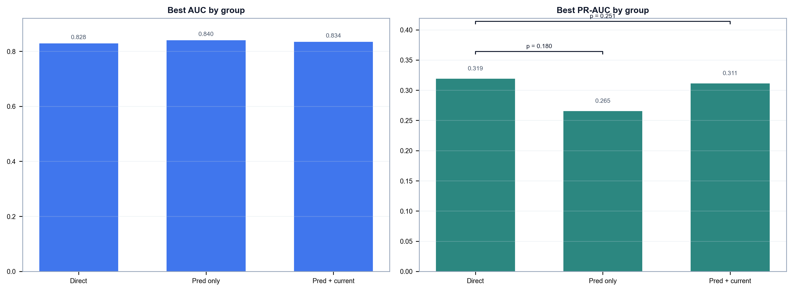
文件名：`results/relapse_two_stage_physio/TwoStage_Group_Comparison.png`

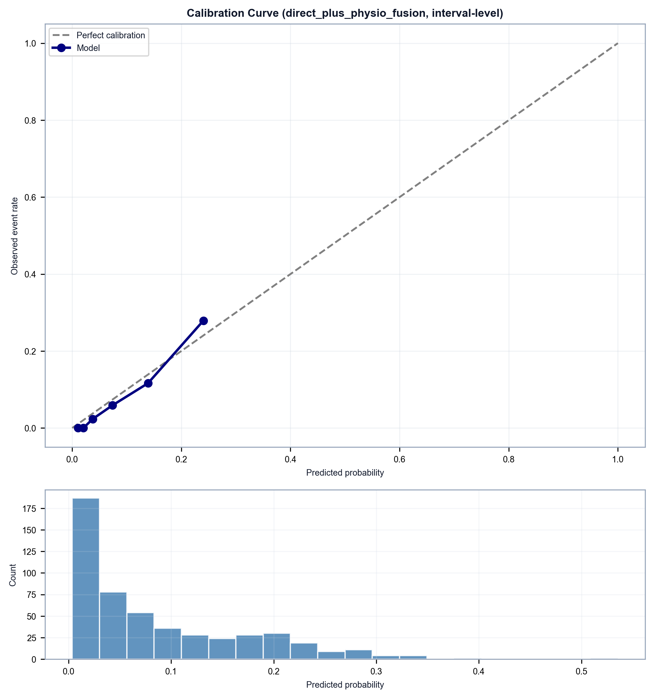
文件名：`results/relapse_two_stage_physio/Calibration_BestStage2.png`

这部分最关键的解释不是“`predicted_only` 的 AUC 看起来更高”，而是：

- 真正更重要的稀少事件指标 `PR-AUC` 上，`direct` 仍然最好。
- stage 1 误差会传导到 stage 2，使得未来生理值中的有效信息在传递中被压缩。
- 因此，两阶段方法更像一种有启发性的支持性分析，而不是当前主线替代方案。

---

## 补充分析：固定 landmark 三分类（`scripts/fixed_landmark_multiclass.py`）
这一分支把问题扩展成 `Hyper / Normal / Hypo` 三分类，用于门诊状态分流。

| Landmark | 模型 | 3分类 ACC | Macro AUC | Hyper AUC | Hypo AUC |
| --- | --- | --- | --- | --- | --- |
| `3M` | `Cascade RF` | `0.649` | `0.801` | `0.845` | `0.730` |
| `3M` | `Cascade GBDT` | `0.630` | `0.785` | `0.830` | `0.710` |
| `6M` | `Cascade RF` | `0.702` | `0.846` | `0.905` | `0.762` |
| `6M` | `Cascade GBDT` | `0.702` | `0.847` | `0.906` | `0.762` |

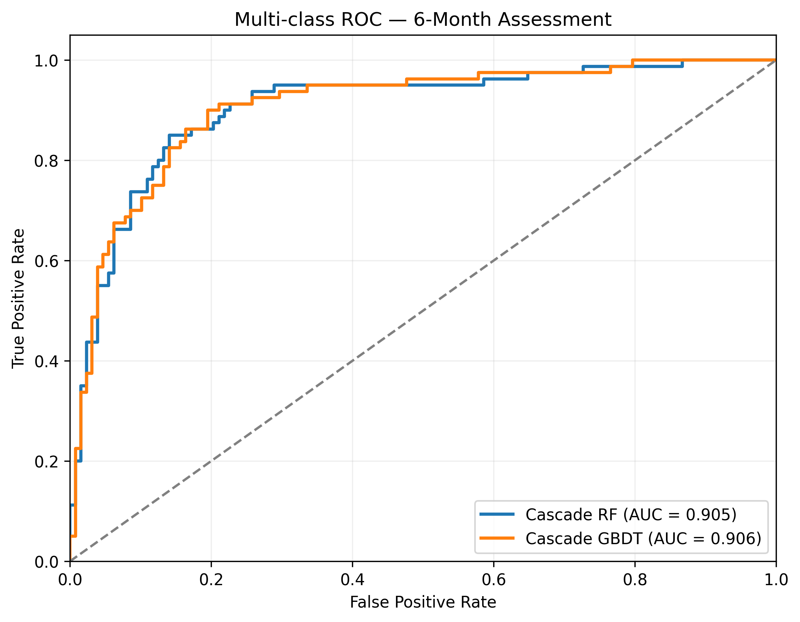
文件名：`results/fixed_landmark_multiclass/ROC_6-Mo.png`

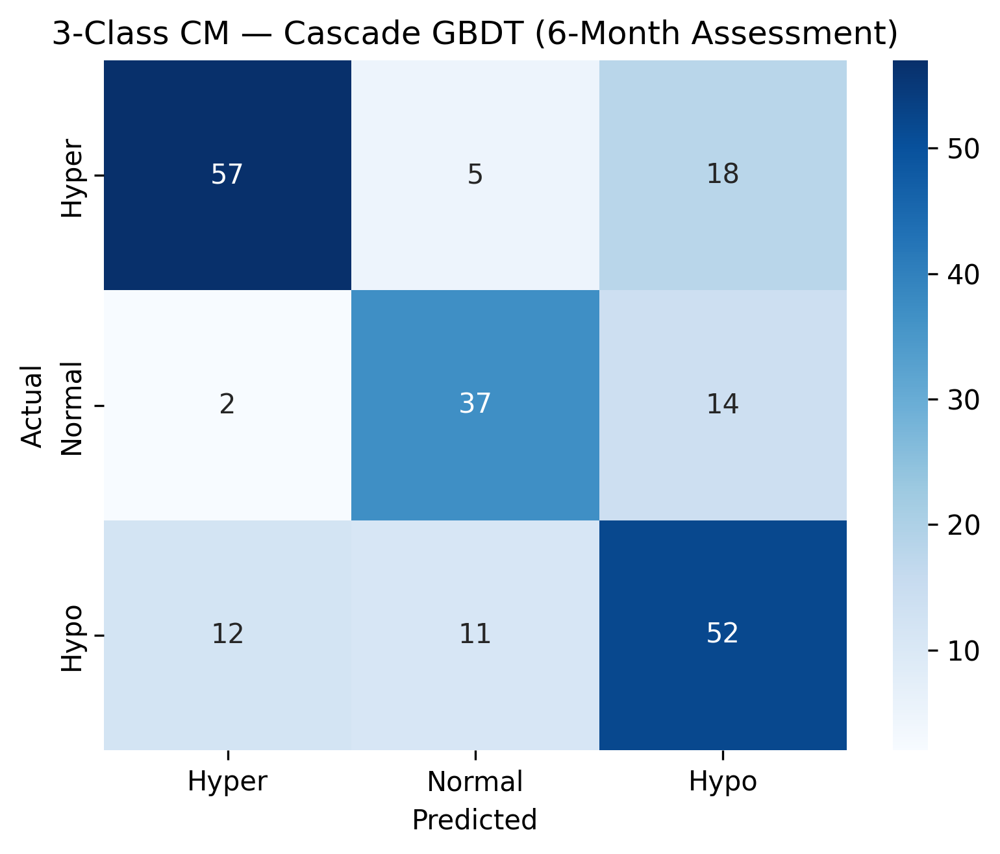
文件名：`results/fixed_landmark_multiclass/CM_6-Mo.png`

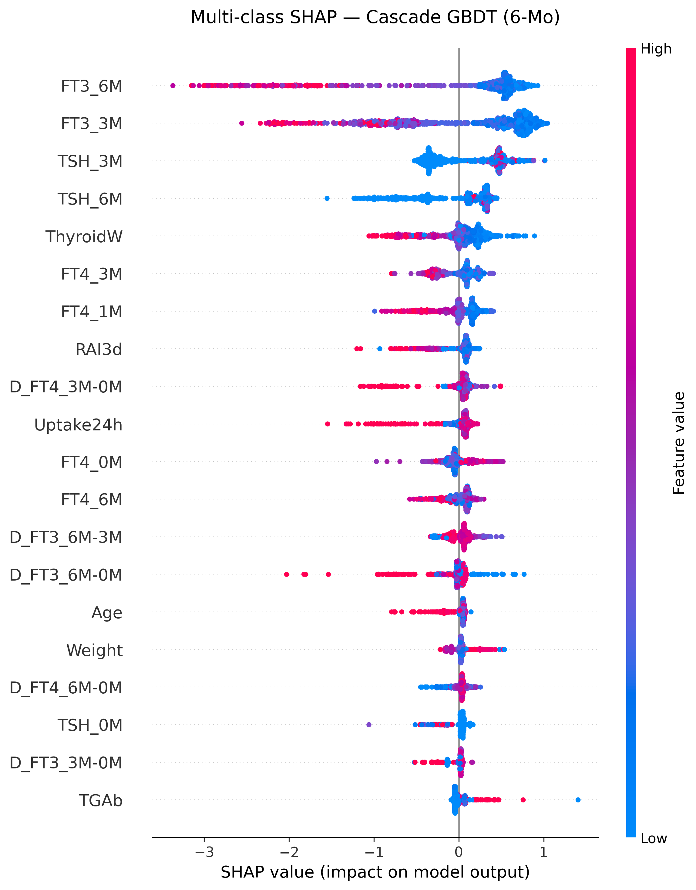
文件名：`results/fixed_landmark_multiclass/SHAP_6-Mo_Hyper.png`

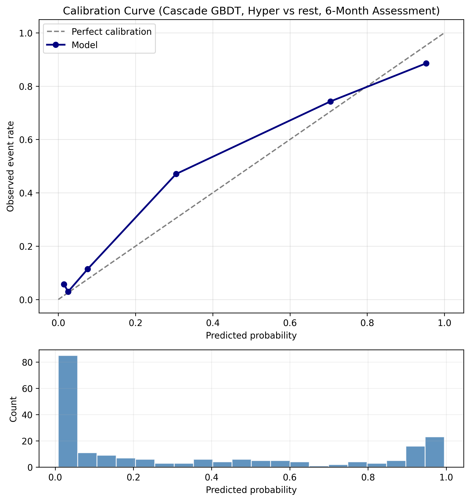
文件名：`results/fixed_landmark_multiclass/Calibration_6-Mo_Hyper.png`

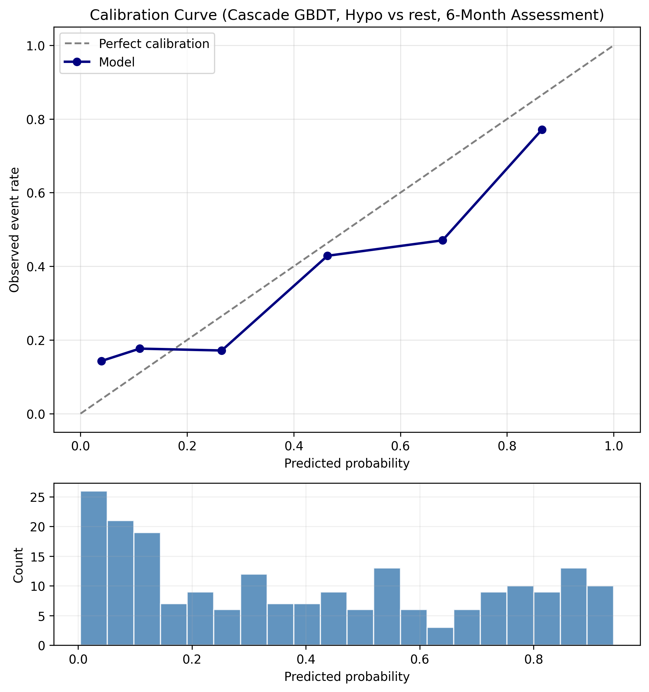
文件名：`results/fixed_landmark_multiclass/Calibration_6-Mo_Hypo.png`

这个分支说明：

- 到 `6M` 时点，三状态分流已经具备一定可行性；
- 若聚焦临床最关心的两端状态，则 `Hyper vs rest` 的区分度明显优于 `Hypo vs rest`；
- 新增的校准图和 DCA 图表明，三分类任务也可以拆成 one-vs-rest 风险工具来辅助状态分流；
- 但它回答的是“当前处于哪一类”，而不是“下一窗口会不会复发”；
- 因此它更适合放在补充分析，而不是与主线争夺叙事中心。

---

## 结果综合解读
### 为什么主线仍然是 `scripts/relapse.py`

综合所有图表与结果，最合理的叙事顺序是：

1. `scripts/fixed_landmark_binary.py` 先说明“当前状态识别”在 `3M/6M` 已经能做得不错。
2. `scripts/relapse.py` 再把问题提升到真正更有临床价值的层次：恢复正常后，下一窗口是否复发。
3. `recurrent_survival` 证明如果改用 recurrent-event 语言，结论方向依旧成立。
4. `two_stage_physio` 说明未来生理值有信号，但并没有优于 direct model。
5. `multiclass` 则提供更细粒度的补充视角。

### 为什么主文优先看 PR-AUC

主线 interval-level 测试集只有 `41/514` 个复发事件，因此：

- `AUC` 更像整体排序指标；
- `PR-AUC` 更直接衡量少数类识别质量；
- `Brier` 与 calibration 更像概率输出是否能用于风险沟通；
- `DCA` 更像部署层面的临床价值检验。

因此，主文不应机械地只看单一 AUC，而应优先写清楚：**哪个模型在稀少事件识别、概率刻度和临床净获益上更平衡。** 这也是当前 README 把 `Logistic Regression` 作为主线模型的原因。

### 当前最强的临床信息是什么

从主线 LR 系数、SHAP 结果、固定 landmark RF 分裂结构以及多分类 SHAP 可重复看到：

- 当前 `FT3` 仍是最强的即时信号；
- `TSH` 的恢复方向和幅度非常关键；
- `Time_In_Normal` 这类病程记忆特征，在“预测下一步会不会复发”时比单纯当前数值更重要；
- `ThyroidW` 等静态负荷指标会持续提供背景风险。

这正是 rolling landmark 框架比纯固定时点识别更有价值的原因：它把“当前状态”与“恢复轨迹”结合在了一起。

---

## 局限性

1. 当前仍是单中心 / 单数据源内部验证，缺乏外部验证。
2. 主线 interval-level 测试事件数仍有限，因此置信区间不可能特别窄。
3. patient-level 风险聚合依赖阈值和聚合策略，不同临床场景可能需要不同设定。
4. recurrent-survival 与 direct rolling-landmark 的问题定义不同，不能做过度简单的 head-to-head 宣称。
5. two-stage 分支已经提示：如果上游预测不够准，下游复发分类会明显受误差传播影响。

---

## 复现说明
### 最简运行

```bash
python scripts/fixed_landmark_binary.py
python scripts/relapse.py
python scripts/relapse_recurrent_survival.py
python scripts/relapse_two_stage_physio.py
python scripts/fixed_landmark_multiclass.py
```

### 清缓存重跑

```bash
python scripts/fixed_landmark_binary.py --clear-cache
python scripts/fixed_landmark_multiclass.py --clear-cache
python scripts/relapse.py --clear-cache
python scripts/relapse_recurrent_survival.py --clear-cache
python scripts/relapse_two_stage_physio.py --clear-cache
```

### 推荐优先阅读的结果目录

- `results/relapse/`：主线 rolling landmark 结果
- `results/fixed_landmark_binary/`：固定 landmark 二分类基线
- `results/recurrent_survival/`：recurrent-event benchmark
- `results/relapse_two_stage_physio/`：两阶段生理预测扩展
- `results/fixed_landmark_multiclass/`：三分类补充分析

### 主文优先阅读图表

1. `results/relapse/Transition_Heatmaps.png`
2. `results/relapse/Model_Comparison_Bar.png`
3. `results/relapse/Performance_Heatmaps.png`
4. `results/relapse/Hazard_Curve_Strict.png`
5. `results/relapse/Calibration_Interval.png`
6. `results/relapse/Patient_Risk_Q1Q4.png`
7. `results/relapse/DCA_Patient.png`
8. `results/relapse/Hazard_SHAP_Relapse.png`
9. `results/relapse/Hazard_SHAP_Relapse_Bar.png`
10. `results/relapse/Logistic_Reg_Coefficient_Flow.png`
11. `results/fixed_landmark_binary/Performance_Heatmaps.png`
12. `results/fixed_landmark_binary/ROC_6-Mo.png`
13. `results/recurrent_survival/Model_Comparison_Bar.png`
14. `results/relapse_two_stage_physio/TwoStage_Group_Comparison.png`

### 路径说明

当前 README 全面使用 `results/` 下的新目录。旧路径如 `all_result/`、`hyper_detect_result/`、`multistate_result/` 仅作为历史兼容缓存来源，不再作为当前文稿的主引用路径。
